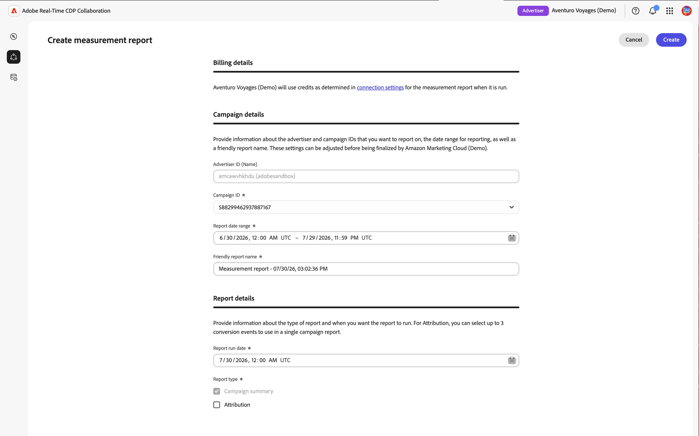
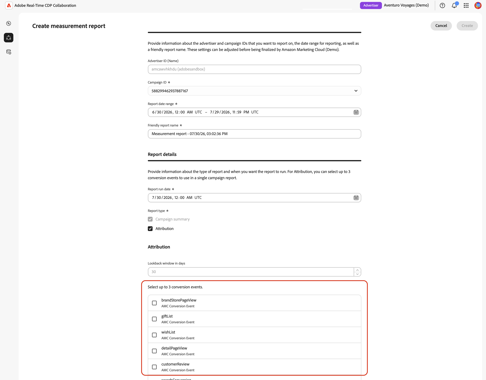
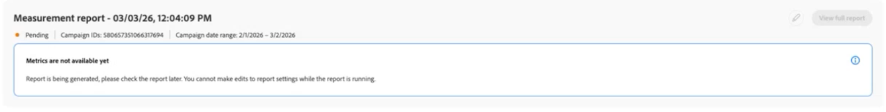
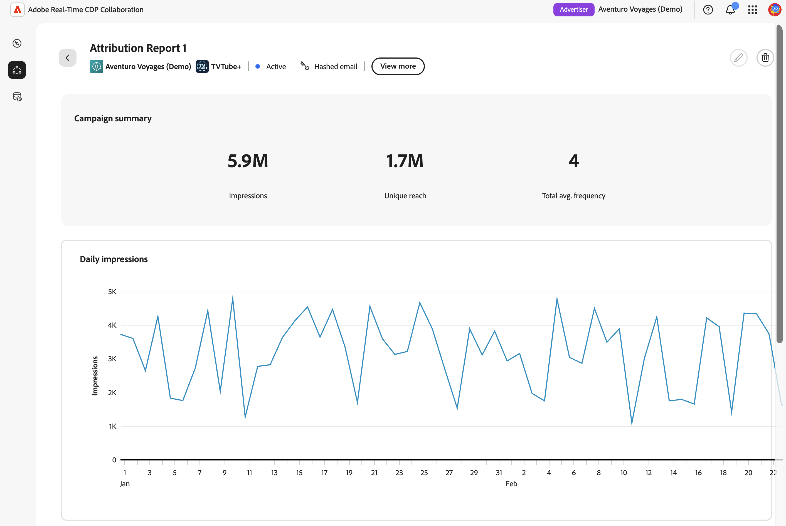
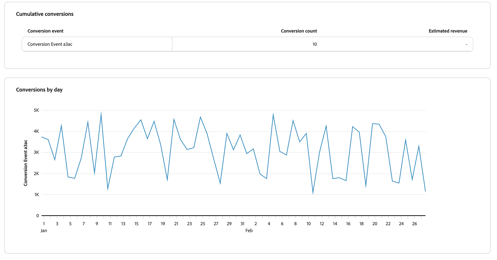

# Criar [!DNL Amazon Marketing Cloud] relatórios de medição {#amc-measurement-reports}

{{limited-availability-release-note}}

Use a guia **[!UICONTROL Medida]** em um projeto [!DNL Amazon Marketing Cloud] ([!DNL AMC]) para analisar o alcance de público, a frequência e os resultados da conversão. Depois de criar um projeto AMC, crie relatórios de medição para campanhas que já foram executadas usando os dados disponíveis na sua instância [!DNL AMC].

>[!IMPORTANT]
>
>A guia **[!UICONTROL Medida]** exibe &quot;Nenhum Dado de Medida Disponível&quot; até que as consultas de configuração de dados em segundo plano sejam concluídas. Esse processo pode levar até 24 horas. Se a mensagem persistir após 24 horas, consulte a seção [Solução de problemas](#troubleshooting).

## Criar um relatório {#create-report}

Para criar um relatório de medição de [!DNL AMC], siga as etapas em [Criar relatório de resumo da campanha](../measure.md#create-campaign-summary-report-create-campaign-summary-report).

{zoomable="yes"}

### Detalhes da campanha {#campaign}

A **[!UICONTROL ID do anunciante]** identifica a conta [!DNL Amazon Advertising] associada à instância [!DNL AMC]. [!DNL AMC] usa esse contexto de conta para recuperar campanhas para medição.

A lista **[!UICONTROL ID da Campanha]** é preenchida automaticamente com campanhas disponíveis na instância [!DNL AMC] conectada. Uma campanha será exibida somente se estiver dentro da janela de pesquisa de descoberta padrão e tiver usuários únicos suficientes para atender ao limite mínimo de agregação de [!DNL AMC]. Selecione a campanha cuja atividade [!DNL Amazon Ads] você deseja medir.

Se a campanha necessária não estiver listada, verifique se ela pertence à conta conectada do [!DNL Amazon Ads] e consulte a [Solução de problemas](#troubleshooting). Para obter mais informações sobre o limite, consulte a [documentação sobre limites de agregação AMC](https://advertising.amazon.com/API/docs/en-us/guides/amazon-marketing-cloud/aggregation-threshold).

#### Intervalo de datas, data de execução e nome do relatório {#dates}

>[!CONTEXTUALHELP]
>id="rtcdp_collaboration_amc_measure_report_date_range"
>title="Intervalo de datas"
>abstract="Defina as datas inicial e final dos dados da campanha a serem incluídos no relatório. O intervalo de datas é limitado a uma janela de retrospectiva de 365 dias com um período máximo de 90 dias. Você só pode relatar campanhas anteriores."

>[!CONTEXTUALHELP]
>id="rtcdp_collaboration_amc_measure_report_run_date"
>title="Data de execução"
>abstract="A data em que o relatório é executado. Deve ser pelo menos um dia após a data final do relatório e pode ser até 46 dias no futuro."

>[!NOTE]
>
>Você só pode relatar campanhas que já foram executadas.

Defina o **[!UICONTROL Intervalo de datas do relatório]** para o período em que a campanha [!DNL AMC] selecionada foi executada. [!DNL AMC] dá suporte a uma janela de pesquisa de 365 dias com um período máximo de 90 dias.

Defina a **[!UICONTROL data de execução do relatório]**. Essa é a data em que o relatório é executado. A data de execução deve ser pelo menos um dia após a data final do relatório e pode ser até 46 dias no futuro. Para obter o conjunto completo de restrições de data, consulte [referência de restrições AMC](#constraints).

>[!TIP]
>
>Para relatórios de atribuição em que o intervalo de datas está dentro de 30 dias da data atual, defina a data de execução 30 dias no futuro para garantir que todas as conversões na janela de lookback fixa de 30 dias tenham sido capturadas antes da execução do relatório.

#### Tipo de relatório {#report-type}

Todos os relatórios de [!DNL AMC] incluem um **[!UICONTROL Resumo da campanha]**. Como opção, você pode incluir dados de **[!UICONTROL Atribuição]** para medir se as impressões da campanha resultaram em ações do cliente, como compras ou inscrições, em uma janela de 30 dias após a exposição do anúncio. A atribuição requer que os eventos de conversão relevantes estejam disponíveis em sua instância [!DNL AMC]. Para campanhas focadas em alcance ou conscientização, o **[!UICONTROL Resumo da campanha]** fornece as métricas de entrega necessárias.

| Tipo de relatório | Descrição |
| --- | --- |
| **[!UICONTROL Resumo da campanha]** | Fornece métricas de alcance, frequência e impressão para a campanha selecionada. Sempre incluído. |
| **[!UICONTROL Atribuição]** | Adiciona dados de conversão ao relatório. Disponível somente se houver eventos de conversão na sua instância [!DNL AMC]. Consulte [Eventos de conversão](#conversion-events). |

#### Eventos de conversão (somente atribuição) {#conversion-events}

>[!CONTEXTUALHELP]
>id="rtcdp_collaboration_amc_attribution_lookback_period"
>title="Período de retrospectiva de atribuição"
>abstract="A AMC impõe uma janela de atribuição fixa de 30 dias: as conversões que ocorrem até 30 dias após a última impressão podem ser atribuídas dentro do intervalo de datas do relatório. Esse valor não é editável. Agende a data de execução do relatório pelo menos 30 dias após o fim do intervalo para garantir que todas as conversões qualificadas sejam capturadas."

>[!CONTEXTUALHELP]
>id="rtcdp_collaboration_amc_measure_conversion_events"
>title="Eventos de conversão"
>abstract="Selecione até três eventos de conversão para incluir no relatório de atribuição. Os eventos disponíveis são descobertos automaticamente da instância do [!DNL AMC]. Se nenhum evento for exibido, talvez a instância do [!DNL AMC] não tenha eventos de conversão gravados e a Atribuição estará indisponível."

>[!NOTE]
>
>Os dados de atribuição exigem que os eventos de conversão sejam configurados na instância [!DNL AMC]. Se a [!UICONTROL Atribuição] não estiver disponível ou não tiver sido selecionada, ignore esta seção e selecione **[!UICONTROL Criar]** para enviar o formulário.

Para relatórios de [!UICONTROL Atribuição], [!DNL AMC] aplica uma janela de retrospectiva de atribuição fixa de 30 dias. Esta configuração não pode ser ajustada.

{zoomable="yes"}

Os eventos de conversão representam ações de clientes no site rastreadas por [!DNL Amazon Ads], como uma compra, uma adição à lista de desejos, uma ação de carrinho de compras ou uma exibição de detalhes do produto. Os relatórios de atribuição suportam até três eventos. Selecione os eventos que se alinham com os resultados da campanha que você deseja medir. Se a opção [!UICONTROL Atribuição] não estiver disponível, consulte [Solução de problemas](#troubleshooting).

Após a criação do relatório, ele aparecerá na guia **[!UICONTROL Medida]** com um status agendado ou pendente. Na data de execução configurada, [!DNL AMC] processa a consulta de relatório e retorna os resultados em 24 horas.

{zoomable="yes"}

## Exibir um relatório {#view-report}

Depois que um relatório é executado, os resultados ficam disponíveis na guia **[!UICONTROL Medida]** do projeto [!DNL AMC]. Localize seu relatório e selecione **[!UICONTROL Exibir relatório completo]** para analisar os resultados.

![A guia Medida em um projeto [!DNL AMC] mostrando um cartão de relatório concluído com sua data de execução, tipo de relatório e o botão Exibir relatório completo destacados.](../../../assets/collaborate/advertising-platforms/view-full-report.png){zoomable="yes"}

O relatório exibe os resultados disponíveis para o tipo de relatório selecionado. Os relatórios do **[!UICONTROL Resumo da campanha]** mostram os resultados da entrega da campanha do Amazon selecionada.

{zoomable="yes"}

Os relatórios que incluem **[!UICONTROL Atribuição]** também mostram a atividade de conversão associada aos eventos de conversão do Amazon Ads selecionados.

{zoomable="yes"}

Para obter mais informações sobre a interpretação dos resultados do relatório, consulte [Medir desempenho](../measure.md#view-reports-view-reports).

## Referência a restrições de [!DNL AMC] {#constraints}

As restrições a seguir se aplicam a todos os [!DNL AMC] relatórios de medição.

| Restrição | Valor |
| --- | --- |
| Início da primeira faixa de datas do relatório | 365 dias antes da data atual |
| Fim do intervalo de datas do relatório mais recente | 45 dias após a data atual. Use-o para pré-configurar um relatório para uma campanha que ainda está em execução e será concluída nos próximos 45 dias; o relatório é executado automaticamente na data de execução agendada após o término da campanha. |
| Intervalo máximo de datas do relatório | 90 dias |
| Janela de retrospectiva de atribuição | 30 dias (fixo para [!DNL AMC]) |
| Data mínima de execução | Pelo menos 1 dia após a data de término do relatório |
| Máximo da data de execução | 46 dias no futuro |
| Máximo de eventos de conversão por relatório | 3 |
| Seleção de campanha | Campanha única por relatório |
| Edição de relatório | Não disponível. O relatório existente é preservado. [Criar um novo relatório](#create-report) quando alterações forem necessárias |

## Solução de problemas {#troubleshooting}

**Nenhum Dado De Medida Disponível**

A guia **[!UICONTROL Medida]** mostra &quot;Nenhum dado de medição disponível&quot; até que as consultas de configuração de dados em segundo plano acionadas na criação do projeto tenham sido concluídas. Isso pode levar até 24 horas. Se a mensagem &quot;Nenhum dado de medição disponível&quot; persistir após 24 horas, verifique se a instância do [!DNL AMC] tem campanhas que foram executadas nos últimos três meses, pois essa é a janela de pesquisa padrão usada durante a descoberta da campanha. Se existirem campanhas qualificadas e a mensagem persistir, verifique o status da campanha na [conta do Amazon Ads](https://advertising.amazon.com/sign-in){target="_blank"}.

**Nenhuma campanha aparece na lista suspensa [!UICONTROL ID da Campanha]**

As campanhas podem estar ausentes mesmo quando a guia **[!UICONTROL Medida]** está visível. [!DNL AMC] aplica um limite mínimo de usuário aos dados da campanha. Campanhas que não atingem o limite mínimo de usuários únicos são excluídas e as consultas de relatório não retornarão resultados. Verifique se as campanhas que deseja relatar têm alcance suficiente. Para obter detalhes sobre os limites de agregação de [!DNL AMC], consulte a [documentação sobre limites de agregação AMC](https://advertising.amazon.com/API/docs/en-us/guides/amazon-marketing-cloud/aggregation-threshold){target="_blank"}.

**Os resultados não estão visíveis após a data de execução**

Permita que até 24 horas após a data de execução agendada para [!DNL AMC] processem as consultas de relatório e retornem resultados. Se o relatório permanecer pendente após esse período, verifique se a data de execução passou e se o status do relatório não é mais exibido como pendente.

**Eventos de conversão não estão disponíveis e [!UICONTROL Atribuição] está esmaecida**

Isso pode ocorrer por três motivos:

1. **O rastreamento de conversão não está habilitado.** Sua conta do anunciante [!DNL AMC] pode não ter o rastreamento de conversão configurado. Navegue até sua [conta do Amazon Ads](https://advertising.amazon.com/sign-in){target="_blank"} e verifique se os eventos de conversão estão sendo rastreados para as campanhas relevantes.
2. **Nenhum evento de conversão gravado.** Mesmo com o rastreamento habilitado, a instância [!DNL AMC] pode ainda não ter registrado nenhum evento de conversão.
3. **Limite de agregação não atingido.** [!DNL AMC] aplica um limite mínimo aos dados de conversão. Se um tipo de evento de conversão não tiver um número suficiente de ocorrências, ele não será retornado e não aparecerá na lista.

**As conversões parecem menores do que o esperado**

Se a data de execução do relatório for anterior ao período de 30 dias, [!DNL AMC] pode não ter capturado todas as conversões na janela de atribuição. [Crie um novo relatório](#create-report) com uma data de execução de pelo menos 30 dias após o término do intervalo de datas.

## Próximas etapas {#next-steps}

Use os resultados do relatório para avaliar o desempenho da campanha e informar o planejamento de campanhas futuras em [!DNL Amazon Advertising]. Por exemplo, você pode ajustar o direcionamento, suprimir públicos-alvo superexpostos identificados na distribuição de frequência ou realocar gastos para inserções de alto desempenho. Para analisar uma campanha ou um período de relatório diferente, crie outro relatório de medição com as configurações apropriadas.

Para obter uma visão geral de todos os recursos de colaboração do [!DNL AMC] disponíveis, consulte [[!DNL Amazon Marketing Cloud]](./amc.md).
