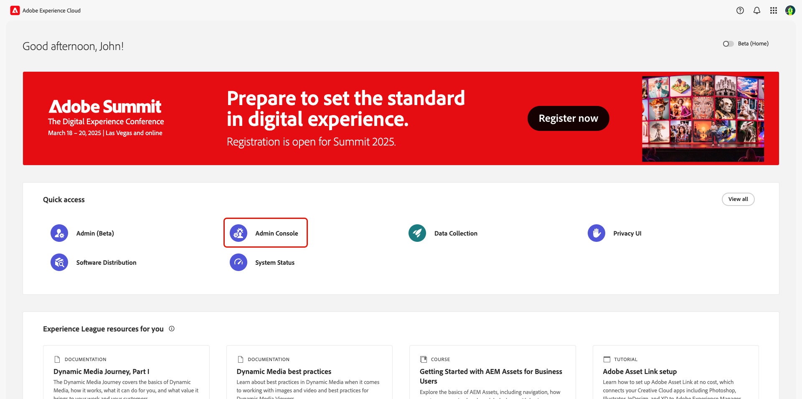
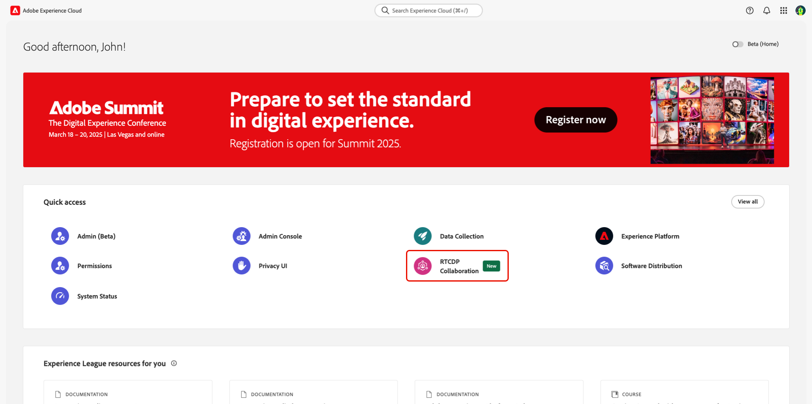

# Gerenciar o acesso do usuário por meio das permissões {#manage-user-access}

{{limited-availability-release-note}}

Gerencie permissões e acesso de usuário a componentes individuais no Adobe Real-Time CDP Collaboration por meio da interface [Permissões](https://experienceleague.adobe.com/en/docs/experience-platform/access-control/abac/permissions-ui/browse){target="_blank"} do Experience Cloud. As permissões permitem que os administradores do sistema e do produto definam [funções](./manage-roles.md) para gerenciar o acesso de usuários a recursos e recursos específicos.

## Configurar acesso às permissões {#permissions-access}

Para acessar as Permissões, você deve ter acesso de administrador de produto e usuário ao produto Adobe Experience Platform. Um administrador de sistema é necessário para configurar privilégios de administrador de produto, enquanto os privilégios de usuário podem ser configurados por um administrador de sistema ou de produto. Para obter mais informações sobre as funções administrativas, leia o guia da [hierarquia de controle de acesso](./overview.md#hierarchy).

>[!TIP]
>
>Neste guia, um **administrador** fará referência a **administradores de sistema e de produto**.

### Administradores do sistema: configurar o acesso do administrador do produto {#admin-access}

Conceda a um administrador de produto do usuário acesso para fornecer recursos administrativos no produto Experience Platform por meio das seguintes etapas:

>[!IMPORTANT]
>
>Como administrador do sistema, você tem acesso imediato a produtos específicos da Experience Cloud, como o Adobe Admin Console. No entanto, para usar as Permissões, você deve fornecer a si mesmo acesso de administrador e usuário ao produto do Experience Platform. Siga o guia passo a passo abaixo para ter acesso como administrador do sistema.

Faça logon no [Adobe Experience Cloud](https://experience.adobe.com/){target="_blank"} com suas credenciais. A exibição inicial é exibida com uma lista dos seus produtos disponíveis na seção **[!UICONTROL Acesso rápido]**. Selecione **[!UICONTROL Admin Console]**.

{zoomable="yes"}

O painel de visão geral do [Adobe Admin Console](https://adminconsole.adobe.com/) é exibido. Selecione **[!UICONTROL Adobe Experience Platform]** na lista **[!UICONTROL Produtos]** em **[!UICONTROL Produtos e serviços]**.

{zoomable="yes"}

O painel do Adobe Experience Platform é exibido. Selecione a guia **[!UICONTROL Administradores]** e depois selecione **[!UICONTROL Adicionar administrador]**.

{zoomable="yes"}

A caixa de diálogo **[!UICONTROL Adicionar administradores de produto]** é exibida. Insira o email ou nome de usuário do usuário no campo de texto **[!UICONTROL Email ou nome de usuário]** e selecione a conta correta na lista suspensa. Selecione **[!UICONTROL Salvar]** para concluir a adição do usuário como administrador do produto.

{zoomable="yes"}

O usuário agora tem privilégios de administrador de produto e pode executar funções administrativas, como adicionar usuários ou outros administradores, ao produto no Admin Console. Em seguida, eles precisarão de acesso do usuário ao produto Experience Platform para acessar e executar funções nas Permissões.

### Administradores: configurar o acesso de usuários ao Experience Platform {#user-access}

Agora que você concedeu acesso de administrador de produto ao usuário, é necessário fornecer a ele acesso de usuário ao produto Experience Platform. Como parte das configurações de acesso, você atribuirá os [perfis de produto](https://helpx.adobe.com/br/enterprise/using/manage-product-profiles.html) específicos do usuário.

>[!TIP]
>
>Se você estiver seguindo a seção anterior, já estará usando o produto Adobe Experience Platform e pode pular a primeira etapa.

Navegue até [Admin Console](https://adminconsole.adobe.com/){target="_blank"} e selecione **[!UICONTROL Adobe Experience Platform]** na lista **[!UICONTROL Produtos]** em **[!UICONTROL Produtos e serviços]**.

{zoomable="yes"}

Selecione a guia **[!UICONTROL Usuários]** e selecione **[!UICONTROL Adicionar usuários]**.

{zoomable="yes"}

A caixa de diálogo **[!UICONTROL Adicionar usuários a este produto]** é exibida. Insira o nome ou email do usuário no campo de texto **[!UICONTROL Nome, grupo de usuários ou endereço de email]** e selecione a conta correta na lista suspensa. Em seguida, selecione a opção de adição **[!UICONTROL Produtos]**.

{zoomable="yes"}

A caixa de diálogo **[!UICONTROL Selecionar perfis de produto]** é exibida. Selecione **[!UICONTROL AEP-Default-All-Users]** e **[!UICONTROL Acesso integral à Produção Padrão]** e **[!UICONTROL Aplicar]**.

{zoomable="yes"}

Confirme se as informações estão corretas e selecione **[!UICONTROL Salvar]**.

{zoomable="yes"}

O usuário deve agora ter acesso de administrador e de produto ao Experience Platform, obtendo acesso às permissões. Em seguida, é necessário atribuir ao usuário duas funções fundamentais para conceder a ele acesso à interface da Experience Platform.

### Administradores: configurar o acesso à interface do usuário do Experience Platform {#product-access}

No Real-Time CDP Collaboration, administradores e usuários finais trabalharão com dados da Experience Platform, como públicos-alvo e logs de auditoria. Esses dados são mantidos em instâncias da Experience Platform chamadas de sandboxes. Para garantir que os usuários possam interagir com esses dados, você precisa atribuir [funções padrão](https://experienceleague.adobe.com/en/docs/experience-platform/access-control/home#default-roles){target="_blank"} ao usuário.

Para começar, navegue até [Adobe Experience Cloud](https://experience.adobe.com/). Agora você deve ver **[!UICONTROL Experience Platform]** e **[!UICONTROL Permissões]** dentro de **[!UICONTROL Acesso rápido]**.

{zoomable="yes"}

>[!NOTE]
>
> Os produtos podem levar vários minutos para obter acesso ao e você receberá um email alertando que recebeu acesso. Se você não estiver vendo o Experience Platform ou as Permissões no Adobe Experience Cloud depois de receber o email, saia e entre novamente na sua conta.

Neste estágio, agora você pode acessar **[!UICONTROL Permissões]**. Se você tentar acessar o **[!UICONTROL Experience Platform]**, receberá um aviso de que nenhuma sandbox está habilitada, como mostrado abaixo. Para resolver isso, você precisa atribuir as funções padrão ao seu usuário. Para começar, selecione **[!UICONTROL Permissões]**.

{zoomable="yes"}

O painel **[!UICONTROL Permissões]** será exibido. Selecione **Usuários** no painel esquerdo e, em seguida, selecione o nome do usuário.

{zoomable="yes"}

Selecione a guia **[!UICONTROL Funções]** e selecione **[!UICONTROL Adicionar funções]**.

{zoomable="yes"}

A caixa de diálogo **[!UICONTROL Adicionar funções]** é exibida. Selecione **[!UICONTROL Acesso integral à Produção Padrão]** e **[!UICONTROL Administradores de Sandbox]** e selecione **[!UICONTROL Salvar]**.

{zoomable="yes"}

Agora você tem acesso ao Experience Platform e às permissões. Na etapa final, você concederá acesso ao Real-Time CDP Collaboration.

### Administradores: configurar o acesso ao Real-Time CDP Collaboration {#RTCDP-collaboration-access}

>[!CONTEXTUALHELP]
>id="rtcdp_collaboration_organization_permissions"
>title="gerenciar guia de acesso dos usuários"
>abstract=""

Para conceder aos usuários acesso ao Collaboration, você usará um conceito de controle de acesso chamado funções. As funções definem o nível de acesso que um administrador ou usuário tem a [recursos](https://experienceleague.adobe.com/en/docs/experience-platform/access-control/home#permissions) em sua organização.

Ao configurar o acesso individual ao Collaboration, você atribuirá as funções dos usuários que contêm permissões do recurso Colaborações. Você pode usar o guia [gerenciar funções](./manage-roles.md) para obter informações sobre:

- as [duas funções padrão](./manage-roles.md#standard-roles) e os níveis de acesso que elas concedem à Collaboration
- criando [funções personalizadas](./manage-roles.md#specific-access-roles) usando o recurso Collaboration
- a lista de permissões incluídas no recurso Colaborações

>[!NOTE]
>
>Além disso, um usuário deve ser atribuído a uma função que contém a permissão **[!UICONTROL Prod]** nos recursos de **[!UICONTROL Sandboxes]**. Ambas as funções padrão contêm essa permissão. Se você optar por atribuir uma função personalizada a um usuário em vez de uma função padrão, certifique-se de que uma das funções às quais ele foi atribuído contenha essa permissão.

Depois de escolher ou criar uma função que inclua o nível de acesso de que seu usuário precisa, é necessário atribuir o usuário a essa função.

#### Atribuir uma função

Você pode atribuir várias funções a um único usuário ou atribuir vários usuários a uma única função. O primeiro caso foi abordado anteriormente ao [atribuir as funções padrão](#product-access) para conceder a um usuário acesso ao Experience Platform. Nas próximas etapas, você atribuirá os usuários diretamente à função selecionada.

Em **[!UICONTROL Permissões]**, selecione **[!UICONTROL Funções]** no painel esquerdo e selecione sua função na lista.

{zoomable="yes"}

A página de detalhes da atribuição é exibida. Selecione a guia **[!UICONTROL Usuários]** e clique em **[!UICONTROL Adicionar usuários]**.

{zoomable="yes"}

A caixa de diálogo **[!UICONTROL Adicionar usuários]** é exibida. Selecione o(s) usuário(s) na lista e selecione **[!UICONTROL Salvar]**.

{zoomable="yes"}

O usuário agora deve ver o **[!UICONTROL RTCDP Collaboration]** listado como um produto em **[!UICONTROL Acesso rápido]** no Experience Cloud.

## Próximas etapas

Agora que os usuários têm acesso ao Real-Time CDP Collaboration, eles podem começar a usar o produto. Para saber mais sobre o produto como um todo, leia o [guia de visão geral](../home.md).
