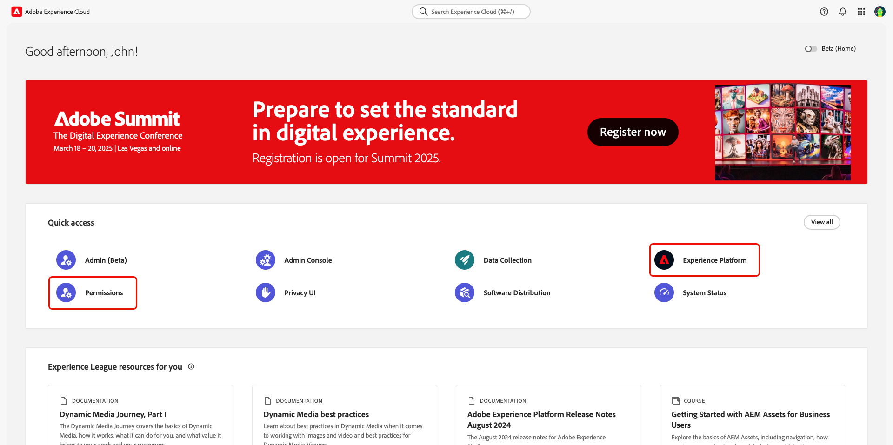
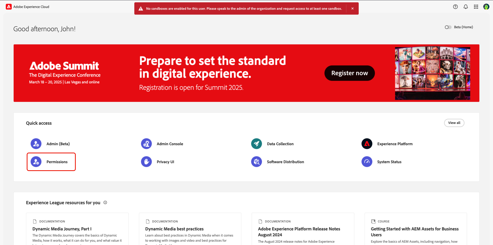
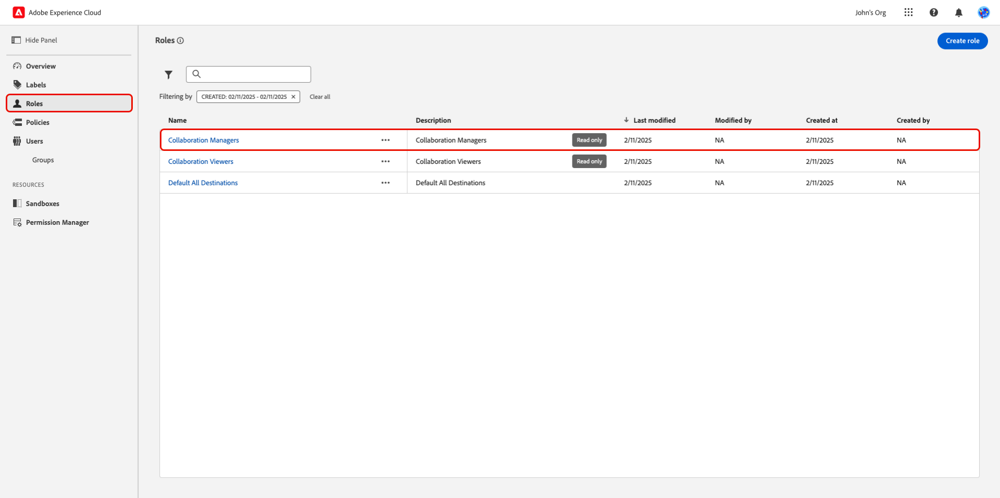
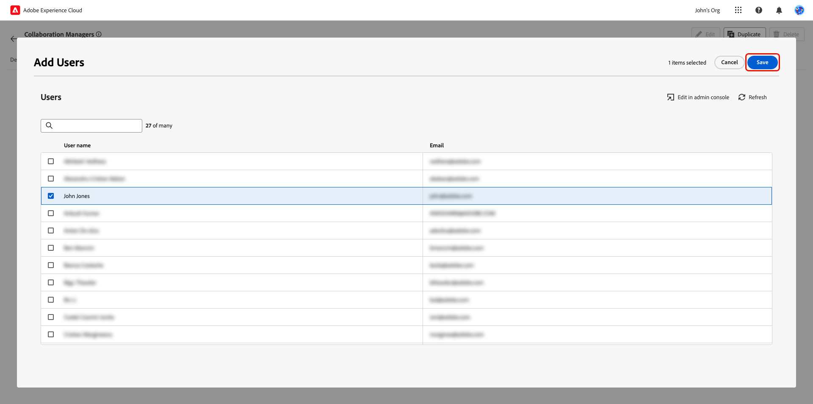

# Gerenciar o acesso do usuário por meio das permissões {#manage-user-access}

{{limited-availability-release-note}}

Gerencie permissões e acesso de usuário a componentes individuais no Adobe Real-Time CDP Collaboration por meio da interface [Permissões](https://experienceleague.adobe.com/en/docs/experience-platform/access-control/abac/permissions-ui/browse){target="_blank"} do Experience Cloud. As permissões permitem que os administradores do sistema e do produto definam [funções](./manage-roles.md) para gerenciar o acesso de usuários a recursos e recursos específicos.

## Configurar acesso às permissões {#permissions-access}

Para acessar as Permissões, você deve ter acesso de administrador de produto e usuário ao produto Adobe Experience Platform. Um administrador de sistema é necessário para configurar privilégios de administrador de produto, enquanto os privilégios de usuário podem ser configurados por um administrador de sistema ou de produto. Para obter mais informações sobre as funções administrativas, leia o guia da [hierarquia de controle de acesso](./overview.md#hierarchy).

>[!TIP]
>
>Neste guia, um **administrador** fará referência a **administradores de sistema e de produto**.

### Administradores do sistema: configurar o acesso do administrador do produto {#admin-access}

Conceda a um administrador de produto do usuário acesso para fornecer recursos administrativos no produto Experience Platform por meio das seguintes etapas:

>[!IMPORTANT]
>
>Como administrador do sistema, você tem acesso imediato a produtos específicos da Experience Cloud, como o Adobe Admin Console. No entanto, para usar as Permissões, você deve fornecer a si mesmo acesso de administrador e usuário ao produto do Experience Platform. Siga o guia passo a passo abaixo para ter acesso como administrador do sistema.

Faça logon no [Adobe Experience Cloud](https://experience.adobe.com/){target="_blank"} com suas credenciais. A exibição inicial é exibida com uma lista dos seus produtos disponíveis na seção **[!UICONTROL Acesso rápido]**. Selecione **[!UICONTROL Admin Console]**.

{zoomable="yes"}

O painel de visão geral do [Adobe Admin Console](https://adminconsole.adobe.com/) é exibido. Selecione **[!UICONTROL Adobe Experience Platform]** na lista **[!UICONTROL Produtos]** em **[!UICONTROL Produtos e serviços]**.

{zoomable="yes"}

O painel do Adobe Experience Platform é exibido. Selecione a guia **[!UICONTROL Administradores]** e depois selecione **[!UICONTROL Adicionar administrador]**.

{zoomable="yes"}

A caixa de diálogo **[!UICONTROL Adicionar administradores de produto]** é exibida. Insira o email ou nome de usuário do usuário no campo de texto **[!UICONTROL Email ou nome de usuário]** e selecione a conta correta na lista suspensa. Selecione **[!UICONTROL Salvar]** para concluir a adição do usuário como administrador do produto.

{zoomable="yes"}

O usuário agora tem privilégios de administrador de produto e pode executar funções administrativas, como adicionar usuários ou outros administradores, ao produto no Admin Console. Em seguida, eles precisarão de acesso do usuário ao produto Experience Platform para acessar e executar funções nas Permissões.

### Administradores: configurar o acesso de usuários ao Experience Platform {#user-access}

Agora que você concedeu acesso de administrador de produto ao usuário, é necessário fornecer a ele acesso de usuário ao produto Experience Platform. Como parte das configurações de acesso, você atribuirá os [perfis de produto](https://helpx.adobe.com/br/enterprise/using/manage-product-profiles.html) específicos do usuário.

>[!TIP]
>
>Se você estiver seguindo a seção anterior, já estará usando o produto Adobe Experience Platform e pode pular a primeira etapa.

Navegue até [Admin Console](https://adminconsole.adobe.com/){target="_blank"} e selecione **[!UICONTROL Adobe Experience Platform]** na lista **[!UICONTROL Produtos]** em **[!UICONTROL Produtos e serviços]**.

{zoomable="yes"}

Selecione a guia **[!UICONTROL Usuários]** e selecione **[!UICONTROL Adicionar usuários]**.

{zoomable="yes"}

A caixa de diálogo **[!UICONTROL Adicionar usuários a este produto]** é exibida. Insira o nome ou email do usuário no campo de texto **[!UICONTROL Nome, grupo de usuários ou endereço de email]** e selecione a conta correta na lista suspensa. Em seguida, selecione a opção de adição **[!UICONTROL Produtos]**.

{zoomable="yes"}

A caixa de diálogo **[!UICONTROL Selecionar perfis de produto]** é exibida. Selecione **[!UICONTROL AEP-Default-All-Users]** e **[!UICONTROL Acesso integral à Produção Padrão]** e **[!UICONTROL Aplicar]**.

{zoomable="yes"}

Confirme se as informações estão corretas e selecione **[!UICONTROL Salvar]**.

{zoomable="yes"}

The user should now have product administrator and product access to Experience Platform, gaining them access to Permissions. Next, you need to assign the user two fundamental roles to give them access to the Experience Plaform UI.

### Administrators: configure Experience Platform UI access {#product-access}

In Real-Time CDP Collaboration, administrators and end users will be working with data from Experience Platform, such as audiences and audit logs. This data is held within instances of Experience Platform called sandboxes. To ensure users can interact with this data, you need to assign [default roles](https://experienceleague.adobe.com/en/docs/experience-platform/access-control/home#default-roles){target="_blank"} to the user.

To begin, navigate to [Adobe Experience Cloud](https://experience.adobe.com/). You should now see **[!UICONTROL Experience Platform]** and **[!UICONTROL Permissions]** inside of **[!UICONTROL Quick access]**.

{zoomable="yes"}

>[!NOTE]
>
> The products can take several minutes to gain access to and you&#39;ll receive an email alerting you that you&#39;ve recieved access. If you&#39;re not seeing Experience Platform or Permissions in Adobe Experience Cloud after receiving the email, log out and then back in to your account.

At this stage, you can now access **[!UICONTROL Permissions]**. If you try to access **[!UICONTROL Experience Platform]**, you&#39;ll get a warning that no sandboxes are enabled, as shown below. To solve this, you need to assign the default roles to your user. To begin, select **[!UICONTROL Permissions]**.

{zoomable="yes"}

The **[!UICONTROL Permissions]** dashboard will display. Select **Users** from the left panel and then select the user&#39;s name.

{zoomable="yes"}

Select the **[!UICONTROL Roles]** tab and then select **[!UICONTROL Add roles]**.

{zoomable="yes"}

The **[!UICONTROL Add Roles]** dialog appears. Select **[!UICONTROL Default Production All Access]** and **[!UICONTROL Sandbox Administrators]** and then select **[!UICONTROL Save]**.

{zoomable="yes"}

You now have access to Experience Platform and Permissions. In the final step, you&#39;ll grant access to Real-Time CDP Collaboration.

### Admins: configurar o acesso ao Real-Time CDP Collaboration {#RTCDP-collaboration-access}

>[!CONTEXTUALHELP]
>id="rtcdp_collaboration_organization_permissions"
>title="gerenciar guia de acesso dos usuários"
>abstract=""

To grant users access to Collaboration, you&#39;ll use an access control concept called roles. Roles define the level of access a administrator or user has to [resources](https://experienceleague.adobe.com/en/docs/experience-platform/access-control/home#permissions) in your organization.

When configuring individual access to Collaboration, you&#39;ll assign users&#39; roles containing permissions from the Collaborations resource. You can use the [manage roles](./manage-roles.md) guide to find out information on:

- the [two standard roles](./manage-roles.md#standard-roles) and the levels of access they grant to Collaboration
- creating [custom roles](./manage-roles.md#specific-access-roles) using the Collaboration resource
- the list of permissions included in the Collaborations resource

>[!NOTE]
>
>Additionally, a user must be assigned to a role containing the **[!UICONTROL Prod]** permission in the **[!UICONTROL Sandboxes]** resources. Both standard roles contain this permission. If you choose to assign a user a custom role instead of a standard role, you must ensure one of the roles they are assigned to contain this permission.

Once you&#39;ve chosen or created a role that encompasses the level of access your user needs, you need to assign the user to that role.

#### Assign a role

You may assign multiple roles to a single user or assign multiple users to a single role. The first case was covered earlier when [assigning the default roles](#product-access) to give a user access to Experience Platform. In the next steps, you&#39;ll assign users directly to the role you&#39;ve selected.

In **[!UICONTROL Permissions]** select **[!UICONTROL Roles]** from the left panel and then select your role from the list.

{zoomable="yes"}

The role&#39;s detail page displays. Select the **[!UICONTROL Users]** tab and then select **[!UICONTROL Add Users]**.

{zoomable="yes"}

The **[!UICONTROL Add Users]** dialog appears. Select the user(s) from the list and then select **[!UICONTROL Save]**.

{zoomable="yes"}

O usuário agora deve ver o **[!UICONTROL RTCDP Collaboration]** listado como um produto em **[!UICONTROL Acesso rápido]** no Experience Cloud.

## Próximas etapas

Agora que os usuários têm acesso ao Real-Time CDP Collaboration, eles podem começar a usar o produto. Para saber mais sobre o produto como um todo, leia o [guia de visão geral](../home.md).
