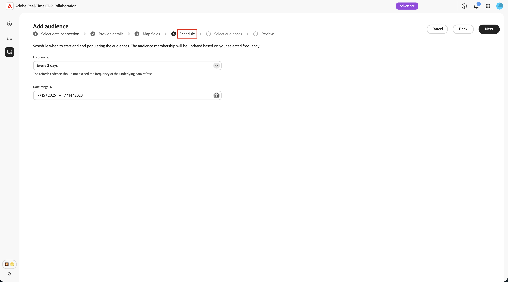
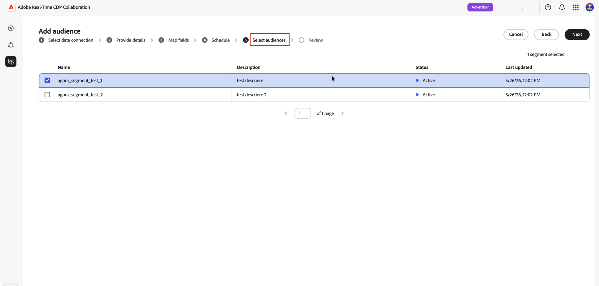

# Configurar o Adobe Audience Manager para fornecimento de público

Saiba como conectar sua instância do Adobe Audience Manager (AAM) ao Adobe Real-Time CDP Collaboration para que você possa obter segmentos primários qualificados na plataforma. Depois de criar a conexão, o Collaboration recupera a associação de público-alvo da Adobe Audience Manager em uma programação recorrente e disponibiliza esses públicos-alvo para análise e ativação de sobreposição em seus projetos de colaboração.

>[!NOTE]
>
> Os públicos-alvo provenientes da Audience Manager seguem as mesmas regras de governança e manipulação de dados que os públicos-alvo provenientes da Adobe Experience Platform. Somente segmentos criados de fontes de dados primárias são qualificados. Segmentos que incluem dados de terceiros ou fontes da Audience Marketplace não são compatíveis.

## Pré-requisitos {#prerequisites}

Conclua todos os itens desta seção antes de iniciar o fluxo de trabalho de configuração. Pré-requisitos incompletos são o motivo mais comum pelo qual a configuração falha ou os públicos-alvo não aparecem após a origem. Antes de seguir este guia, você deve ter concluído a integração e a configuração da [conta](./onboard-account.md).

### Acesso e permissões do Adobe Audience Manager {#aam-access-and-permissions}

Antes de continuar, confirme se você tem:

* Um contrato Adobe Audience Manager ativo e uma instância Audience Manager provisionada.
* Acesso à interface do usuário do Audience Manager com permissão para exibir os segmentos que você deseja originar.
* Sua instância do Audience Manager e conta do Collaboration provisionadas na mesma organização do Adobe IMS. Não há suporte para fornecimento entre organizações.

### Requisitos de qualificação de segmento {#aam-segments-requirements}

Ao configurar a conexão, o Collaboration filtra automaticamente a lista de segmentos com base nas seguintes regras.

**Somente dados próprios**

Somente segmentos baseados em seus próprios dados primários estão disponíveis para origem. Os segmentos que incluem características de provedores de dados de terceiros ou do AAM Audience Marketplace são excluídos.

**Filtro de recenticidade**

Somente segmentos que foram criados ou atualizados **nos últimos 13 meses** estão disponíveis para fornecimento. Os segmentos mais antigos são excluídos durante a configuração da conexão e em cada atualização subsequente.

### Requisitos de consentimento {#consent-requirements}

Todos os segmentos do AAM originados no Collaboration devem ser filtrados após o consentimento. Se um marcador de recusa estiver presente para um perfil no momento da exportação, esse perfil será excluído antes de chegar à Collaboration.

>[!IMPORTANT]
>
>Você é responsável por garantir que o consentimento seja configurado e aplicado corretamente na instância do Audience Manager antes de se conectar ao Collaboration. A Adobe não reaplica regras de consentimento depois que os dados saem do Audience Manager.

## Configurar a conexão do Audience Manager {#configure-aam-connection}

O fluxo de trabalho de configuração é um assistente de várias etapas dentro do espaço de trabalho **[!UICONTROL Instalação]**. Conclua cada etapa em sequência. Você pode retornar a qualquer etapa usando o ícone de lápis na tela de revisão final antes de criar a conexão.

### Adicionar uma conexão de dados {#add-data-connection}

Na guia **[!UICONTROL Meus públicos-alvo]** do espaço de trabalho **[!UICONTROL Configuração]**, selecione o ícone adicionar () e selecione **[!UICONTROL Público]**.

Se este for seu primeiro público-alvo, você também poderá selecionar a opção **[!UICONTROL Adicionar público-alvo]**.

O fluxo de trabalho Adicionar público-alvo é exibido. Selecione **[!UICONTROL Adicionar nova conexão de dados]** e **[!UICONTROL Avançar]**.

{zoomable="yes"}

### Selecione Adobe Audience Manager como a conexão de dados {#select-aam}

A tela de seleção da fonte de dados lista todos os tipos de conexão disponíveis. Selecione **[!UICONTROL Adobe Audience Manager]** como conexão de dados e clique em **[!UICONTROL Avançar]**.

### Confirmar o consentimento e o uso de dados {#confirm-consent-data-use}

Antes de continuar, confirme se você aplicou as opções de não participação exigidas por lei aos dados do público-alvo enviados para o Collaboration. Se você não tiver certeza se seus dados atendem a esse requisito, revise o guia [políticas de governança e ações de imposição](./onboard-audiences.md#governance-policy-and-enforcement-actions) antes de continuar. Marque a caixa de seleção de confirmação e selecione **[!UICONTROL OK]** para continuar.

### Fornecer detalhes da conexão {#provide-connection-details}

Em seguida, digite um nome e uma descrição opcional para essa conexão de dados. Após a criação da conexão, o nome fornecido aparece na guia **[!UICONTROL Minhas conexões de dados]** e ajuda a identificar essa fonte no futuro.

* **[!UICONTROL Nome da conexão de dados]** (obrigatório)
* **[!UICONTROL Descrição da conexão de dados]** (opcional)

Quando terminar, selecione **[!UICONTROL Próximo]**.

### Revisar mapeamento de identidade {#review-identity-mapping}

A tela **[!UICONTROL Mapping]** é somente leitura. O Collaboration mapeia automaticamente a saída de identidade compatível dos segmentos do AAM para os campos de identidade da Collaboration. Consulte a tabela a seguir para obter mais informações.

| Saída de identidade do AAM | Campo de identidade do Collaboration | Notas |
| ------------------- | ---------------------------- | ----- |
| `Demdex ID` | `DEMDEX_ID` | Saída de identidade compatível com essa integração. A Collaboration não traduz a ID Demdex para a ECID durante o fornecimento. |
| `GAID` | `GAID` | Saída de identidade compatível com essa integração. |
| `IDFA` | `IDFA` | Saída de identidade compatível com essa integração. |

{style="table-layout:auto"}

Você pode revisar o mapeamento, mas não pode modificá-lo neste estágio. Clique em **[!UICONTROL Avançar]** para continuar.

### Agendar atualização de dados {#schedule-data-refresh}

Na exibição **[!UICONTROL Agendamento]**, defina a frequência de atualização na qual o Collaboration recupera os dados atualizados de associação ao público dos segmentos do AAM e defina o intervalo de datas ativo para a origem.

Use a lista suspensa **[!UICONTROL Frequência]** para selecionar um intervalo de atualização entre um e seis dias. Em seguida, use o calendário para definir datas de início e término para o fornecimento de público-alvo. Quando a data final é atingida, a origem é interrompida e os públicos-alvo originados anteriormente expiram.

>[!IMPORTANT]
>
>Os segmentos do Audience Manager normalmente são atualizados a cada 24-48 horas com base nas regras de recenticidade e frequência de características. Definir um intervalo de atualização do Collaboration mais curto do que isso pode consumir créditos do Collaboration sem resultados atualizados. Para monitorar o uso do crédito, consulte [Rastrear a atividade de consumo de crédito](./my-activity.md).

Depois de concluído, selecione **[!UICONTROL Próximo]**.

### Selecionar públicos-alvo {#select-audiences}

Você pode exibir uma lista de segmentos elegíveis que usam características de fonte de dados primárias e foram criados ou atualizados nos últimos 13 meses.

Selecione os segmentos que deseja originar na Collaboration. Você pode pesquisar por nome ou rolar a tela para encontrar segmentos específicos. Selecione **[!UICONTROL Avançar]** quando terminar.

>[!TIP]
>
>Se um segmento que você espera ver não estiver listado, verifique se ele foi atualizado nos últimos 13 meses e usa somente características de fonte de dados primárias. Segmentos com características de terceiros ou do Audience Marketplace são excluídos.

### Revisar e concluir a conexão {#review-and-complete}

Revise o resumo completo da configuração antes de criar a conexão. A tela de resumo mostra as seguintes seções:

* **[!UICONTROL Detalhes]**: o nome e a descrição opcional desta conexão de dados.
* **[!UICONTROL Seleção de público-alvo]**: os segmentos do AAM selecionados.
* **[!UICONTROL Mapeamento]**: o mapeamento do campo de identidade dos campos de origem do AAM para os campos de identidade do Collaboration.
* **[!UICONTROL Agendar]**: a frequência de atualização e o intervalo de datas ativo.

Selecione o ícone de lápis () ao lado de qualquer seção se precisar fazer alterações. Selecione **[!UICONTROL Concluir]** para confirmar todas as seções.

Uma caixa de diálogo de confirmação é exibida, indicando que a conexão de dados foi criada e que a origem do público-alvo está em andamento.

## Revisar públicos-alvo originados {#review-sourced-audiences}

Após concluir o assistente, o Collaboration começa a recuperar os dados de associação de público-alvo de seus segmentos do AAM selecionados de forma assíncrona. Navegue até **[!UICONTROL Configuração] > [!UICONTROL Meus públicos-alvo]** para monitorar o progresso.

### Monitorar o progresso do fornecimento de público {#monitor-progress}

Enquanto a Collaboration recupera os dados de segmento da AAM, um banner na parte superior do espaço de trabalho **[!UICONTROL Meus públicos]** indica que a origem está em andamento. Públicos-alvo individuais aparecem na lista como conclusões de seleção de fornecedor para cada segmento.

### Exibir detalhes do público-alvo de origem {#view-sourced-audience-details}

Quando a origem for concluída, os segmentos do AAM aparecerão na guia **[!UICONTROL Meus públicos-alvo]**. A coluna **[!UICONTROL Source]** as identifica como **[!UICONTROL Adobe Audience Manager]**.

Selecione uma linha ou a opção **[!UICONTROL Exibir público-alvo]** para abrir a exibição detalhada de um público-alvo específico.

A exibição detalhada mostra:

* **[!UICONTROL Identidades]**: a contagem total de identidades e todas as informações de detalhamento disponíveis.
* **[!UICONTROL Categorias]**: todas as marcas aplicadas para organizar ou filtrar o público-alvo.
* **[!UICONTROL Acesso à conexão]**: se o público-alvo é privado, público ou compartilhado com colaboradores específicos.
* **[!UICONTROL Visibilidade de metadados]**: quais informações de público-alvo estão visíveis para os colaboradores.

Use esta exibição para confirmar as configurações de público-alvo e as configurações de visibilidade antes de usar o público-alvo em projetos de colaboração. Para atualizar categorias, acesso à conexão ou visibilidade de metadados, consulte [Exibir e gerenciar públicos-alvo individuais](./onboard-audiences.md#view-individual-audiences).

## Limitações conhecidas

Observe as seguintes restrições ao configurar e usar o conector de origem do Audience Manager:

* **Somente dados próprios:** Segmentos que incluem características de provedores de dados de terceiros ou do Adobe Audience Marketplace não podem ser originados. Somente os segmentos criados totalmente de suas próprias fontes de dados primárias são qualificados.
* Janela de recenticidade de segmento de **13 meses:** somente segmentos criados ou atualizados nos últimos 13 meses estão disponíveis para seleção durante a instalação e em cada atualização agendada.
* **Nenhuma atualização sob demanda:** As atualizações de dados de público-alvo estão de acordo com o agendamento que você configura. A atualização manual e imediata não é suportada.
* **Uma conexão ativa do AAM por organização:** Há suporte para apenas uma conexão ativa de dados do AAM por organização IMS.
* **Restrições de chave de correspondência:** depois que uma chave de correspondência é habilitada para uma conexão de dados, ela não pode ser removida. Para alterar chaves de correspondência ativas, exclua a conexão e crie uma nova.

## Solução de problemas {#troubleshooting}

Leia esta seção para resolver problemas comuns após estabelecer a conexão inicial.

**Os públicos-alvo não estão aparecendo ou a fonte está demorando mais do que o esperado**

* O tempo de fornecimento é escalonado com o número de segmentos selecionados e o tamanho de cada população de segmento.
* Se os públicos-alvo não aparecerem em 24 horas, confirme se os segmentos selecionados ainda estão ativos no Audience Manager e têm contagem de população diferente de zero.
* Verifique na guia **[!UICONTROL Minhas conexões de dados]** se há indicadores de erro na conexão.
* Se o problema persistir, entre em contato com o suporte ao cliente da Adobe com o nome da conexão de dados e os nomes dos segmentos que não estão aparecendo.

**Um segmento que eu esperava selecionar não estava disponível durante a configuração**

Confirme se o segmento:

* Foi criado ou atualizado pela última vez nos últimos 13 meses. Segmentos mais antigos não são mostrados.
* Usa somente características próprias. Segmentos com características de terceiros ou do Audience Marketplace são excluídos.
* Pertence à Organização IMS configurada para a conexão.

**A conexão de dados mostra um status de falha após êxito inicial**

* Confirme se o relacionamento da organização IMS entre sua instância do AAM e a conta da Collaboration não foi alterado.
* Confirme se os segmentos selecionados ainda existem no AAM e não foram excluídos.
* Se o problema persistir, [exclua a conexão](./manage-data-connection.md#delete-data-connection) e crie uma nova ou entre em contato com o suporte ao cliente da Adobe.

## Próximas etapas {#next-steps}

Agora você configurou o Audience Manager como uma fonte de dados no Collaboration. Após a conclusão do fornecimento, seus públicos-alvo estarão disponíveis no espaço de trabalho **[!UICONTROL Meus públicos-alvo]** e prontos para uso em projetos de colaboração. Se os públicos-alvo não aparecerem após a conclusão do processo de fornecimento inicial, revise a seção [solução de problemas](#troubleshooting) nesta página.

Aqui você pode:

* [Criar e gerenciar projetos de colaboração](../collaborate/manage-projects.md)
* [Ativar públicos em um projeto](../collaborate/activate.md)
* [Revisar sobreposições e medir o desempenho](../collaborate/measure.md)
* [Gerenciar configurações e visibilidade de público](./onboard-audiences.md)
* [Gerenciar suas conexões de dados](./manage-data-connection.md)

Para outros métodos de fornecimento de público-alvo, consulte:

* [Configurar [!DNL Amazon S3] para fornecimento de público](./configure-aws-s3-audience-sourcing.md)
* [Configurar [!DNL Google Cloud Storage] para fornecimento de público](./configure-gcs-audience-sourcing.md)
* [Configurar [!DNL Snowflake] para fornecimento de público](./configure-snowflake-audience-sourcing.md)
* [Públicos-alvo da Source no Experience Platform](./onboard-audiences.md)
* [Fazer upload de um arquivo CSV para fornecimento de público](./upload-csv-audience-sourcing.md)
