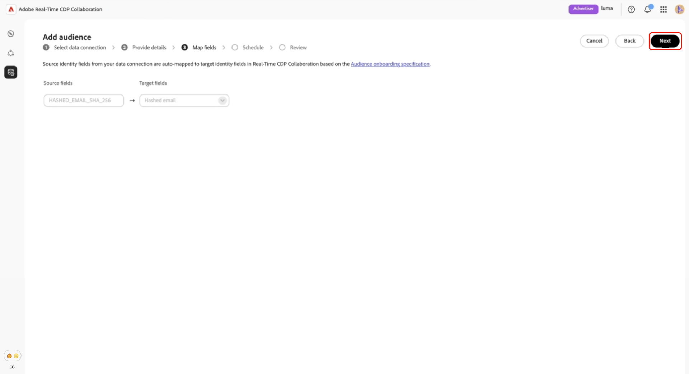
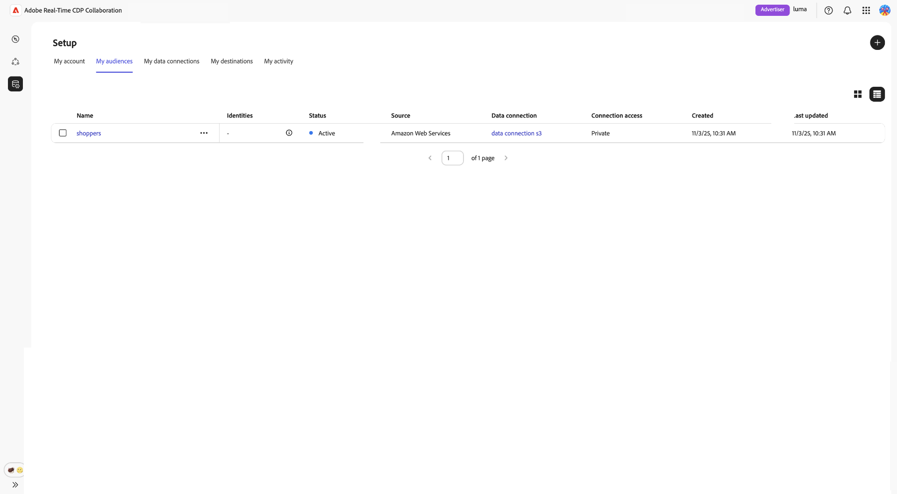

# [!DNL Amazon S3]

[!DNL Amazon S3]

>[!IMPORTANT]
>
>Before following this guide, you must have completed the steps to authorize Adobe&#39;s IAM role within your AWS account.\
>**[&#128279;](./configure-aws-permissions-audience-sourcing.md)**

## Visão geral {#overview}

[!DNL Amazon S3]

Audiences sourced through S3 follow the same governance and data handling rules as those sourced from Adobe Experience Platform.

## Pré-requisitos {#prerequisites}

Before configuring your S3 data connection, ensure the following:

* **[!DNL Amazon S3]**&#x200B;**[&#128279;](../../assets/quick-start/RTCDP_Collaboration_Audience_Sourcing_Spec_v1.2.pdf)**
* **&#x200B;**&#x200B;**&#x200B;**&#x200B;**[&#128279;](./configure-aws-permissions-audience-sourcing.md)**

   * `ListBucket`
   * `GetBucketLocation`
   * `GetObject`

* You have the following values ready:

   * **&#x200B;**
   * **&#x200B;**
   * **&#x200B;**

>[!NOTE]
>
>**&#x200B;**

## [!DNL Amazon S3] {#configure-aws-s3-connection}

**&#x200B;**&#x200B;**&#x200B;****&#x200B;**

**&#x200B;**

**&#x200B;**&#x200B;**&#x200B;**

{zoomable="yes"}

### [!DNL Amazon S3] {#select-aws-s3}

**&#x200B;**&#x200B;**&#x200B;**

![[!DNL Amazon S3]](../../assets/setup/aws-audience-sourcing/select-s3-data-connection.png)

### Revisar requisitos do arquivo de público-alvo {#review-audience-requirements}

>[!CONTEXTUALHELP]
>id="rtcdp_collaboration_audience_sourcing_specifications"
>title="Prepare seus dados para integração"
>abstract="Leia o guia para especificar a origem do público-alvo para saber como formatar e estruturar os dados de público-alvo no Amazon S3 for Collaboration."
>additional-url="https://www.adobe.com/go/rtcdp-collaboration-audience-sourcing" text="Consulte o guia"

**[&#128279;](../../assets/quick-start/RTCDP_Collaboration_Audience_Sourcing_Spec_v1.2.pdf)**&#x200B;[!DNL Amazon S3]

>[!IMPORTANT]
>
>[!DNL Amazon S3]&#x200B;[!DNL Amazon S3]

Your audience files must comply with the Audience Sourcing Specification. The match keys are automatically mapped based on the required format.

Key considerations include:

* `|`
* If uploading multiple files, ensure all files contain identical columns.
* `AUDIENCE_ID` `HASHED_EMAIL_SHA_256` `HASHED_PHONE_SHA_256` `HASHED_IPV4_SHA_256` `CRM_ID` `LOYALTY_ID` `ADFIXUS_ID`
* Data refreshes occur every 1–6 days based on your selection during the sourcing setup in Collaboration.

### Autentique sua conexão do S3 {#authenticate-s3-connection}

>[!CONTEXTUALHELP]
>id="rtcdp_collaboration_sources_s3_folderpath"
>title="Formato do caminho da pasta"
>abstract="Insira o caminho da pasta (prefixo) no bucket do [!DNL Amazon S3] em que os arquivos de público-alvo estão armazenados. <ul><li>Não inicie caminhos com uma barra (/).</li><li>Inclua uma barra no final do caminho.</li><ul> Exemplo válido: `base/path/` Exemplo inválido: `/base/path`"

>[!CONTEXTUALHELP]
>id="rtcdp_collaboration_audience_sharing_amazon_s3"
>title="Adicionar público-alvo para o Amazon S3"
>abstract="Para conectar seu armazenamento do Amazon S3, autorize o usuário do serviço da Adobe a recuperar os dados do público-alvo para processamento. Siga as etapas descritas na Experience League para conceder à Adobe acesso ao seu armazenamento do Amazon S3."

[!DNL Amazon S3]

**[&#128279;](./configure-aws-permissions-audience-sourcing.md)**&#x200B;[!DNL Amazon S3]

* Função do IAM
* S3 Bucket Name
* Folder Path

![[!DNL Amazon S3]](../../assets/setup/aws-audience-sourcing/s3-authentication-credentials-form.png)

### Confirm consent acknowledgment {#confirm-consent}

Você deve reconhecer que as opções de recusa de consentimento foram removidas antes de continuar. Marque a caixa de confirmação seguida de **[!UICONTROL OK]** para confirmar.

### Validar resultados de autenticação {#validate-authentication}

Após a conexão, o sistema valida suas credenciais e exibe uma das seguintes mensagens:

| Status | Mensagem | Descrição |
|---| ---|---|
| **Sucesso** | **[!UICONTROL Autenticação bem-sucedida]** | Your connection to [!DNL Amazon S3] has been established successfully. |
| **Falha** | **[!UICONTROL Falha na autenticação]** | Revise suas credenciais e tente novamente. |
| **Acesso negado** | **[!UICONTROL Acesso negado]** | Suas credenciais não têm as permissões necessárias para acessar este bucket do [!DNL Amazon S3]. Please verify access settings or contact your administrator. |
| **Formato de arquivo inválido** | **[!UICONTROL Formato de arquivo inválido]** | Os dados do público-alvo não correspondem à estrutura esperada. Certifique-se de que seus arquivos estejam em conformidade com as Especificações de origem de público-alvo. |
| **Nenhum arquivo de público encontrado** | **[!UICONTROL Nenhum arquivo de público encontrado]** | Confirme se os arquivos de público-alvo existem no caminho de pasta especificado e se o caminho está acessível. |
| **Internal error** | **[!UICONTROL Ocorreu um erro interno]** | Tente novamente. Se o problema persistir, entre em contato com o suporte ao cliente. |

### Provide connection details {#provide-connection-details}

Insira um nome descritivo e uma descrição opcional para sua conexão de dados do S3. 

* **&#x200B;**
* **&#x200B;**

### Review auto-mapped identity fields {#auto-mapped-fields}

**&#x200B;**

**&#x200B;**

### Schedule refresh frequency and date range {#schedule-refresh}

**&#x200B;**

>[!IMPORTANT]
>
>To manage your Collaboration credits effectively, set the refresh frequency to match or exceed the update frequency of your underlying S3 data. The minimum supported refresh interval is once every six days.

### Review and complete the connection {#review-and-complete}

Finally, review your configuration settings in the summary screen. This view contains a summary of the following sections:

* **&#x200B;**
* **&#x200B;**
* **&#x200B;**`HASHED_EMAIL`
* **&#x200B;**

**&#x200B;**

A dialog confirmation appears stating that the data connection was created successfully and that audience sourcing in progress.

## Review sourced audiences {#review-sourced-audiences}

[!DNL Amazon S3]&#x200B;**&#x200B;**

If audience sourcing is in progress, a banner appears at the top of the screen. Individual audiences appear only after sourcing completes.

![[!DNL Amazon S3]](../../assets/setup/aws-audience-sourcing/s3-audiences-sourcing-in-progress.png)

Once the S3 audiences are sourced, your list of available audiences are provided in a tabulated or card view.

>[!TIP]
>
>**&#x200B;**

**&#x200B;**

**&#x200B;**&#x200B;**&#x200B;**&#x200B;**&#x200B;**&#x200B;**&#x200B;**

Use this view to confirm audience configuration and visibility settings before using the audience in collaboration projects.

[&#128279;](https://experienceleague.adobe.com/en/docs/real-time-cdp-collaboration/using/setup/onboard-audiences#view-audiences-dashboard)

## View your S3 data connection {#view-s3-connection}

[!DNL Amazon S3]&#x200B;**&#x200B;**

Your S3 data connection includes the same functionality and details as other audience data connections, except that you cannot add or edit audiences directly from this view.

>[!NOTE]
>
>[!DNL Amazon S3]

![[!DNL Amazon S3]](../../assets/setup/aws-audience-sourcing/s3-data-connections-tab.png)

## Próximas etapas {#next-steps}

[!DNL Amazon S3]

**&#x200B;**&#x200B;[&#128279;](./onboard-audiences.md)
