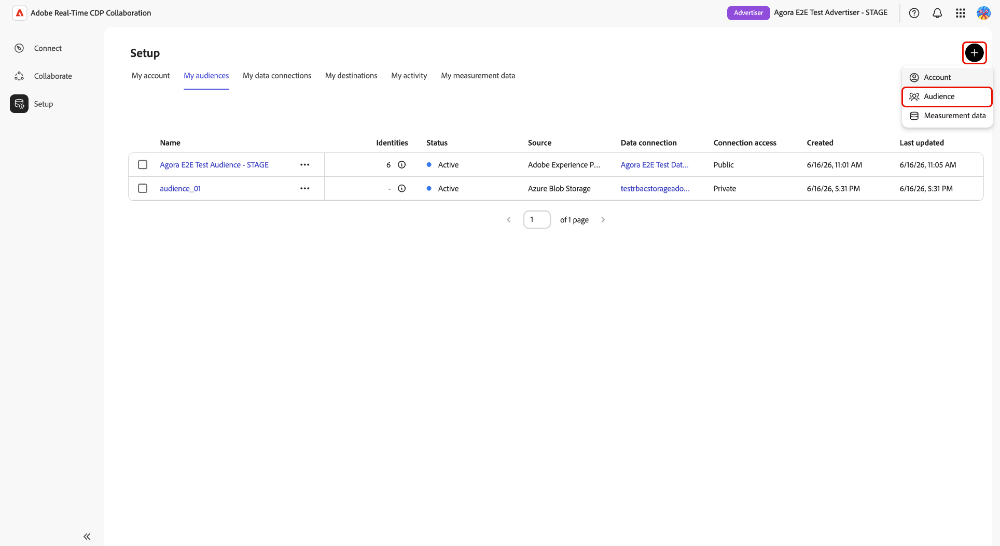

# Públicos-alvo da Source do armazenamento da Azure

Conecte o [!DNL Azure Blob Storage] ou o [!DNL Azure Data Lake Storage] (ADLS) Gen2 ao Adobe Real-Time CDP Collaboration para obter dados de público-alvo primário para ativação e análise de sobreposição.

Use este guia para criar uma conexão de dados [!DNL Azure] reutilizável e executar uma importação única do local de armazenamento configurado. Antes de começar, confirme se seus arquivos de público-alvo atendem à [Especificação de origem de público-alvo](../../assets/quick-start/RTCDP_Collaboration_Audience_Sourcing_Spec_v1_3.pdf). Você concederá à Adobe acesso de leitura ao seu armazenamento Azure durante o processo de configuração.

## Escolha seu tipo de origem [!DNL Azure] {#choose-source-type}

O Collaboration oferece suporte a duas opções de assimilação de [!DNL Azure]. Use a tabela abaixo para escolher o caminho do guia que corresponde ao local em que seus arquivos de público-alvo vivem.

| | **[!DNL Azure Blob Storage]** | **[!DNL Azure Data Lake Storage]Ger2** |
|---|---|---|
| **Usar quando** | Os arquivos estão em um Blob **contêiner** padrão em uma conta de armazenamento (nenhum namespace hierárquico é necessário). | Os arquivos estão em um **sistema de arquivos** em uma conta de armazenamento com **namespace hierárquico habilitado (ADLS Gen2)**. |
| **Opção do Source no Collaboration** | **[!DNL Azure Blob Storage]** | **[!DNL Azure Data Lake Storage]Ger2** |
| **Campos obrigatórios no Collaboration** | Conta de armazenamento, **[!UICONTROL Container]**, **[!UICONTROL Path]** | Conta de armazenamento, **[!UICONTROL Contêiner]** (sistema de arquivos ADLS Gen2), **[!UICONTROL Caminho]** |
| **Seção de permissões** | [[!DNL Azure Blob] permissões](#set-up-azure-blob-storage-permissions) | [[!DNL Azure Data Lake Storage] Permissões Gen2](#set-up-adls-gen2-permissions) |

Você só pode configurar **um tipo de origem por conexão de dados**. Para origem do [!DNL Blob] e do ADLS, crie conexões de dados separadas.

## Pré-requisitos {#prerequisites}

Antes de seguir este guia, conclua a integração e a configuração da [conta](./onboard-account.md). Em seguida, conclua os pré-requisitos nesta seção antes de iniciar o workflow de configuração.

Algumas etapas requerem ação de um **[!DNL Azure]administrador**. Se você não for o administrador [!DNL Azure] da sua organização, identifique a pessoa apropriada antes de iniciar.

### [!DNL Azure] acesso e permissões {#azure-access-and-permissions}

Antes de configurar a conexão no Collaboration, você ou o administrador do [!DNL Azure] deve conceder ao Adobe acesso de leitura ao contêiner de armazenamento ou ao sistema de arquivos ADLS Gen2 que contém os arquivos de público-alvo. Após a conclusão da configuração de permissão, o fluxo de trabalho de configuração do Collaboration valida o acesso durante a etapa **[!UICONTROL Consentimento]**.

### Preparar os dados do público {#prepare-audience-data}

Seus arquivos de público-alvo devem estar em conformidade com a **[Especificação de origem de público-alvo (v1.2)](../../assets/quick-start/RTCDP_Collaboration_Audience_Sourcing_Spec_v1_3.pdf)** antes do início do fornecimento.

Os principais requisitos incluem:

* **Formato de arquivo:** CSV, usando vírgulas como delimitadores de campo e barras verticais (`|`) como separadores para vários valores em um único campo.
* **Campos obrigatórios:** todos os registros devem incluir uma coluna `AUDIENCE_ID` e pelo menos uma coluna de chave de correspondência com suporte.
* **Chaves de correspondência com suporte:** `HASHED_EMAIL_SHA_256`, `HASHED_PHONE_SHA_256`, `HASHED_IPV4_SHA_256`, `CRM_ID`, `LOYALTY_ID`, `ADFIXUS_ID`.
* **Requisitos de hash:** Todos os valores de chave correspondentes devem ser cortados, ter letras minúsculas e ter hash SHA256 antes do carregamento. O Collaboration não faz hash ou normaliza dados antes da assimilação.
* **Consistência de coluna:** todos os arquivos no caminho configurado devem usar estruturas de coluna idênticas.

Todas as chaves de correspondência presentes nos arquivos de público-alvo também devem ser habilitadas para a conta do Collaboration. Consulte [Configurar chaves de correspondência](https://experienceleague.adobe.com/pt-br/docs/real-time-cdp-collaboration/using/setup/onboard-account#set-up-match-keys) para obter orientação.

>[!IMPORTANT]
>
> As chaves de correspondência habilitadas para uma conexão de dados não podem ser removidas após a criação da conexão. Para alterar o conjunto ativo de chaves de correspondência, você deve excluir a conexão e criar uma nova. Confirme sua configuração completa da chave de correspondência antes de iniciar o fluxo de trabalho de configuração.

### Valores obrigatórios antes de começar {#values-required}

Tenha os seguintes valores prontos antes de iniciar o fluxo de trabalho de configuração.

| Valor | Descrição | Exemplo de armazenamento de blobs do Azure | Exemplo de ADLS Gen2 |
| ------------------- | ------------------------ | -------------------------------------- | -------------------------------------- |
| **Conta de armazenamento** | O nome da conta de armazenamento do [!DNL Azure] que hospeda os arquivos de público-alvo. | `customerdatastore` | `datalake-prod` |
| **Contêiner** | Para [!DNL Azure Blob Storage], o contêiner de armazenamento que contém seus arquivos de público-alvo. Para [!DNL Azure Data Lake Storage] Gen2, insira o nome do sistema de arquivos ADLS Gen2 no campo **[!UICONTROL Container]**. | `audience-ingest` | `audiences` |
| **Caminho** | O caminho da pasta no container ou sistema de arquivos que contém os arquivos de público-alvo a serem assimilados. O Collaboration assimila somente arquivos diretamente no caminho configurado e não assimila arquivos de subpastas aninhadas. | `sourcing/audiences/path1/` | `sourcing/inbound/` |
| **ID do inquilino** | A ID do locatário do Microsoft Entra associada à sua conta de armazenamento do [!DNL Azure]. | `00000000-0000-0000-0000-000000000000` | `00000000-0000-0000-0000-000000000000` |

## Configurar [!DNL Azure] permissões {#set-up-azure-permissions}

Conclua as etapas desta seção para preparar seu ambiente do [!DNL Azure]. O Adobe exige acesso de leitura ao seu contêiner de armazenamento para que o fluxo de trabalho de configuração do Collaboration possa estabelecer uma conexão. Este trabalho é executado no portal [!DNL Azure] e pode precisar ser concluído pelo administrador [!DNL Azure].

Após concluir esta seção, prossiga para [Configurar sua [!DNL Azure] conexão](#configure-your-azure-connection).

### Obter o identificador da entidade de serviço [!DNL Azure] da Adobe {#obtain-principal-identifier}

Antes de concluir as etapas de atribuição de função abaixo, entre em contato com sua equipe de conta da Adobe para obter o identificador da entidade de serviço [!DNL Azure] para sua região (América do Norte, EMEA ou Austrália e Nova Zelândia). Você usará esse identificador para conceder à Adobe acesso de leitura ao seu armazenamento.

### Configurar [!DNL Azure Blob Storage] permissões {#set-up-azure-blob-storage-permissions}

>[!IMPORTANT]
>
> Você precisa de permissão para atribuir funções na conta de armazenamento ou contêiner (por exemplo, **Proprietário** ou **Administrador de Acesso de Usuário**, ou equivalente).

1. No [[!DNL Azure] portal](https://portal.azure.com/), abra a conta de armazenamento, vá para **[!UICONTROL Containers]** e selecione o contêiner que contém seus arquivos de público-alvo.
2. Selecione **[!DNL Access control (IAM)]** e depois **[!DNL Add role assignment]**.
3. Atribua a função **[!DNL Storage Blob Data Reader]** à entidade de segurança da Adobe no escopo do contêiner.
4. Selecione **Salvar**.

### Configurar permissões do ADLS Gen2 {#set-up-adls-gen2-permissions}

Para conexões ADLS Gen2, o campo **[!UICONTROL Container]** no Collaboration corresponde ao sistema de arquivos ADLS Gen2 em [!DNL Azure]. Use o sistema de arquivos que contém os arquivos de público-alvo.

Antes de atribuir permissões, confirme se a conta de armazenamento tem o **namespace hierárquico habilitado** e se as regras de firewall ou ponto de extremidade privado permitem acesso ao Adobe.

1. No [[!DNL Azure] portal](https://portal.azure.com/), abra a conta de armazenamento que contém seu sistema de arquivos ADLS Gen2.
2. Abra o sistema de arquivos que contém os arquivos de público-alvo.
3. Selecione **[!UICONTROL Controle de acesso (IAM)]** e **[!UICONTROL Adicionar atribuição de função]**.
4. Atribua a função **[!DNL Storage Blob Data Reader]** à entidade de segurança da Adobe no escopo do sistema de arquivos ou diretório.
5. Selecione **[!UICONTROL Salvar]**.

Após concluir a configuração de permissão para o seu tipo de origem, prossiga para [Configurar sua [!DNL Azure] conexão](#configure-your-azure-connection).

## Configurar sua conexão com o [!DNL Azure] {#configure-your-azure-connection}

Use o fluxo de trabalho de configuração do Collaboration para validar os detalhes de armazenamento do [!DNL Azure], confirmar o acesso ao Adobe, revisar campos de identidade mapeados automaticamente e criar a conexão de dados.

### Adicionar uma nova conexão de dados {#add-new-data-connection}

Navegue até **[!UICONTROL Configuração]** > **[!UICONTROL Meus públicos-alvo]** e selecione o ícone adicionar () e escolha **[!UICONTROL Público]**.

{zoomable="yes"}

O fluxo de trabalho **[!UICONTROL Adicionar público-alvo]** é exibido. Selecione **[!UICONTROL Adicionar nova conexão de dados]** e **[!UICONTROL Avançar]**.

{zoomable="yes"}

### Selecione sua fonte de dados [!DNL Azure] {#select-azure-data-source}

Selecione **[!UICONTROL Azure Blob Storage]** ou **[!UICONTROL Azure Data Lake Storage Gen2]** e, em seguida, **[!UICONTROL Next]**.

![O fluxo de trabalho Adicionar público-alvo mostrando [!DNL Azure Blob Storage] selecionado como o tipo de conexão de dados e as etapas de integração Credenciais, Consentimento, Mapeamento de Campo e Revisão.](../../assets/setup/azure-sourcing/azure-source-selection-step.png){zoomable="yes"}

Continue com as etapas restantes para validar sua conexão com o Azure, confirmar o acesso ao Adobe, revisar os mapeamentos de campo e criar a conexão de dados.

### Inserir credenciais de conexão {#enter-connection-credentials}

Na etapa **[!UICONTROL Credenciais]**, forneça as informações necessárias para acessar seu local de armazenamento [!DNL Azure].

| Campo | Descrição |
|---|---|
| **[!UICONTROL Conta de Armazenamento]** | A conta de armazenamento do [!DNL Azure] que contém seus arquivos de público-alvo. |
| **[!UICONTROL Contêiner]** | O contêiner de armazenamento ou o sistema de arquivos ADLS Gen2 que contém seus arquivos de público-alvo. |
| **[!UICONTROL Caminho]** | O caminho da pasta no container onde os arquivos de público-alvo são armazenados. |
| **[!UICONTROL ID do inquilino]** | O identificador de locatário [!DNL Azure] associado à sua conta de armazenamento. |

Depois de inserir os valores necessários, selecione **[!UICONTROL Conectar-se ao Azure]**.

Uma mensagem de confirmação indica que a conexão foi estabelecida com sucesso. Clique em **[!UICONTROL Avançar]** para continuar.

![A etapa Credenciais mostra campos de Conta de Armazenamento, Contêiner, Caminho e ID de Locatário concluídos com uma mensagem de confirmação Conectado a [!DNL Azure].](../../assets/setup/azure-sourcing/azure-credentials-step.png){zoomable="yes"}

### Conceder acesso à Adobe para seu armazenamento do [!DNL Azure] {#grant-adobe-access}

Na etapa **[!UICONTROL Consentimento]**, o Collaboration valida as permissões [!DNL Azure] configuradas anteriormente.

Selecione o ícone de inicialização ao lado de **[!UICONTROL URL de consentimento]** para abrir o fluxo de trabalho de autorização em [!DNL Azure]. Faça logon com uma conta que tenha permissão para conceder consentimento ao local de armazenamento e, em seguida, conclua os prompts de autorização do Azure que concedem à Adobe acesso ao local de armazenamento configurado. Após a conclusão da autorização, volte para a Collaboration e selecione **[!UICONTROL Confirmar consentimento]** para validar o acesso da Adobe.

>[!NOTE]
>
>[!DNL Azure] atribuições de função podem levar vários minutos para se propagarem. Se a validação de consentimento não for bem-sucedida imediatamente, aguarde alguns minutos, confirme se a entidade de serviço da Adobe tem a atribuição de função necessária e tente novamente.

Quando a validação do consentimento for bem-sucedida, será exibida uma mensagem de confirmação **[!UICONTROL Consentimento concedido]**. Clique em **[!UICONTROL Avançar]** para continuar.

![A etapa Consentimento mostrando uma URL de Consentimento, o \[!DNL Azure\] identificador do aplicativo e uma mensagem de confirmação de Consentimento concedido.](../../assets/setup/azure-sourcing/azure-consent-granted-step.png){zoomable="yes"}

### Revisar mapeamentos de campo {#review-field-mappings}

Na etapa **[!UICONTROL Mapeamento de campos]**, o Collaboration mapeia automaticamente os campos de identidade compatíveis a partir dos arquivos de origem.

Nenhuma configuração manual é necessária.

>[!IMPORTANT]
>
> O Collaboration mapeia automaticamente campos de identidade com base na Especificação da origem do público-alvo. Se os mapeamentos exibidos estiverem incorretos, atualize os arquivos de origem antes de concluir o fluxo de trabalho de integração.

Revise os mapeamentos exibidos e confirme se os campos de origem correspondem às colunas de identidade nos arquivos de público-alvo. Clique em **[!UICONTROL Avançar]** para continuar.

{zoomable="yes"}

### Revisar e concluir a conexão {#review-and-complete}

Na etapa **[!UICONTROL Revisão]**, verifique a conta de armazenamento, o contêiner, o caminho de origem, a ID do locatário e os mapeamentos de campo.

A página de revisão também indica que o fluxo de trabalho [!DNL Azure] atual executa uma única fonte e não configura um agendamento recorrente.

Quando a configuração estiver correta, selecione **[!UICONTROL Concluído]**.

{zoomable="yes"}

## Confirme a conexão e monitore os públicos-alvo de origem {#confirm-connection-and-monitor-audiences}

Depois que você selecionar **[!UICONTROL Concluído]**, o Collaboration criará a conexão de dados e navegará você para **[!UICONTROL Instalação]** > **[!UICONTROL Minhas conexões de dados]**.

### Confirmar se a conexão foi criada {#confirm-connection-created}

O cartão de conexão em **[!UICONTROL Minhas conexões de dados]** confirma que a conexão foi criada com êxito. O cartão exibe o tipo de origem (**[!UICONTROL Azure Blob Storage]** ou **[!UICONTROL Azure Data Lake Storage] Gen2**), a data de criação, as chaves de correspondência, o contagem de público-alvo e o status de conexão atual.

![A exibição Minhas conexões de dados mostrando um cartão de conexão [!DNL Azure Blob Storage] recém-criado com detalhes da conexão, chaves de correspondência, contagem de público-alvo e informações de status.](../../assets/setup/azure-sourcing/azure-data-connection-card.png){zoomable="yes"}

### Exibir públicos-alvo de origem {#view-sourced-audiences}

Depois que a conexão é criada, o Collaboration começa automaticamente a fornecer públicos-alvo a partir do local [!DNL Azure] configurado. Navegue até **[!UICONTROL Configuração]** > **[!UICONTROL Meus públicos-alvo]** para monitorar o progresso do fornecimento e revisar os públicos-alvo originados.

Os públicos-alvo de origem aparecem na tabela **[!UICONTROL Meus públicos-alvo]**. Use o status do público-alvo, a contagem de identidades, a origem, a conexão de dados e a data da última atualização para confirmar se os públicos-alvo esperados foram obtidos da sua conexão [!DNL Azure].

>[!TIP]
>
>O tempo de origem varia de acordo com o volume de dados. Se os públicos-alvo não aparecerem após 24 horas, consulte [Solução de problemas](#troubleshooting).

## Limitações conhecidas {#known-limitations}

Analise as limitações a seguir antes de criar ou gerenciar uma conexão de dados do Azure.

* **Restrições de chave de correspondência:** As chaves de correspondência não podem ser removidas de uma conexão existente. Para alterar as chaves de correspondência ativas, exclua a conexão e crie uma nova.
* **Uma conexão ativa por [!DNL Azure] tipo de origem:** Você pode ter uma conexão Blob ativa e uma conexão ADLS Gen2 ativa por conta. Para alterar o local de armazenamento, exclua a conexão existente e crie uma nova.
* **Suporte a subpastas:** o Collaboration assimila somente arquivos diretamente no caminho configurado. Ele não assimila arquivos de subpastas aninhadas.
* **Tipos de origem separados:** Blob e ADLS Gen2 são conexões distintas; não misture configuração entre elas em uma única execução de assistente.

## Solução de problemas {#troubleshooting}

### Os públicos-alvo não estão aparecendo ou a fonte está lenta {#audiences-not-appearing}

Se os públicos-alvo de origem não forem exibidos depois que você criar a conexão, conclua as ações a seguir.

* Confirme se os arquivos de público-alvo existem diretamente no caminho configurado e estão em conformidade com a Especificação de origem de público-alvo.
* Verificar **[!UICONTROL Minhas conexões de dados]** em busca de erros.
* Entre em contato com o suporte da Adobe com o nome da conexão, a conta de armazenamento e os detalhes do contêiner se os problemas persistirem após 24 horas.

### Públicos-alvo de origem, mas mostrar identidades zero ou inesperadas {#zero-identities}

Se os públicos-alvo aparecerem após a origem, mas as contagens de identidade forem zero ou menores que o esperado, conclua as seguintes ações.

* Verifique se todos os valores de chave correspondentes nos arquivos de público-alvo foram cortados, colocados em minúsculas e com hash SHA256 antes do upload. O Collaboration não faz hash ou normalização de dados na assimilação.
* Confirme se as chaves de correspondência presentes nos arquivos estão habilitadas para a conta do Collaboration. Consulte [Configurar chaves de correspondência](https://experienceleague.adobe.com/pt-br/docs/real-time-cdp-collaboration/using/setup/onboard-account#set-up-match-keys).

### A conexão falhou após o sucesso inicial {#connection-failed}

Use essas verificações quando uma conexão foi criada com êxito, mas depois entra em estado de falha.

* Verifique se a atribuição de função RBAC [!DNL Azure] para a entidade de segurança da Adobe não foi removida ou restringida.
* Confirme se os arquivos ainda existem no caminho e correspondem à especificação.

### Importar ou formatar erros {#format-errors}

Use essas verificações quando a origem falhar devido a problemas de estrutura de arquivo, hash ou formato de coluna.

* Certifique-se de que todos os arquivos mantenham a mesma estrutura de coluna e regras de hash da assimilação inicial.

## Próximas etapas {#next-steps}

Após a conclusão da fonte, os públicos-alvo estarão disponíveis em **[!UICONTROL Meus públicos-alvo]** para ativação, análise de sobreposição e fluxos de trabalho de medição. Para ativar públicos-alvo de origem com colaboradores, consulte [Ativar públicos-alvo](../collaborate/activate.md).

Outros métodos de fornecimento disponíveis incluem Experience Platform, [!DNL Amazon S3], [!DNL Google Cloud Storage], [!DNL Snowflake] e carregamento de arquivo CSV. Para outros métodos de fornecimento de público-alvo, consulte:

* [Configurar o Google Cloud Storage para fornecimento de público](./configure-gcs-audience-sourcing.md)
* [Configurar o Snowflake para fornecimento de público](./configure-snowflake-audience-sourcing.md)
* [Configurar o AWS S3 para fornecimento de público](./configure-aws-s3-audience-sourcing.md)
* [Públicos-alvo da Source no Experience Platform](./onboard-audiences.md)
* [Fazer upload de um arquivo CSV para fornecimento de público](./upload-csv-audience-sourcing.md)
