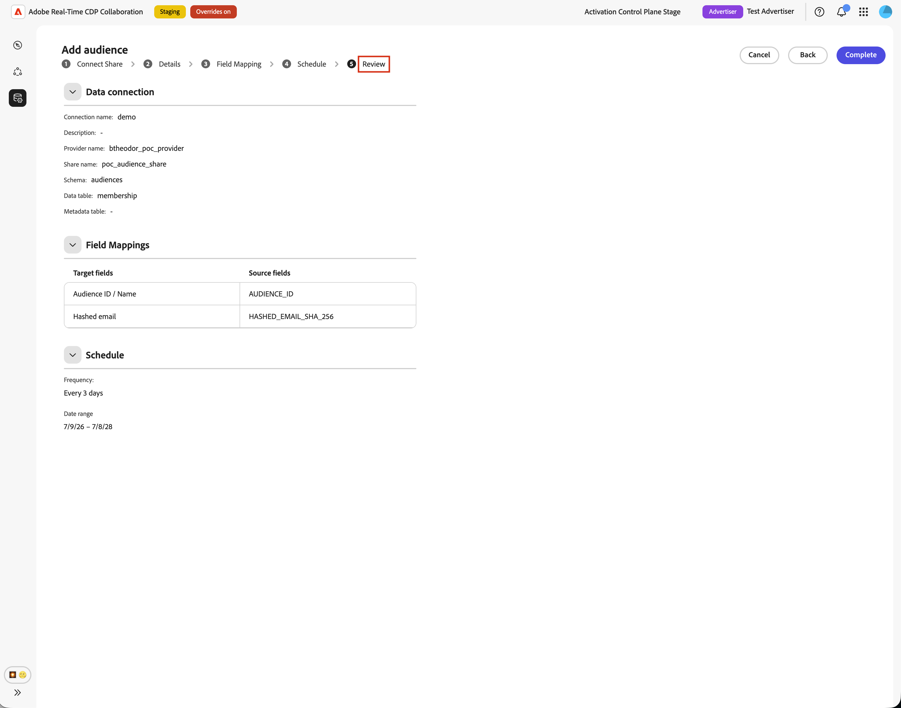
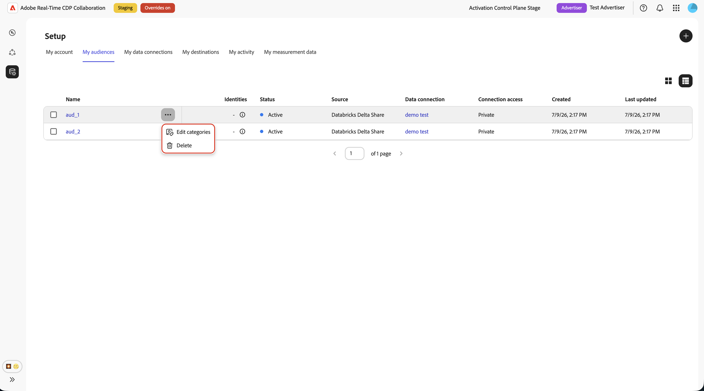

# Configurar [!DNL Databricks Delta Share] para fornecimento de público

Use este guia para conectar o [!DNL Databricks Delta Share] ao Adobe Real-Time CDP Collaboration e fornecer públicos-alvo primários por meio da interface do usuário.

Ao conectar [!DNL Databricks Delta Share], o Collaboration lê os dados de público-alvo diretamente do compartilhamento do Catálogo do Unity. Depois que a origem for concluída, você poderá usar os públicos-alvo para ativação e análise de sobreposição em projetos de colaboração.

Este guia explica como preparar pré-requisitos, conectar seu [!DNL Delta Share], especificar tabelas de origem, mapear campos de identidade e verificar se a origem de público-alvo é iniciada com êxito.

Os públicos-alvo provenientes de [!DNL Databricks] seguem as mesmas regras de governança e tratamento de dados que os públicos-alvo provenientes da Adobe Experience Platform e de outras fontes de nuvem compatíveis.

Outros métodos de fornecimento disponíveis são [Experience Platform](./onboard-audiences.md), [Amazon S3](./configure-aws-s3-audience-sourcing.md), [Google Cloud Storage](./configure-gcs-audience-sourcing.md), [Snowflake](./configure-snowflake-audience-sourcing.md), [Azure storage](./configure-azure-storage-audience-sourcing.md) e [upload de arquivo CSV](./upload-csv-audience-sourcing.md). Para saber mais sobre todas as fontes disponíveis no Collaboration, consulte [Visão geral das fontes](./source-overview.md).

## Pré-requisitos {#prerequisites}

Conclua os pré-requisitos nesta seção antes de iniciar o fluxo de trabalho de configuração. Os pré-requisitos ausentes são um motivo comum pelo qual a configuração falha ou os públicos-alvo não aparecem após o fornecimento. Antes de seguir este guia, conclua a integração e a configuração da [conta](./onboard-account.md).

Algumas tarefas neste guia exigem a ajuda de um administrador do [!DNL Databricks]. Se você não administrar [!DNL Databricks] para sua organização, trabalhe com o administrador apropriado antes de começar.

### [!DNL Databricks Delta Share] acesso {#databricks-delta-share-access}

Antes de continuar, confirme o seguinte com o administrador do [!DNL Databricks]:

* Sua organização publicou um [!DNL Delta Share] para a conta [!DNL Databricks] do Adobe usando o compartilhamento de Databricks nativos para Databricks (Catálogo do Unity). O Collaboration não oferece suporte à entrada de credencial OIDC ou bearer-token na interface do usuário para esse fluxo de trabalho.
* Você sabe o nome do provedor como registrado no metastore do Catálogo do Unity do Adobe, o nome do compartilhamento e o esquema que contém suas tabelas de público-alvo.
* O fornecimento de público-alvo [!DNL Databricks Delta Share] está disponível para sua conta e região da Collaboration. Se o fornecimento de Databricks ainda não estiver disponível em sua região, entre em contato com o representante de conta da Adobe para confirmar um cronograma.

Para obter instruções passo a passo sobre como publicar um compartilhamento na Adobe, consulte a seção [Publicar o compartilhamento delta na Adobe](#publish-delta-share) neste guia.

### Preparar os dados do público {#prepare-audience-data}

Estruture suas tabelas de público para que o Collaboration possa descobrir públicos e mapear identidades corretamente.

* **Tabela de associação (obrigatória):** uma tabela dentro do esquema compartilhado que contém uma linha por par perfil-público. Esta tabela deve incluir uma coluna mapeável para `AUDIENCE_ID` e pelo menos uma coluna de chave correspondente com suporte. O Collaboration usa essa tabela para visualização de dados de origem e mapeamento de campo.
* **Tabela de metadados (opcional):** se você mantiver um catálogo separado de públicos-alvo (uma linha por público-alvo com ID de público-alvo, nome, contagens ou metadados semelhantes), poderá fornecer essa tabela para que o Collaboration leia as definições de público-alvo a partir dela em vez de deduzir IDs de público-alvo distintas somente da tabela de associação.
* **Chaves de correspondência com suporte:** `HASHED_EMAIL_SHA_256`, `HASHED_PHONE_SHA_256`, `HASHED_IPV4_SHA_256`, `CRM_ID`, `LOYALTY_ID`, `ADFIXUS_ID` e outras chaves de correspondência habilitadas para sua conta da Collaboration.
* **Requisitos de hash:** Todos os valores de chave de correspondência devem ser cortados, ter letras minúsculas e ter hash SHA256 antes de serem armazenados em [!DNL Databricks]. O Collaboration não faz hash ou normaliza dados antes da assimilação.
* **Consistência de coluna:** A tabela de associação deve expor nomes de coluna estáveis que o Collaboration pode mapear para suas chaves de correspondência habilitadas.

Todas as chaves de correspondência presentes na tabela de associação também devem ser habilitadas para a conta do Collaboration. Para adicionar ou habilitar chaves correspondentes, consulte [Configurar chaves correspondentes](./onboard-account.md#set-up-match-keys).

### Valores obrigatórios antes de começar {#required-values}

Tenha os seguintes valores prontos antes de iniciar o assistente de configuração.

| Valor | Descrição |
| ----- | ----------- |
| Nome do provedor | O identificador de provedor que o Adobe usa no Catálogo de Unidade para acessar o [!DNL Delta Share]. O administrador do [!DNL Databricks] ou o contato de integração do Adobe pode fornecer esse valor. Este valor não é o mesmo que a URL do espaço de trabalho [!DNL Databricks]. |
| Nome do compartilhamento | O nome do [!DNL Delta Share] publicado no Adobe. |
| Esquema | O esquema no compartilhamento que contém suas tabelas de público-alvo. |
| Tabela de associação | O nome da tabela no esquema que contém as linhas de associação de público-alvo (uma linha por perfil em um público-alvo). |
| Tabela de metadados (opcional) | O nome da tabela no esquema que lista públicos (uma linha por público), se você usar um catálogo de público orientado por metadados. |

{style="table-layout:auto"}

## Configurar sua conexão com o [!DNL Databricks] {#configure-databricks-connection}

O fluxo de trabalho de configuração é um assistente de várias etapas dentro do espaço de trabalho **[!UICONTROL Instalação]**. Conclua cada etapa em sequência.

### Adicionar uma nova conexão de dados {#add-data-connection}

Na guia **[!UICONTROL Meus públicos-alvo]** do espaço de trabalho **[!UICONTROL Configuração]**, selecione o ícone adicionar () e selecione **[!UICONTROL Público]**.

Se este for seu primeiro público-alvo, você também poderá selecionar a opção **[!UICONTROL Adicionar]**.

O fluxo de trabalho Adicionar público-alvo é exibido. Selecione **[!UICONTROL Adicionar nova conexão de dados]** e **[!UICONTROL Avançar]**.

{zoomable="yes"}

### Selecione [!DNL Databricks Delta Share] como a fonte de dados {#select-databricks-delta-share}

A tela de seleção da fonte de dados lista todos os tipos de conexão disponíveis. Selecione **[!UICONTROL Compartilhamento delta de Databricks]** e, em seguida, **[!UICONTROL Próximo]**.

### Conecte seu [!DNL Delta Share] {#connect-delta-share}

>[!CONTEXTUALHELP]
>id="rtcdp_collaboration_audience_sharing_databricks"
>title="Experience League"
>abstract="Consulte o guia de fornecimento do [!DNL Databricks Delta Share] para obter instruções sobre como configurar seu compartilhamento para fornecimento de público"

Forneça os detalhes necessários para permitir que o Collaboration acesse seu [!DNL Delta Share]. Insira os detalhes do provedor, compartilhamento, esquema e tabela de [!DNL Databricks Delta Share]. A tabela de associação necessária deve estar disponível no schema compartilhado. Se você usar uma tabela de metadados, ela também deverá estar disponível no mesmo schema compartilhado.
Depois de inserir as informações necessárias, selecione **[!UICONTROL Conectar]**.

O Collaboration valida o compartilhamento e o monta no espaço de trabalho do Adobe. Essa etapa pode levar até um minuto. Um indicador de progresso é exibido enquanto a conexão é estabelecida.

| Campo | Descrição |
| --- | --- |
| **[!UICONTROL Nome do provedor]** | O nome do provedor do Catálogo do Unity que a Adobe usa para consumir seu compartilhamento. Consulte [Valores necessários antes de começar](#required-values). |
| **[!UICONTROL Nome do compartilhamento]** | O nome do [!DNL Delta Share] publicado no Adobe. |
| **[!UICONTROL Esquema]** | O esquema no compartilhamento que contém suas tabelas de público-alvo. |
| **[!UICONTROL Tabela de dados]** | O nome da tabela no esquema que contém as linhas de associação de público-alvo (uma linha por perfil em um público-alvo). |
| **[!UICONTROL Tabela de metadados]** | A tabela que lista os públicos-alvo (uma linha por público-alvo). |

Se o compartilhamento não puder ser encontrado ou o esquema ainda não estiver visível, uma mensagem de erro será exibida. Verifique os valores com o administrador [!DNL Databricks] e tente novamente.

### Confirmar consentimento e confirmação do uso de dados {#confirm-consent}

Antes de continuar, confirme se você aplicou as opções de não participação exigidas por lei aos dados do público-alvo enviados para o Collaboration. Se você não tiver certeza se seus dados atendem a esse requisito, revise o guia [políticas de governança e ações de imposição](./onboard-audiences.md#governance-policy-and-enforcement-actions) antes de continuar. Marque a caixa de seleção de confirmação e selecione **[!UICONTROL OK]** para continuar.

### Fornecer detalhes da conexão {#provide-connection-details}

Insira um nome e uma descrição opcional para esta conexão de dados. O nome fornecido aparece na guia **[!UICONTROL Minhas conexões de dados]** e ajuda a distinguir essa fonte se você gerenciar várias conexões de dados.

* **[!UICONTROL Nome da conexão de dados]** (obrigatório)
* **[!UICONTROL Descrição da conexão de dados]** (opcional)

Clique em **[!UICONTROL Avançar]** para continuar.

### Mapear campos de identidade {#map-identity-fields}

A tela **[!UICONTROL Mapping]** mostra como o Collaboration mapeia colunas de origem da tabela de associação para campos de identidade de destino. O Collaboration mapeia campos automaticamente com base nos nomes das colunas e nas chaves de correspondência ativadas para sua conta.

>[!TIP]
>
>Selecione **[!UICONTROL Visualizar dados de origem]** para examinar uma amostra da tabela de associação em formato tabular e selecione **[!UICONTROL Fechar]** para retornar à tela de mapeamento.

Confirme se os mapeamentos exibidos refletem as colunas da tabela de associação. Clique em **[!UICONTROL Avançar]** para continuar.

### Agendar intervalo de datas e frequência de atualização {#schedule-refresh}

A exibição **[!UICONTROL Agenda]** aparece. Use o menu suspenso para selecionar uma frequência de atualização entre um e seis dias e, em seguida, defina o intervalo de datas ativo. Use o ícone de calendário para especificar datas de início e término.

>[!IMPORTANT]
>
>Para gerenciar seus créditos do Collaboration com eficiência, defina a frequência de atualização para corresponder ou exceder a frequência de atualização de seus dados subjacentes.

### Revisar e concluir a conexão {#review-and-complete}

Revise o resumo da configuração antes de criar a conexão. A tela de resumo exibe as seguintes seções:

* **[!UICONTROL Conexão de dados]**: o nome da conexão, o nome do provedor, o nome do compartilhamento e o esquema que você configurou.
* **[!UICONTROL Mapeamento]**: os mapeamentos dos campos de identidade de origem e de destino.
* **[!UICONTROL Agendar]**: a frequência de atualização e o intervalo de datas ativo.

Verifique se todas as seções estão corretas e selecione **[!UICONTROL Concluído]**.

Uma caixa de diálogo de confirmação é exibida, indicando que o Collaboration criou a conexão de dados e que a origem do público-alvo está em andamento.

## Revisar públicos-alvo originados {#review-sourced-audiences}

Após concluir o assistente de configuração, o Collaboration começa a fornecer públicos-alvo das tabelas do [!DNL Databricks] de forma assíncrona. Navegue até **[!UICONTROL Configuração] > [!UICONTROL Meus públicos-alvo]** para monitorar o progresso. A origem não é concluída imediatamente; o tempo necessário depende do tamanho dos dados.

### Monitorar o progresso do fornecimento de público {#monitor-sourcing-progress}

Enquanto a Collaboration recupera os dados do seu público-alvo, um banner na parte superior do espaço de trabalho **[!UICONTROL Meus públicos-alvo]** indica que a origem está em andamento. Os públicos-alvo individuais aparecem na lista somente após a conclusão do fornecimento para cada público-alvo.

>[!TIP]
>
>O tempo de fornecimento do público-alvo varia de acordo com o tamanho da tabela de associação e se você usa uma tabela de metadados para descobrir o público-alvo. Conjuntos de dados maiores podem levar mais tempo para serem exibidos no espaço de trabalho **[!UICONTROL Meus públicos-alvo]**.

### Exibir detalhes do público-alvo de origem {#view-audience-details}

Quando a origem for concluída, os públicos-alvo [!DNL Databricks] aparecerão na guia **[!UICONTROL Meus públicos-alvo]** junto com os públicos-alvo provenientes de outras conexões. Selecione um item de linha ou **[!UICONTROL Exibir público-alvo]** para abrir a exibição detalhada para um público-alvo específico.

A exibição detalhada mostra o status do público-alvo, a origem e o nome da conexão de dados, juntamente com os seguintes painéis:

* **[!UICONTROL Identidades]**: a contagem e o detalhamento de identidades totais do público-alvo, assim que os dados forem disponibilizados.
* **[!UICONTROL Categorias]**: todas as marcas aplicadas para organizar ou filtrar o público-alvo.
* **[!UICONTROL Acesso à conexão]**: se o público-alvo é privado, público ou compartilhado com colaboradores específicos.
* **[!UICONTROL Visibilidade de metadados]**: quais informações de público-alvo, como contagem de identidades, porcentagem de sobreposição e índice, estão visíveis para os colaboradores.

Revise essas configurações antes de usar o público-alvo em um projeto de colaboração. Para atualizar categorias, acesso à conexão ou visibilidade de metadados, consulte [Exibir e gerenciar públicos-alvo individuais](./onboard-audiences.md#view-individual-audiences).

### Editar configurações de público {#edit-audience-settings}

Você pode editar os metadados do público diretamente na exibição de lista **[!UICONTROL Meus públicos-alvo]** sem abrir a exibição de detalhes. Marque a caixa de seleção de um público-alvo para revelar a barra de ferramentas de ações e selecione uma ação: **[!UICONTROL Editar visibilidade de metadados]**, **[!UICONTROL Editar acesso à conexão]**, **[!UICONTROL Editar nome e descrição]**, **[!UICONTROL Editar categorias]** ou **[!UICONTROL Excluir]**.

### Exibir sua conexão de dados do [!DNL Databricks] {#view-databricks-connection}

Para revisar a própria conexão, incluindo suas chaves de correspondência, navegue até **[!UICONTROL Configuração]** > **[!UICONTROL Minhas conexões de dados]**. Sua nova conexão [!DNL Databricks] está disponível lá. A origem do público é exibida como **[!UICONTROL Compartilhamento Delta de Databricks]**.

![A guia Minhas conexões de dados mostrando a conexão de dados [!DNL Databricks Delta Share] com informações de status de fornecimento.](../../assets/setup/databricks-audience-sourcing/databricks-my-data-connections-tab.png)

## Limitações conhecidas {#known-limitations}

Esteja ciente das seguintes restrições ao configurar e usar a fonte de público-alvo [!DNL Databricks Delta Share]:

* **Somente compartilhamento nativo:** A interface dá suporte somente a Databricks nativos para Databricks [!DNL Delta Sharing]. Os fluxos de autenticação de bearer-token e OIDC não estão disponíveis no assistente de configuração.
* **Nenhum navegador de tabela do assistente:** Insira nomes de tabela manualmente. O Collaboration valida os nomes das tabelas quando você as visualiza; ele não lista todas as tabelas no seu compartilhamento automaticamente.
* **Limite de linhas da tabela de metadados:** Quando você usa uma tabela de metadados para descoberta de público-alvo, o Collaboration importa até 100.000 linhas de público-alvo dessa tabela. Entre em contato com o suporte da Adobe se o catálogo exceder esse limite.
* **Restrições de chave de correspondência:** depois que uma chave de correspondência é habilitada para uma conexão de dados, ela não pode ser removida. Você pode adicionar chaves de correspondência a uma conexão existente, mas não pode desabilitá-las ou excluí-las. Para alterar as chaves de correspondência ativas, você deve [excluir a conexão de dados](./manage-data-connection.md#delete-data-connection) e criar uma nova.
* **Tabela de associação necessária:** Mesmo quando você usa uma tabela de metadados para descoberta de público-alvo, deve especificar uma tabela de associação. O Collaboration lê linhas de identidade da tabela de associação durante a assimilação.

## Solução de problemas {#troubleshooting}

Use esta seção para resolver problemas que ocorrem durante ou após a configuração. Para obter erros durante a conexão de compartilhamento, examine o nome do provedor, o nome do compartilhamento e o esquema com o administrador do [!DNL Databricks].

**Falha ou tempo limite de conexão de compartilhamento**

* Verifique se o [!DNL Delta Share] foi publicado na conta [!DNL Databricks] do Adobe e se o nome do provedor, o nome do compartilhamento e o esquema estão corretos.
* Confirme se o esquema está visível no compartilhamento. A propagação de compartilhamentos recém-publicados pode demorar.
* Se a conexão ainda falhar após vários minutos, reinicie a configuração e tente novamente ou entre em contato com o suporte ao cliente da Adobe e forneça o nome do provedor, o nome do compartilhamento, o esquema e todos os detalhes de erro relevantes. Não inclua credenciais confidenciais.

**Falha na visualização da tabela**

* Confirme se o nome da tabela foi digitado corretamente e se existe no esquema especificado.
* Verifique se a tabela está incluída no [!DNL Delta Share] publicado no Adobe.
* Para a descoberta orientada por metadados, visualize a tabela de associação e a tabela de metadados antes de continuar.

**Progresso dos blocos de validação de mapeamento de campo**

* Confirme se a tabela de associação inclui uma coluna mapeável para **`AUDIENCE_ID`**.
* Verifique se pelo menos dois campos de identidade estão totalmente mapeados (origem e destino).
* Use **[!UICONTROL Visualizar dados de origem]** para verificar se os nomes de coluna correspondem às chaves de correspondência habilitadas.

**Os públicos-alvo não estão aparecendo ou a fonte está demorando mais do que o esperado**

* O tempo de origem é escalonado com o volume de dados. O tempo de processamento estendido é esperado para tabelas de associação grandes.
* Se os públicos-alvo não aparecerem em 24 horas, verifique na guia **[!UICONTROL Minhas conexões de dados]** se há indicadores de erro na conexão.
* Verifique se a estrutura da tabela de associação e os mapeamentos de campo correspondem aos requisitos em [Preparar os dados do público-alvo](#prepare-audience-data).
* Se o problema persistir, entre em contato com o suporte ao cliente da Adobe e forneça o nome da conexão de dados e os detalhes da tabela.

**A conexão de dados mostra um status de falha após êxito inicial**

* Confirme se a [!DNL Delta Share] e as tabelas não foram removidas ou renomeadas em [!DNL Databricks] desde que você criou a conexão.
* Verifique se o acesso da Adobe ao compartilhamento não foi revogado.
* Se o problema persistir, entre em contato com o suporte ao cliente da Adobe.

## Publicar seu [!DNL Delta Share] no Adobe {#publish-delta-share}

O [!DNL Databricks] Catálogo de Unidade [!DNL Delta Sharing] permite que você compartilhe tabelas com segurança com outras contas do [!DNL Databricks] sem copiar dados. Para permitir que o Collaboration leia seus dados de público-alvo, o administrador do [!DNL Databricks] deve publicar um [!DNL Delta Share] na conta de consumidor do [!DNL Databricks] da Adobe.

### Antes de publicar {#before-you-publish}

Entre em contato com o representante de conta da Adobe ou com o contato de integração para obter:

* Confirmação de que a Adobe está pronta para receber sua parte na região.
* O nome do provedor que a Adobe usa em seu metastore do Catálogo do Unity para identificar sua organização como um provedor de compartilhamento.

Prepare o seguinte no seu espaço de trabalho [!DNL Databricks]:

* Um [!DNL Delta Share] contendo o esquema e as tabelas que o Collaboration lerá.
* Uma tabela de associação com uma linha por par perfil-público e colunas para **`AUDIENCE_ID`** e chaves correspondentes.
* Uma tabela de metadados opcional se você planeja usar a descoberta de públicos orientada por metadados.

### Publicar o compartilhamento {#publish}

Siga os procedimentos [!DNL Databricks Delta Sharing] de sua organização para conceder à conta de consumidor da Adobe acesso ao compartilhamento. As etapas exatas dependem do modelo de governança e implantação do [!DNL Databricks]. Em geral:

1. No Catálogo do Unity, crie ou identifique o compartilhamento que contém seu esquema de público-alvo e tabelas.
2. Adicione o esquema (ou tabelas individuais) ao compartilhamento.
3. Conceda o compartilhamento para a conta de consumidor [!DNL Databricks] da Adobe usando o compartilhamento de Databricks nativos para Databricks.
4. Confirme com o contato do Adobe se o compartilhamento está visível no lado do consumidor e anote o nome do provedor e o nome do compartilhamento do assistente de configuração do Collaboration.
5. Para obter a documentação do produto [!DNL Databricks] sobre [!DNL Delta Sharing], consulte a [documentação de Compartilhamento Delta de Databricks](https://docs.databricks.com/aws/en/delta-sharing).

### Coletar detalhes de [!DNL Databricks] para o Collaboration {#collect-databricks-details}

Após publicar o compartilhamento, verifique se você tem o nome do provedor, o nome do compartilhamento, o esquema e os nomes da tabela disponíveis para o fluxo de trabalho de configuração do Collaboration.

Obtenha os detalhes abaixo antes de iniciar o assistente de configuração do Collaboration.

| Campo | Descrição | Exemplo |
| ------| ----------- | ------- |
| Nome do provedor | Identificador do provedor no metastore do Catálogo do Unity da Adobe (da integração do Adobe) | `your_org_provider` |
| Nome do compartilhamento | Nome do [!DNL Delta Share] publicado | `audience_share_prod` |
| Esquema | Esquema | `collaboration_audiences` |
| Tabela de associação | Tabela com linhas de associação perfil-público | `audience_members` |
| Tabela de metadados (opcional) | Tabela listando públicos (uma linha por público) | `audience_catalog` |

{style="table-layout:auto"}

## Próximas etapas {#next-steps}

Você configurou [!DNL Databricks Delta Share] como fonte de dados no Collaboration. Após a conclusão do fornecimento, seus públicos-alvo estarão disponíveis no espaço de trabalho **[!UICONTROL Meus públicos-alvo]** e prontos para uso em projetos de colaboração.

Aqui você pode:

* [Criar e gerenciar projetos de colaboração](../collaborate/manage-projects.md)
* [Ativar públicos em um projeto](../collaborate/activate.md)
* [Revisar sobreposições e medir o desempenho](../collaborate/measure.md)
* [Gerenciar configurações e visibilidade de público](./onboard-audiences.md#view-individual-audiences)
* [Exibir e gerenciar conexões de dados](./manage-data-connection.md)

Para outros métodos de fornecimento de público-alvo, consulte:

* [Configurar [!DNL Google Cloud Storage] para fornecimento de público](./configure-gcs-audience-sourcing.md)
* [Configurar [!DNL Amazon S3] para fornecimento de público](./configure-aws-s3-audience-sourcing.md)
* [Configurar [!DNL Snowflake] para fornecimento de público](./configure-snowflake-audience-sourcing.md)
* [Públicos-alvo da Source no Experience Platform](./onboard-audiences.md)
* [Fazer upload de um arquivo CSV para fornecimento de público](./upload-csv-audience-sourcing.md)
