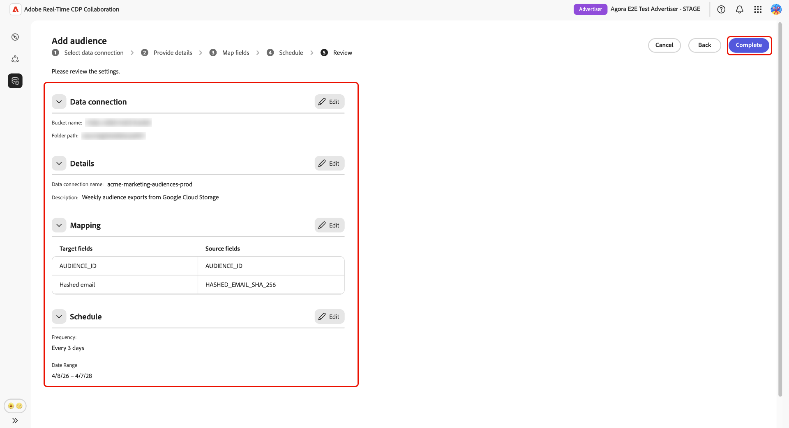

# Configurar [!DNL Google Cloud Storage] para fornecimento de público

Siga as etapas deste guia para conectar seu bucket do [!DNL Google Cloud Storage] (GCS) à Adobe Real-Time CDP Collaboration e começar a fornecer dados de público-alvo primários por meio da interface do usuário.

Conecte um bucket de GCS ao Collaboration para assimilar dados de público-alvo primários diretamente, sem suporte de engenharia. Depois de conectado, o Collaboration origina públicos-alvo do seu bucket em uma programação recorrente e os disponibiliza para ativação e análise de sobreposição em seus projetos de colaboração. Fornecer seus públicos é uma etapa necessária antes de ativá-los ou usá-los na análise de sobreposição com colaboradores.

Este guia aborda o fluxo de trabalho de configuração de ponta a ponta: preparação de pré-requisitos, autenticação do bucket de GCS, revisão de campos de identidade mapeados automaticamente, programação de atualização de dados e confirmação da conclusão com êxito da seleção de fornecedor.

Os públicos-alvo originados de [!DNL Google Cloud Storage] seguem as mesmas regras de governança e manipulação de dados que os públicos-alvo originados do Adobe Experience Platform.

Outros métodos de fornecimento disponíveis incluem [Experience Platform](./onboard-audiences.md), [Amazon S3](./configure-aws-s3-audience-sourcing.md), [Snowflake](./configure-snowflake-audience-sourcing.md) e [carregamento de arquivo CSV](./upload-csv-audience-sourcing.md).

## Pré-requisitos {#prerequisites}

Conclua todos os itens desta seção antes de iniciar o fluxo de trabalho de configuração. Pré-requisitos incompletos são o motivo mais comum pelo qual a configuração falha ou os públicos-alvo não aparecem após a origem. Antes de seguir este guia, você deve ter concluído a integração e a configuração da [conta](./onboard-account.md).

Algumas etapas desta seção requerem ação de um administrador [!DNL Google Cloud]. Se você não for o administrador [!DNL Google Cloud] da sua organização, identifique a pessoa apropriada antes de iniciar.

### Acesso e permissões do GCS {#gcs-access-permissions}

Antes de continuar, confirme o seguinte com o administrador do [!DNL Google Cloud]:

* A Adobe recebeu as permissões necessárias para autenticar em seu bucket de GCS e ler arquivos de público-alvo. Para obter instruções passo a passo, consulte a [seção de configuração de permissão](#setup-gcs-permissions).
* O fornecimento de público-alvo [!DNL Google Cloud Storage] está disponível em sua região. A disponibilidade varia de acordo com a região (NA, EMEA, ANZ). Se a origem de GCS ainda não estiver disponível em sua região, entre em contato com o representante de conta da Adobe para confirmar um cronograma.

### Preparar os dados do público {#prepare-audience-data}

Seus arquivos de público-alvo devem estar em conformidade com a **[Especificação de origem de público-alvo (v1.2)](../../assets/quick-start/RTCDP_Collaboration_Audience_Sourcing_Spec_v1.2.pdf)** antes do início do fornecimento. Revise a especificação para a definição completa do esquema e exemplos em nível de campo. Os principais requisitos incluem:

* **Formato de arquivo:** CSV, usando vírgulas como delimitadores de campo e barras verticais (`|`) como separadores para vários valores em um único campo.
* **Campos obrigatórios:** todos os registros devem incluir uma coluna `AUDIENCE_ID` e pelo menos uma coluna de chave de correspondência com suporte.
* **Chaves de correspondência com suporte:** `HASHED_EMAIL_SHA_256`, `HASHED_PHONE_SHA_256`, `HASHED_IPV4_SHA_256`, `CRM_ID`, `LOYALTY_ID`, `ADFIXUS_ID`.
* **Requisitos de hash:** Todos os valores de chave correspondentes devem ser cortados, ter letras minúsculas e ter hash SHA256 antes do carregamento. O Collaboration não faz hash ou normaliza dados antes da assimilação.
* **Consistência de coluna:** Se o seu compartimento contiver vários arquivos de público-alvo, todos os arquivos deverão usar estruturas de coluna idênticas.

Todas as chaves de correspondência presentes nos arquivos de público-alvo também devem ser habilitadas para a conta do Collaboration. Para adicionar ou habilitar chaves correspondentes, consulte [Configurar chaves correspondentes](./onboard-account.md#set-up-match-keys).

### Valores obrigatórios antes de começar {#required-values}

Tenha os seguintes valores prontos antes de iniciar o assistente de configuração.

| Valor | Descrição |
| --- | --- |
| **[!UICONTROL Balde]** | O nome do bucket [!DNL Google Cloud Storage] que contém seus arquivos de público-alvo. |
| **[!UICONTROL Caminho]** | O prefixo do caminho no compartimento onde os arquivos de público-alvo estão armazenados (por exemplo, `sourcing/testdata/path1/`). |

## Configurar sua conexão com o [!DNL Google Cloud Storage] {#configure-gcs-connection}

O fluxo de trabalho de configuração é um assistente de várias etapas dentro do espaço de trabalho **[!UICONTROL Instalação]**. Conclua cada etapa em sequência. Você pode retornar a qualquer etapa usando o ícone de lápis na tela de revisão final antes de criar a conexão.

### Adicionar uma nova conexão de dados {#add-data-connection}

Na guia **[!UICONTROL Meus públicos-alvo]** do espaço de trabalho **[!UICONTROL Configuração]**, selecione o ícone adicionar () e selecione **[!UICONTROL Público]**.

Se este for seu primeiro público-alvo, você também poderá selecionar a opção **[!UICONTROL Adicionar]**.

O fluxo de trabalho Adicionar público-alvo é exibido. Selecione **[!UICONTROL Adicionar nova conexão de dados]** e **[!UICONTROL Avançar]**.

{zoomable="yes"}

### Selecionar [!DNL Google Cloud Storage] como fonte de dados {#select-gcs}

>[!CONTEXTUALHELP]
>id="rtcdp_collaboration_audience_sourcing_specifications_gcs"
>title="Prepare seus dados para integração"
>abstract="Leia o guia de especificação de origem de público-alvo para saber como formatar e estruturar os dados de público-alvo do Google Cloud Storage for Collaboration."
>additional-url="https://www.adobe.com/go/rtcdp-collaboration-audience-sourcing" text="Consulte o guia"

A tela de seleção da fonte de dados lista todos os tipos de conexão disponíveis. Selecione **[!UICONTROL Google Cloud Storage]** e **[!UICONTROL Próximo]**.

Uma caixa de diálogo de pré-requisito descrevendo as etapas de configuração necessárias (por exemplo, configuração de bucket do GCS e atribuição de função do IAM) é exibida e observa que os dados devem estar em conformidade com a **[[!UICONTROL Especificação de Origem de Público-Alvo]](../../assets/quick-start/RTCDP_Collaboration_Audience_Sourcing_Spec_v1.2.pdf)**. Selecione **[!UICONTROL Iniciar integração]** para confirmar a conformidade antes de continuar.

### Insira os detalhes da conexão do [!DNL Google Cloud Storage] {#authenticate-gcs-connection}

Forneça os detalhes necessários para permitir que o Collaboration acesse seu bucket do [!DNL Google Cloud Storage]. Depois de inserir as informações necessárias, selecione **[!UICONTROL Avançar]**.

| Campo | Descrição |
| --- | --- |
| **[!UICONTROL Balde]** | O nome do seu bucket [!DNL Google Cloud Storage]. Consulte [Valores necessários antes de começar](#required-values). |
| **[!UICONTROL Caminho]** | O prefixo do caminho no compartimento onde os arquivos de público-alvo estão armazenados. |

### Confirmar consentimento e confirmação do uso de dados {#confirm-consent}

Você deve confirmar se as opções de recusa de consentimento foram removidas dos dados do público-alvo antes que o Collaboration possa processá-las. Se você não tiver certeza se seus dados atendem a esse requisito, revise o guia [políticas de governança e ações de imposição](./onboard-audiences.md#governance-policy-and-enforcement-actions) antes de continuar. Marque a caixa de seleção de confirmação e selecione **[!UICONTROL OK]** para continuar.

### Fornecer detalhes da conexão {#provide-connection-details}

Insira um nome e uma descrição opcional para esta conexão de dados. O nome fornecido aparece na guia **[!UICONTROL Minhas conexões de dados]** e ajuda a distinguir essa fonte se você gerenciar várias conexões de dados.

* **[!UICONTROL Nome da conexão de dados]** (obrigatório)
* **[!UICONTROL Descrição da conexão de dados]** (opcional).

Clique em **[!UICONTROL Avançar]** para continuar.

### Revisar campos de identidade mapeados automaticamente {#auto-mapped-fields}

A tela **[!UICONTROL Mapping]** é somente leitura. O Collaboration mapeia automaticamente os campos de identidade de origem dos arquivos de público-alvo para os campos de destino com base nos nomes de coluna definidos na Especificação da origem do público-alvo. Não é possível adicionar, remover ou aplicar transformações a campos mapeados neste estágio.

>[!TIP]
>
>Selecione **[!UICONTROL Visualizar dados de origem]** para revisar uma amostra dos dados de público-alvo em formato tabular e selecione **[!UICONTROL Fechar]** para retornar à tela de mapeamento.

{zoomable="yes"}

Confirme se os mapeamentos exibidos refletem os campos nos arquivos de público-alvo. Caso contrário, pare e corrija seus arquivos para que estejam em conformidade com a [Especificação de Origem de Público-Alvo](../../assets/quick-start/RTCDP_Collaboration_Audience_Sourcing_Spec_v1.2.pdf) antes de continuar. Clique em **[!UICONTROL Avançar]** para continuar.

### Agendar atualização de dados {#schedule-data-refresh}

Na exibição **[!UICONTROL Agendamento]**, defina a frequência com que o Collaboration recupera os dados atualizados do público-alvo do seu bucket de GCS e defina o intervalo de datas ativo para a origem.

Use a lista suspensa **[!UICONTROL Frequência]** para selecionar a frequência com que o Collaboration recupera dados atualizados do público-alvo do seu bucket de GCS. Intervalos disponíveis de **[!UICONTROL Diariamente]** a **[!UICONTROL A cada 6 dias]**.

Digite um intervalo de datas no campo de entrada ou selecione o ícone de calendário para definir a **[!UICONTROL Data inicial]** e a **[!UICONTROL Data final]** para o período de origem ativo. Quando a data final é atingida, a origem é interrompida e os públicos-alvo originados anteriormente expiram e ficam indisponíveis para uso em projetos de colaboração.

>[!IMPORTANT]
>
>Defina a frequência de atualização para corresponder ou não exceder a taxa na qual seus dados de público-alvo do GCS subjacente são atualizados. O intervalo mínimo de atualização suportado é uma vez a cada seis dias. Atualizar com mais frequência do que as alterações de dados consome créditos do Collaboration sem produzir resultados atualizados. Para monitorar o uso do crédito, consulte [Rastrear a atividade de consumo de crédito](./my-activity.md).

Clique em **[!UICONTROL Avançar]** para continuar.

### Revisar e concluir a conexão {#review-and-complete}

Revise o resumo da configuração antes de criar a conexão. A tela de resumo exibe as seguintes seções:

* **[!UICONTROL Conexão de dados]**: as credenciais do bucket de GCS e o caminho de pasta que você configurou.
* **[!UICONTROL Detalhes]**: o nome e a descrição opcional desta conexão de dados.
* **[!UICONTROL Mapeamento]**: os campos de identidade de origem e de destino mapeados automaticamente.
* **[!UICONTROL Agendar]**: a frequência de atualização e o intervalo de datas ativo.

Selecione o ícone de lápis () ao lado de qualquer seção para retornar a essa etapa e fazer alterações. Quando todas as seções estiverem corretas, selecione **[!UICONTROL Concluído]**.

Uma caixa de diálogo de confirmação é exibida, indicando que o Collaboration criou a conexão de dados e que a origem do público-alvo está em andamento.

## Revisar públicos-alvo originados {#review-sourced-audiences}

Após concluir o assistente de configuração, o Collaboration começa a fornecer públicos-alvo do seu bucket de GCS de forma assíncrona. Navegue até **[!UICONTROL Configuração]** > **[!UICONTROL Meus públicos-alvo]** para monitorar o progresso. A origem não é concluída imediatamente; o tempo necessário depende do tamanho dos dados e da frequência de atualização configurada.

### Monitorar o progresso do fornecimento de público {#monitor-sourcing-progress}

Enquanto a Collaboration recupera os dados do seu público-alvo, um banner na parte superior do espaço de trabalho **[!UICONTROL Meus públicos-alvo]** indica que a origem está em andamento. Os públicos-alvo individuais aparecem na lista somente após a conclusão do fornecimento para cada público-alvo.

>[!TIP]
>
>O tempo de fornecimento do público-alvo varia de acordo com o tamanho dos dados do GCS e a frequência de atualização configurada. Conjuntos de dados maiores ou agendamentos de atualização menos frequentes podem levar mais tempo para serem exibidos no espaço de trabalho **[!UICONTROL Meus públicos]**.

### Exibir detalhes do público-alvo de origem {#view-audience-details}

Quando a origem for concluída, os públicos-alvo [!DNL Google Cloud Storage] aparecerão na guia **[!UICONTROL Meus públicos-alvo]** junto com os públicos-alvo provenientes de outras conexões. Selecione um item de linha ou **[!UICONTROL Exibir público-alvo]** para abrir a exibição detalhada para um público-alvo específico.

A exibição detalhada mostra o status do público-alvo, a origem e o nome da conexão de dados, juntamente com os seguintes painéis:

* **[!UICONTROL Identidades]**: a contagem e o detalhamento de identidades totais do público-alvo, assim que os dados forem disponibilizados.
* **[!UICONTROL Categorias]**: todas as marcas aplicadas para organizar ou filtrar o público-alvo.
* **[!UICONTROL Acesso à conexão]**: se o público-alvo é privado, público ou compartilhado com colaboradores específicos.
* **[!UICONTROL Visibilidade de metadados]**: quais informações de público-alvo — como contagem de identidades, porcentagem de sobreposição e índice — estão visíveis para os colaboradores.

Revise essas configurações antes de usar o público-alvo em um projeto de colaboração. Para atualizar categorias, acesso à conexão ou visibilidade de metadados, consulte [Exibir e gerenciar públicos-alvo individuais](./onboard-audiences.md#view-individual-audiences).

### Editar configurações de público {#edit-audience-settings}

Você pode editar os metadados do público diretamente na exibição de lista **[!UICONTROL Meus públicos-alvo]** sem abrir a exibição de detalhes. Marque a caixa de seleção de um público-alvo para revelar a barra de ferramentas de ações e selecione uma ação: **[!UICONTROL Editar visibilidade de metadados]**, **[!UICONTROL Editar acesso à conexão]**, **[!UICONTROL Editar nome e descrição]**, **[!UICONTROL Editar categorias]** ou **[!UICONTROL Excluir]**.

### Exibir sua conexão de dados GCS {#view-gcs-connection}

Para revisar ou gerenciar a própria conexão, incluindo suas chaves de correspondência e agendamento, navegue até **[!UICONTROL Instalação]** > **[!UICONTROL Minhas conexões de dados]**. Sua nova conexão GCS está imediatamente disponível lá. A origem do público é exibida como **[!UICONTROL Google Cloud Storage]**.

## Limitações conhecidas {#known-limitations}

Esteja ciente das seguintes restrições ao configurar e usar a fonte de público-alvo [!DNL Google Cloud Storage]:

* **Restrições de chave de correspondência:** depois que uma chave de correspondência é habilitada para uma conexão de dados, ela não pode ser removida. Você pode adicionar chaves de correspondência a uma conexão existente, mas não pode desabilitá-las ou excluí-las. Para alterar as chaves de correspondência ativas, você deve [excluir a conexão de dados](./manage-data-connection.md#delete-data-connection) e criar uma nova.
* **Uma conexão de dados ativa por origem:** Só há suporte para uma conexão de dados ativa [!DNL Google Cloud Storage] de cada vez. Se você precisar originar públicos de um bucket diferente, [exclua a conexão existente](./manage-data-connection.md#delete-data-connection) e crie uma nova que aponte para o novo bucket.
* **Suporte a subpastas:** os arquivos de público-alvo devem estar localizados diretamente no caminho de pasta especificado. O Collaboration não percorre subpastas nesse caminho.

## Solução de problemas {#troubleshooting}

Use esta seção para resolver problemas que ocorrem após estabelecer a conexão inicial. Para erros que ocorrem durante a autenticação, revise suas credenciais e permissões de bucket ou entre em contato com o administrador.

**Os públicos-alvo não estão aparecendo ou a fonte está demorando mais do que o esperado**

* O tempo de origem é escalonado com o volume de dados e a frequência de atualização configurada. Espera-se um tempo de processamento estendido para grandes conjuntos de dados.
* Se os públicos-alvo não tiverem aparecido em 24 horas, confirme se os arquivos de público-alvo existem no caminho de pasta especificado durante a configuração e se estão em conformidade com a Especificação de origem de público-alvo.
* Verifique na guia **[!UICONTROL Minhas conexões de dados]** se há indicadores de erro na conexão.
* Se o problema persistir após a conclusão dessas etapas, entre em contato com o suporte ao cliente da Adobe e forneça o nome da conexão de dados e os detalhes do bucket.

**A conexão de dados mostra um status de falha após êxito inicial**

* Confirme se as permissões e credenciais do bucket de GCS não foram alteradas desde a criação da conexão. Qualquer alteração que remova o acesso do Adobe ao bucket causa falha nas execuções de origem subsequentes.
* Verifique se os arquivos de público-alvo ainda existem no caminho de pasta configurado e se estão em conformidade com a Especificação de origem de público-alvo.
* Se o problema persistir após a confirmação das permissões e da disponibilidade do arquivo, [exclua a conexão](./manage-data-connection.md#delete-data-connection) e crie uma nova ou entre em contato com o suporte ao cliente da Adobe.

**Erros de formato de arquivo de público durante uma atualização agendada**

* Confirme se os arquivos atualizados no bucket estão em conformidade com a estrutura de coluna e os requisitos de campo na [Especificação da origem do público-alvo](../../assets/quick-start/RTCDP_Collaboration_Audience_Sourcing_Spec_v1.2.pdf).
* Verifique se todos os arquivos no caminho de pasta configurado usam estruturas de coluna idênticas. Arquivos de formato misto no mesmo caminho podem causar falhas parciais de fornecimento.

## Configurar [!DNL Google Cloud Storage] permissões {#setup-gcs-permissions}

O [!DNL Google Cloud Storage] fornece uma maneira segura e escalável de armazenar e acessar seus dados na nuvem. Para permitir que o Adobe leia dos seus buckets do GCS, você deve configurar as permissões de Gerenciamento de Identidade e Acesso (IAM) e o acesso à conta de serviço apropriados em sua conta do [!DNL Google Cloud].

### Coletar informações de [!DNL Google Service Account] da Adobe {#collect-account-information}

Para começar, observe o [!DNL Google Service Account] para Adobe que corresponde à sua região. Essas informações serão necessárias para conceder acesso à Adobe em etapas posteriores.

| Região | [!DNL Google Service Account] |
| ------------- | --------------- |
| América do Norte | `kk9930000@va3-22da.iam.gserviceaccount.com` |
| EMEA | `kze830000@sfc-eufrankfurt-1-g4a.iam.gserviceaccount.com` |
| Austrália | `knhv20000@sfc-au-1-nla.iam.gserviceaccount.com` |

{style="table-layout:auto"}

### Configurar função do IAM {#setup-iam-role}

>[!IMPORTANT]
>
>Você deve ter privilégios de **Administrador da Conta** na sua conta [!DNL Google Cloud] para concluir esta configuração. Se você não tiver esses privilégios, entre em contato com o administrador antes de continuar.

Siga as etapas abaixo para criar uma função IAM personalizada com as permissões necessárias e atribuí-la à conta de serviço da Adobe. Isso garante que a Adobe tenha acesso seguro aos dados de público-alvo do GCS.

#### Criar função IAM {#create-iam-role}

Primeiro, crie uma função IAM personalizada em seu projeto [!DNL Google Cloud] com as permissões necessárias para atribuir ao Adobe.

Na página **[!DNL IAM & Admin]** do [[!DNL Google Cloud] Console](https://console.cloud.google.com), navegue até **[!DNL Roles]** e selecione **[!DNL Create role]**. Preencha as informações necessárias, como o título e a ID para sua nova função.

Em seguida, adicione as seguintes permissões à função:

| Permissão | Finalidade |
| ------------- | --------------- |
| `storage.buckets.get` | Metadados do bucket de leitura. |
| `storage.objects.get` | Ler dados e metadados do objeto. |
| `storage.objects.list` | Listar objetos em um bucket. |

{style="table-layout:auto"}

Para obter mais informações sobre permissões, consulte [Permissões de GCS IAM](https://cloud.google.com/storage/docs/access-control/iam-permissions). Para obter instruções passo a passo, consulte [como criar funções personalizadas](https://docs.cloud.google.com/iam/docs/creating-custom-roles).

#### Atribuir função IAM à Adobe {#assign-role}

Em seguida, abra a página [**[!DNL Buckets]**](https://console.cloud.google.com/storage/browser) em [!DNL Google Cloud Console] e selecione o compartimento que contém seus dados de público-alvo.

Navegue até a guia **[!DNL Permissions]**, escolha **[!DNL View by principals]** e selecione **[!DNL Grant access]**.

Na caixa de diálogo **[!DNL Add principals]**, adicione a [Conta de Serviço do Adobe Google](#collect-account-information) como entidade de segurança e atribua a função IAM personalizada que você criou anteriormente. Selecione **[!DNL Save]** para confirmar a configuração.

O Adobe agora tem acesso seguro aos dados do público-alvo no bucket do GCS selecionado. Revise todos os [pré-requisitos](#prerequisites) adicionais conforme necessário ou prossiga para [iniciar o fornecimento de públicos do GCS para a Collaboration](#configure-gcs-connection).

#### Coletar detalhes de [!DNL Google Cloud Storage] {#collect-gcs-details}

Por fim, colete os detalhes do seu bucket de GCS, conforme mostrado na tabela abaixo. Essas informações serão necessárias para configurar a conexão entre o GCS e a Collaboration.

| Campo | Descrição | Exemplo |
|------ |------------ |-------- |
| [!DNL Bucket] | O nome exato do bucket [!DNL Google Cloud Storage] que contém seus arquivos de público-alvo. | `customer-data-bucket` |
| [!DNL Path] | O prefixo do caminho no compartimento onde os arquivos de público-alvo estão armazenados. Deve terminar com `/` para ler todos os arquivos. | `sourcing/testdata/path1/` |

{style="table-layout:auto"}

## Próximas etapas {#next-steps}

Você configurou [!DNL Google Cloud Storage] como fonte de dados no Collaboration. Após a conclusão do fornecimento, seus públicos-alvo estarão disponíveis no espaço de trabalho **[!UICONTROL Meus públicos-alvo]** e prontos para uso em projetos de colaboração.

Aqui você pode:

* [Criar e gerenciar projetos de colaboração](../collaborate/manage-projects.md)
* [Ativar públicos em um projeto](../collaborate/activate.md)
* [Revisar sobreposições e medir o desempenho](../collaborate/measure.md)
* [Gerenciar configurações e visibilidade de público](./onboard-audiences.md#view-individual-audiences)
* [Gerenciar chaves de correspondência e agendamento desta conexão de dados](./manage-data-connection.md)

Para outros métodos de fornecimento de público-alvo, consulte:

* [Configurar [!DNL Amazon S3] para fornecimento de público](./configure-aws-s3-audience-sourcing.md)
* [Configurar [!DNL Snowflake] para fornecimento de público](./configure-snowflake-audience-sourcing.md)
* [Públicos-alvo da Source no Experience Platform](./onboard-audiences.md)
* [Fazer upload de um arquivo CSV para fornecimento de público](./upload-csv-audience-sourcing.md)
