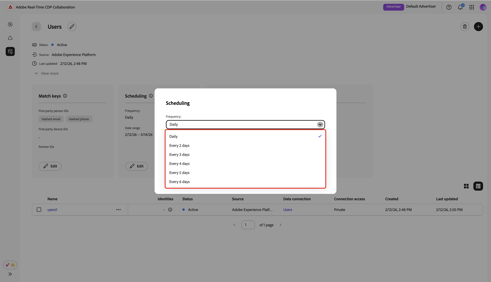

# Gerenciar conexões de dados

{{limited-availability-release-note}}

## Visão geral

Use conexões de dados no Real-Time CDP Collaboration para originar públicos-alvo de várias plataformas. Saiba como gerenciar chaves de correspondência e agendar a atualização de dados para suas conexões de dados existentes. Além disso, você poderá filtrar públicos-alvo por atributos diferentes para obter insights mais granulares.

## Exibir conexões de dados

Para exibir as conexões de dados existentes, navegue até **[!UICONTROL Instalação]** e selecione a guia **[!UICONTROL Minhas conexões de dados]**. Todas as conexões de dados atuais são exibidas, mostrando uma breve visão geral de cada conexão. Para obter uma exibição completa das informações de uma conexão de dados, incluindo suas chaves de correspondência, detalhes do agendamento e públicos-alvo, selecione **[!UICONTROL Exibir conexão de dados]** na conexão correspondente.

{zoomable="yes"}

### Chaves de correspondência {#match-keys}

>[!CONTEXTUALHELP]
>id="rtcdp_collaboration_manage_dataconnections_matchkeys"
>title="Chaves de correspondência"
>abstract="As chaves de correspondência determinam como os dados de diferentes fontes serão correspondidos. As chaves de correspondência mostradas abaixo são os campos de destino para os quais foram mapeados os campos de origem."

As chaves de correspondência são os campos de destino para os quais você [mapeou seus campos de origem](./onboard-audiences.md#map-fields). Para saber mais sobre como as chaves de correspondência funcionam, consulte o guia [chaves de correspondência](./onboard-account.md#set-up-match-keys).

{zoomable="yes"}

### Agendamento {#scheduling}

>[!CONTEXTUALHELP]
>id="rtcdp_collaboration_manage_dataconnections_scheduling"
>title="Agendamento"
>abstract="Exiba os detalhes de agendamento da sua conexão de dados e edite as configurações, se necessário."

Exibir e gerenciar as configurações de agendamento para suas conexões de dados. O agendamento determina a frequência com que o público-alvo é atualizado.

Após criar uma conexão de dados, você poderá atualizar sua frequência de atualização, data de início e data de término diretamente da seção **[!UICONTROL Agendamento]** do espaço de trabalho da conexão de dados.

>[!NOTE]
>
>Ao fornecer públicos-alvo da Adobe Experience Platform, os públicos-alvo se tornam disponíveis em 24 horas após a conexão de dados ser estabelecida. Após a origem inicial, os dados do público-alvo são atualizados de acordo com a frequência definida.

Para obter mais informações sobre agendamento, consulte a [seção de agendamento](/help/guide/setup/onboard-audiences.md#schedule) no guia para configurar públicos.

{zoomable="yes"}

## Editar conexão de dados {#edit-data-connection}

Leia as seções a seguir para saber como atualizar as chaves de correspondência e as configurações de agendamento de uma conexão de dados existente.

### Editar chaves de correspondência {#edit-match-keys}

>[!CONTEXTUALHELP]
>id="rtcdp_collaboration_edit_measurement_data_connection_enrichment"
>title="Enriquecimento"
>abstract="Não há suporte para a desativação do enriquecimento. Em vez disso, você pode alterar as chaves de junção de enriquecimento."
>additional-url="https://www.adobe.com/go/rtcdp-collaboration-manage-dataconnections" text="Enriquecimento"

>[!IMPORTANT]
>
>Antes de editar as chaves de correspondência para uma conexão de dados, observe o seguinte:
>
>* Somente as chaves de correspondência configuradas para sua conta podem ser usadas para conexões de dados.
>* No momento, você pode adicionar mais chaves de correspondência a uma conexão de dados, mas uma vez habilitada, ela não poderá ser removida.

Selecione **[!UICONTROL Editar]** na seção **[!UICONTROL Chaves de correspondência]**.

{zoomable="yes"}

Uma caixa de diálogo de confirmação é exibida, explicando que quaisquer alterações na conexão de dados serão aplicadas a todos os públicos-alvo associados. Selecione **[!UICONTROL OK]** para confirmar. Você pode optar por ignorar essa confirmação no futuro.

{zoomable="yes"}

Na caixa de diálogo **[!UICONTROL Chaves de correspondência]**, você pode exibir os mapeamentos existentes entre campos de origem e seus campos de destino correspondentes (chaves de correspondência). Você pode editar uma chave de correspondência atualizando o campo de origem mapeado ou adicionar outras linhas de campo de mapeamento para preencher novas chaves de correspondência.

{zoomable="yes"}

#### Adicionar chaves de correspondência {#add-match-keys}

Selecione **[!UICONTROL Adicionar campo]** para adicionar uma nova linha de campo.

{zoomable="yes"}

Em seguida, selecione o campo de origem vazio. A caixa de diálogo **[!UICONTROL Selecionar campo de origem]** é exibida com as opções **[!UICONTROL Namespaces de identidade]** e **[!UICONTROL Atributos de perfil]**. Você pode filtrar a lista e localizar o campo de origem desejado com a opção de pesquisa.

Escolha o campo de origem desejado, seguido por **[!UICONTROL Selecionar]**.

{zoomable="yes"}

Na caixa de diálogo **[!UICONTROL Corresponder chaves]**, use o menu suspenso para mapear o novo campo de origem para um campo de destino. Todos os campos de público-alvo disponíveis são as chaves de correspondência configuradas para sua conta do Collaborator. Se você não vir o campo de destino necessário, [edite as chaves de correspondência da sua conta](./onboard-account.md#edit-match-keys) para adicioná-lo.

Use a opção **[!UICONTROL Aplicar transformação]** se desejar originar um campo sem hash para um campo de destino com hash, por exemplo, ao mapear um campo de origem de email de texto simples para o campo de destino **[!UICONTROL Email com hash]**.

{zoomable="yes"}

Depois de concluir o mapeamento dos campos, revise suas atualizações e selecione **[!UICONTROL Confirmar]** para aplicar as alterações.

{zoomable="yes"}

Uma caixa de diálogo de confirmação confirma que as chaves de correspondência foram atualizadas com êxito.

### Editar agendamento {#edit-scheduling}

Após criar uma conexão de dados, você poderá atualizar sua frequência de atualização, data de início e data de término diretamente da seção **[!UICONTROL Agendamento]** do espaço de trabalho da conexão de dados.

É possível editar a frequência de uma conexão de dados existente para controlar melhor a frequência com que os públicos-alvo são atualizados. Para editar o agendamento, selecione **[!UICONTROL Editar]** na conexão de dados do cartão de agendamento.

{zoomable="yes"}

Uma caixa de diálogo de confirmação é exibida, explicando que quaisquer alterações na conexão de dados serão aplicadas a todos os públicos-alvo associados. Selecione **[!UICONTROL OK]** para confirmar. Você pode optar por ignorar essa confirmação no futuro.

{zoomable="yes"}

Na caixa de diálogo **[!UICONTROL Agendamento]**, selecione o menu suspenso para atualizar a **[!UICONTROL Frequência]**. Defina a frequência de atualização para ser executada diariamente ou a cada dois ou seis dias.

{zoomable="yes"}

Em seguida, selecione **[!UICONTROL Intervalo de datas]** se desejar atualizar o período durante o qual os públicos-alvo são preenchidos e atualizados.

{zoomable="yes"}

Quando terminar, revise as atualizações e selecione **[!UICONTROL Salvar]** para aplicar as alterações.

{zoomable="yes"}

## Excluir conexão de dados

A exclusão de uma conexão de dados removerá todos os públicos-alvo subjacentes, as configurações associadas e o uso no Collaboration. Esta ação não pode ser desfeita.

Para excluir uma conexão de dados existente, selecione o ícone de exclusão () no espaço de trabalho de uma conexão de dados individual.

{zoomable="yes"}

Uma caixa de diálogo de confirmação será exibida. Selecione **[!UICONTROL Excluir]** para concluir a exclusão da conexão de dados.

{zoomable="yes"}

## Gerenciar públicos {#manage-audiences}

Uma lista de públicos-alvo anexados à conexão de dados é exibida na parte inferior do espaço de trabalho. A lista exibe uma breve visão geral de cada público-alvo, incluindo status, origem e acesso à conexão. Para editar as categorias, o acesso à conexão ou a visibilidade dos metadados de um público, selecione o nome do público. Para obter um guia completo sobre como gerenciar um público-alvo, consulte o guia [exibir públicos-alvo individuais](./onboard-audiences.md#view-individual-audiences).

{zoomable="yes"}

## Próximas etapas

Depois de gerenciar as conexões de dados, você pode [descobrir sobreposições](/help/guide/collaborate/discover.md) entre os públicos-alvo e os públicos que o colaborador descobriu.
