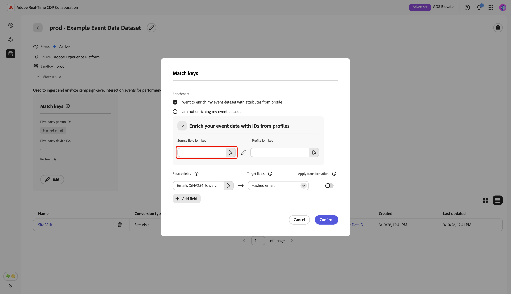

# Gerenciar conexões de dados de medição

{{limited-availability-release-note}}

## Visão geral

Use conexões de dados de medição no Real-Time CDP Collaboration para originar seus dados de conversão de várias plataformas. Saiba como gerenciar detalhes e chaves de correspondência para suas conexões de dados existentes.

## Exibir conexões de dados de medição {#view-measurement-data-connections}

Você pode exibir detalhes de qualquer conexão de dados de medição existente, incluindo como seus dados de conversão são originados, quais chaves de correspondência estão em uso e todos os eventos de conversão vinculados à conexão.

No espaço de trabalho **[!UICONTROL Instalação]**, navegue até a guia **[!UICONTROL Minhas conexões de dados]**. Todas as suas conexões atuais de dados de medição são exibidas na seção **[!UICONTROL Medida]**, na exibição em tabela ou grade. Selecione **[!UICONTROL Exibir conexão de dados]** no cartão de conexão relevante ou selecione o nome da conexão de dados quando estiver na exibição de tabela para abrir seu espaço de trabalho e exibir todos os detalhes.

{zoomable="yes"}

### Detalhes da conexão de dados de medição {#measurement-data-connection-details}

Nesta seção, você pode ver os seguintes detalhes da conexão de dados:

| Campo | Descrição |
|-------------------|-------------|
| Status | O estado atual da conexão de dados de medição, por exemplo, **[!UICONTROL Ativo]**. |
| Fonte | A plataforma ou o sistema que fornece os dados de medição para essa conexão. |
| Sandbox | O nome da sandbox onde a conexão de dados de medição está configurada. |
| Conjunto de dados | O nome do conjunto de dados usado para fornecer dados de medição na conexão. |
| Última atualização | O carimbo de data e hora da atualização mais recente da conexão de dados de medição. |
| Última atualização por | O usuário que modificou a conexão de dados de medição por último. |
| Criado | O carimbo de data e hora quando a conexão de dados de medição foi criada. |
| Criado por | O usuário que criou originalmente a conexão de dados de medição. |

{style="table-layout:auto"}

### Chaves de correspondência {#match-keys}

As chaves de correspondência são os campos de destino para os quais você mapeou seus campos de origem quando [originou seus dados de medição](./onboard-measurement-data.md). Para saber mais sobre como as chaves de correspondência funcionam, consulte o guia [chaves de correspondência](./onboard-account.md#set-up-match-keys).

{zoomable="yes"}

### Eventos de conversão {#conversion-events}

Uma lista de eventos de conversão anexados à conexão de dados é exibida na parte inferior do espaço de trabalho. A lista exibe uma breve visão geral de cada evento, incluindo seu status, tipo de conversão e origem. Você pode selecionar o nome do evento para exibir e editar suas configurações ou remover o evento de conversão com a opção de exclusão (). Para obter um guia completo sobre como gerenciar um evento de conversão, consulte o guia [adicionar e gerenciar dados de medição](./onboard-measurement-data.md).

{zoomable="yes"}

## Editar conexão de dados de medição {#edit-measurement-data-connection}

É possível atualizar os detalhes e as chaves de correspondência de uma conexão de dados de medição existente a qualquer momento para garantir que seus relatórios e análises permaneçam precisos. Para começar, navegue até a guia **[!UICONTROL Minhas conexões de dados]** e selecione a conexão de dados de medição que deseja editar. Isso abre o espaço de trabalho da conexão de dados, em que você pode seguir as etapas abaixo para fazer as alterações necessárias.

### Editar nome e descrição {#edit-name-and-description}

Para atualizar o nome e a descrição da conexão de dados, selecione o ícone de edição () ao lado do nome da conexão atual.

{zoomable="yes"}

Na caixa de diálogo **[!UICONTROL Editar conexão de dados]**, atualize os campos com os valores desejados e selecione **[!UICONTROL Salvar]** para aplicar as alterações.

{zoomable="yes"}

Uma caixa de diálogo de confirmação é exibida para confirmar que os detalhes foram atualizados com êxito.

### Editar chaves de correspondência {#edit-match-keys}

>[!IMPORTANT]
>
>Antes de editar as chaves de correspondência para uma conexão de dados, observe o seguinte:
>
>* Somente as chaves de correspondência configuradas para sua conta podem ser usadas para conexões de dados.
>* No momento, você pode adicionar mais chaves de correspondência a uma conexão de dados, mas uma vez habilitada, ela não poderá ser removida.

No espaço de trabalho da conexão de dados, selecione **[!UICONTROL Editar]** no painel **[!UICONTROL Chaves de correspondência]**.

{zoomable="yes"}

Uma caixa de diálogo de confirmação é exibida, explicando que quaisquer alterações na conexão de dados serão aplicadas a todas as conversões associadas. Selecione **[!UICONTROL OK]** para confirmar. Você pode optar por ignorar essa confirmação no futuro.

{zoomable="yes"}

Na caixa de diálogo **[!UICONTROL Chaves de correspondência]**, você pode examinar configurações de enriquecimento e ver os mapeamentos atuais entre os campos de origem e os campos de destino (chaves de correspondência).

{zoomable="yes"}

#### Enriquecimento {#enrichment}

Se o enriquecimento não foi habilitado quando você [originou seus dados de medição](./onboard-measurement-data.md), você tem a opção de enriquecer seu conjunto de dados de evento com atributos do Perfil de cliente em tempo real. Observe que, uma vez ativado o enriquecimento para dados de medição, ele não poderá ser desativado. Você ainda pode atualizar as chaves de junção de enriquecimento conforme necessário.

Ao habilitar o enriquecimento na caixa de diálogo **[!UICONTROL Chaves de correspondência]**, a interface do usuário se expande para exibir mais opções de configuração na seção **[!UICONTROL Enriquecer os dados do evento com IDs de perfis]**.

Selecione a opção **[!UICONTROL Chave de junção do campo do Source]**.

{zoomable="yes"}

Na caixa de diálogo **[!UICONTROL Chave de ingresso do campo do Source]**, escolha o campo de origem, seguido por **[!UICONTROL Selecionar]**.

{zoomable="yes"}

Em seguida, selecione a opção **[!UICONTROL Chave de ingresso do perfil]**. Na caixa de diálogo **[!UICONTROL Chave de ingresso do perfil]**, selecione o campo de perfil na lista. Você pode usar a opção Search para localizar o campo desejado. Em seguida, escolha **[!UICONTROL Selecionar]** para confirmar.

{zoomable="yes"}

#### Editar mapeamento {#edit-mapping}

Para editar uma chave de correspondência existente, atualize seu campo de origem associado e o campo de destino na caixa de diálogo **[!UICONTROL Chaves de correspondência]**. Para incluir uma nova chave de correspondência, selecione **[!UICONTROL Adicionar campo]**. Isso cria uma linha vazia onde é possível definir mapeamento adicional entre campos de origem e de destino.

{zoomable="yes"}

Em seguida, selecione o campo de origem vazio. A caixa de diálogo **[!UICONTROL Selecionar campo de origem]** é exibida com uma lista de campos de origem disponíveis agrupados em opções como **[!UICONTROL Namespaces de identidade]** e **[!UICONTROL Atributos de perfil]**. Você pode filtrar a lista e localizar o campo de origem desejado com a opção de pesquisa.

Escolha o campo de origem desejado, seguido por **[!UICONTROL Selecionar]**.

{zoomable="yes"}

Na caixa de diálogo **[!UICONTROL Chaves de correspondência]**, use o menu suspenso para mapear o novo campo de origem para um campo de destino. Todos os campos de público-alvo disponíveis são as chaves de correspondência configuradas para sua conta do Collaborator. Se você não vir o campo de destino necessário, [edite as chaves de correspondência da sua conta](./onboard-account.md#edit-match-keys) para adicioná-lo.

Use a opção **[!UICONTROL Aplicar transformação]** se desejar originar um campo sem hash para um campo de destino com hash, por exemplo, ao mapear um campo de origem de telefone de texto simples para o campo de destino **[!UICONTROL Telefone com hash]**.

{zoomable="yes"}

Depois de concluir o mapeamento dos campos, revise suas atualizações e selecione **[!UICONTROL Confirmar]** para aplicar as alterações.

{zoomable="yes"}

Uma caixa de diálogo de confirmação confirma que as chaves de correspondência foram atualizadas com êxito.

## Excluir conexão de dados

A exclusão de uma conexão de dados removerá todas as conversões subjacentes, configurações associadas e uso no Collaboration. Esta ação não pode ser desfeita.

Para excluir uma conexão de dados existente, selecione o ícone de exclusão () no espaço de trabalho de uma conexão de dados individual.

{zoomable="yes"}

Uma caixa de diálogo de confirmação é exibida. Selecione **[!UICONTROL Excluir]** para concluir a exclusão da conexão de dados.

{zoomable="yes"}

Uma caixa de diálogo de confirmação confirma que a conexão de dados foi excluída com sucesso.

## Próximas etapas {#next-steps}

Após gerenciar as conexões de dados de medição, você pode:

* Adicione mais eventos de conversão vinculados à sua conexão de dados, conforme necessário. Para obter etapas detalhadas, leia a documentação [adicionar e gerenciar dados de medição](./onboard-measurement-data.md).
* Gere relatórios de medição para obter insights sobre o desempenho e o impacto da campanha. Para obter mais informações sobre tipos de relatórios disponíveis e como criá-los, consulte o guia [medir desempenho](/help/guide/collaborate/measure.md).
