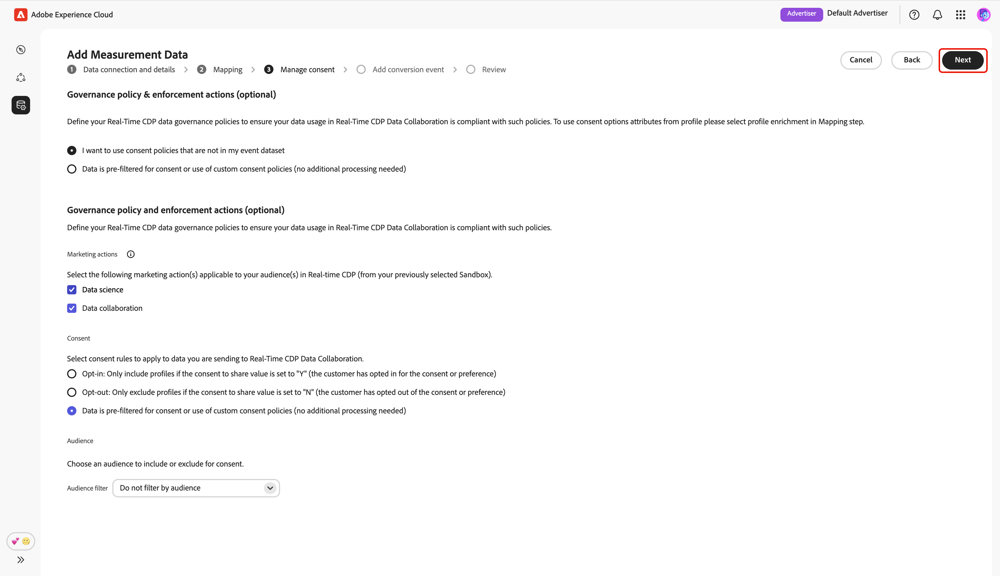
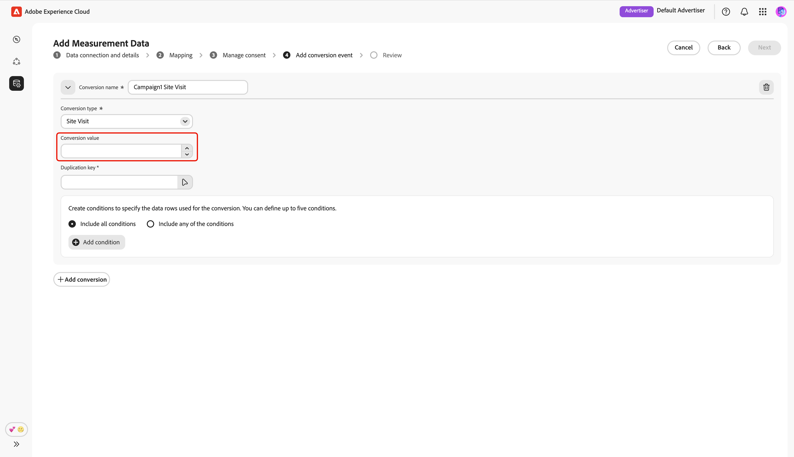

# Adicionar e gerenciar dados de medição {#add-and-manage-measurement-data}

>[!CONTEXTUALHELP]
>id="rtcdp_collaboration_onboard_measurement_data"
>title="Saiba mais"
>abstract=""

>[!CONTEXTUALHELP]
>id="rtcdp_collaboration_measurement_data_target_fields"
>title="Campos de destino"
>abstract="Espaço reservado para campos de destino de medição."

>[!CONTEXTUALHELP]
>id="rtcdp_collaboration_measurement_data_source_fields"
>title="Campos de origem"
>abstract="Espaço reservado para campos de origem de medição."

>[!CONTEXTUALHELP]
>id="rtcdp_collaboration_import_measurement_mapping_source_fields"
>title="Mapear campos da origem"
>abstract="Espaço reservado para o mapeamento de medição dos campos de origem."

>[!CONTEXTUALHELP]
>id="rtcdp_collaboration_import_measurement_mapping_target_fields"
>title="Mapear campos de origem"
>abstract="Espaço reservado para o mapeamento de medição dos campos de destino."

{{limited-availability-release-note}}

Este documento descreve as etapas para adicionar dados de medição da campanha ao Adobe Real-Time CDP Collaboration. Os editores podem trabalhar com as equipes do Adobe para carregar dados de medição da campanha. Depois que os dados forem carregados e processados, tanto o editor quanto o anunciante poderão exibir [relatórios de medição de campanha](/help/guide/collaborate/measure.md) abrangentes.

## Adicionar dados de medição {#add-measurement-data}

Como anunciante, você pode fazer upload de seus dados de medição que contêm eventos de conversão para o Collaboration para usar em relatórios de medição de campanha. Os dados de conversão normalmente incluem campos como identificadores de usuário (por exemplo, email com hash ou IDs de dispositivo), carimbo de data e hora do evento de conversão e detalhes específicos do evento de conversão, como compra ou inscrição.

Para originar dados de medição, navegue até a guia **[!UICONTROL Meus dados de medição]** no espaço de trabalho **[!UICONTROL Configuração]**. Selecione o ícone adicionar () e selecione **[!UICONTROL Dados de medição]**.

Se esses forem seus primeiros dados de medição, você também poderá selecionar a opção **[!UICONTROL Adicionar]**.

{zoomable="yes"}

A tela **[!UICONTROL Adicionar dados de medição]** é exibida, exibindo um resumo das etapas para a origem dos dados de medição. Selecione **[!UICONTROL Iniciar integração]**.

{zoomable="yes"}

### Conexão de dados e detalhes {#data-connection-and-details}

Nesta etapa, é necessário configurar a conexão de dados e especificar os detalhes dos dados de medição.

#### Selecionar tipo de dados de medição {#select-measurement-data-type}

O tipo de dados de medição define o tipo de eventos que você traz para a medição da campanha. Atualmente, dados de conversão é o tipo compatível.

Selecione **[!UICONTROL Dados de conversão]** como o tipo de dados de medição, seguido de **[!UICONTROL Próximo]**.

{zoomable="yes"}

#### Selecionar conexão de dados {#select-data-connection}

Uma conexão de dados é a origem de onde você origina os dados de medição no Collaboration. Depois de estabelecer sua conexão de dados inicial e originar seu primeiro conjunto de dados de medição, você pode continuar fornecendo dados de medição adicionais usando a mesma conexão de dados.

Para adicionar uma conexão de dados, selecione **[!UICONTROL Adicionar nova conexão de dados]** e **[!UICONTROL Avançar]**.

{zoomable="yes"}

#### Selecionar fonte de dados {#select-data-source}

Em seguida, escolha a origem da conexão de dados. No momento, o Adobe Experience Platform é a única fonte de dados compatível.

Selecione sua fonte de dados e, em seguida, selecione **[!UICONTROL Próximo]**.

{zoomable="yes"}

#### Selecionar sandbox {#select-sandbox}

Selecione a sandbox que inclui os dados de medição que você deseja usar para os relatórios de medição da campanha do Collaboration. Escolha a sandbox na lista de sandboxes disponíveis e selecione **[!UICONTROL Avançar]**.

{zoomable="yes"}

#### Selecionar conjunto de dados de medição {#select-measurement-dataset}

Uma lista de conjuntos de dados na sandbox selecionada é exibida. Selecione um conjunto de dados como seus dados de medição e selecione **[!UICONTROL Próximo]**. Você pode usar a opção Pesquisar para filtrar e encontrar o conjunto de dados preferido.

{zoomable="yes"}

#### Fornecer nome e detalhes {#provide-name-and-details}

Em seguida, forneça um nome e uma descrição para sua conexão de dados. Essas informações ajudarão você a identificar a conexão de dados posteriormente.

{zoomable="yes"}

### Mapeamento {#mapping}

A próxima etapa é mapear campos dos dados de medição para os campos de destino correspondentes usados no Collaboration. Você também pode optar por enriquecer seu conjunto de dados de evento com atributos do Perfil de cliente em tempo real mapeando chaves de junção e usar esses atributos para detalhar os relatórios de medição.

#### Enriquecer dados do evento {#enrich-event-data}

Para enriquecer os dados do evento, selecione a opção **[!UICONTROL Chave de junção do campo do Source]**.

{zoomable="yes"}

Na caixa de diálogo **[!UICONTROL Chave de ingresso do campo do Source]**, escolha o campo de origem, seguido por **[!UICONTROL Selecionar]**.

{zoomable="yes"}

Em seguida, selecione a opção **[!UICONTROL Chave de ingresso do perfil]**. Na caixa de diálogo **[!UICONTROL Chave de ingresso do perfil]**, selecione o campo de perfil na lista. Você pode usar a opção Search para localizar o campo desejado. Em seguida, escolha **[!UICONTROL Selecionar]** para confirmar.

{zoomable="yes"}

#### Mapeamento de campos {#mapping-fields}

Para começar a mapear campos de origem dos dados de medição para os campos de destino no Collaboration, selecione o campo de origem vazio na tela **[!UICONTROL Mapeamento]**.

{zoomable="yes"}

A caixa de diálogo **[!UICONTROL Selecionar campo de origem]** é exibida, exibindo uma lista de campos de origem disponíveis agrupados em opções como **[!UICONTROL Namespace de identidade]** e **[!UICONTROL Esquema de evento]**. Você pode usar a opção de pesquisa para filtrar e localizar o campo de origem na lista.

Escolha o campo de origem desejado, seguido por **[!UICONTROL Selecionar]**.

{zoomable="yes"}

Em seguida, use o menu suspenso para mapear o campo de origem selecionado para um campo de destino apropriado. Todos os campos de destino disponíveis são as [chaves de correspondência configuradas para sua conta do Collaborator](./onboard-account.md#set-up-match-keys).

{zoomable="yes"}

É possível adicionar ou remover linhas de mapeamento, conforme necessário. Se você precisar mapear um campo de origem sem hash para um campo de destino com hash (por exemplo, mapear um email de texto sem formatação para [!UICONTROL Email com hash]), use a opção **[!UICONTROL Aplicar transformação]** para aplicar o hash necessário.

Quando terminar, revise os campos mapeados e as chaves de junção se o enriquecimento estiver ativado. Em seguida, selecione **[!UICONTROL Próximo]**.

{zoomable="yes"}

### Gerenciar consentimento {#manage-consent}

Antes de continuar, você deve reconhecer que o uso de dados no Collaboration está em conformidade com as políticas de governança de dados da Real-Time CDP. Todos os dados devem ser pré-filtrados de acordo com os requisitos de consentimento ou com as políticas de consentimento personalizadas aplicáveis, portanto, não é necessário nenhum processamento adicional.

Para confirmar sua confirmação, selecione **[!UICONTROL Avançar]**.

{zoomable="yes"}

Se você [habilitar o enriquecimento do perfil durante a etapa de mapeamento](#enrich-event-data), poderá configurar políticas de consentimento a partir de uma lista de opções predefinidas. Isso inclui:

* **Ações de marketing**: use essas ações de marketing para controlar quais dados de público-alvo trazer para a Collaboration da Experience Platform.
* **Regras de consentimento**: selecione as regras de consentimento a serem aplicadas aos dados que estão sendo originados na Collaboration.
* **Público-alvo**: use o filtro de público-alvo para incluir ou excluir perfis de público-alvo para consentimento.

>[!NOTE]
>
>**[!UICONTROL O Data Collaboration]** oferece suporte aos rótulos de uso de dados C4, C5 e C9, enquanto o **[!UICONTROL Data Science]** oferece suporte apenas a C9. Leia mais sobre os rótulos de uso de dados na documentação do Experience Platform:
>
>* [Visão geral dos rótulos de uso de dados](https://experienceleague.adobe.com/pt-br/docs/experience-platform/data-governance/labels/overview){target="_blank"}
>* [Glossário](https://experienceleague.adobe.com/pt-br/docs/experience-platform/data-governance/labels/reference){target="_blank"}

Selecione as configurações preferenciais e, em seguida, selecione **[!UICONTROL Avançar]**.

{zoomable="yes"}

Antes de continuar, você precisa confirmar e aceitar os termos na caixa de diálogo **[!UICONTROL Política de governança e ações de imposição]**. Marque a caixa de seleção, seguida de **[!UICONTROL OK]**.

{zoomable="yes"}

#### Filtro de público-alvo {#audience-filter}

Para incluir ou excluir determinados perfis de público-alvo para consentimento, use o menu suspenso **[!UICONTROL Filtro de público-alvo]**. Após selecionar esse filtro, a interface será atualizada para exibir a opção **[!UICONTROL Procurar públicos-alvo]**. Selecione **[!UICONTROL Procurar públicos]**.

{zoomable="yes"}

A caixa de diálogo **[!UICONTROL Selecionar públicos-alvo]** é exibida. Escolha um público da lista, seguido por **[!UICONTROL Selecionar]**.

{zoomable="yes"}

O público-alvo escolhido agora é exibido, com a opção de removê-lo, se necessário. Examine suas configurações de consentimento e selecione **[!UICONTROL Avançar]**.

{zoomable="yes"}

### Adicionar evento de conversão {#add-conversion-event}

Em seguida, defina os eventos de conversão nos quais você deseja medir o impacto de suas campanhas, por exemplo, visitas de site, registros ou compras concluídas. Você pode especificar até **3** eventos de conversão distintos para medição.

Forneça o nome do evento de conversão e use o menu suspenso para selecionar o tipo de conversão.

{zoomable="yes"}

Você pode inserir um valor para a conversão ou deixá-lo vazio se não quiser atribuir um valor neste momento.

{zoomable="yes"}

Em seguida, você precisa especificar a chave de duplicação para indicar quais linhas no conjunto de dados do evento pertencem ao mesmo evento de conversão subjacente (por exemplo, o mesmo carimbo de data e hora durante um processo de inscrição). Isso impede a contagem da mesma conversão várias vezes nos relatórios de medição. Para fazer isso, selecione **[!UICONTROL Chave de duplicação]**. Na caixa de diálogo **[!UICONTROL Chave de duplicação]**, localize e escolha a chave, seguida por **[!UICONTROL Selecionar]**.

{zoomable="yes"}

Depois de especificar a chave de duplicação, você pode adicionar até **5** condições para incluir somente linhas relevantes do conjunto de dados do evento para a conversão. Escolha aplicar todas ou qualquer uma dessas condições.

Selecione **[!UICONTROL Adicionar condição]** e selecione a opção de condição.

{zoomable="yes"}

Na caixa de diálogo **[!UICONTROL Selecionar campo de origem]**, localize e escolha um campo de origem para a regra de condição, seguido por **[!UICONTROL Selecionar]**.

{zoomable="yes"}

Use o menu suspenso para selecionar um operador lógico e, em seguida, insira o valor da regra de configuração.

{zoomable="yes"}

Para adicionar outro evento de conversão, selecione **[!UICONTROL Adicionar conversão]**. Você pode incluir até **3** eventos de conversão no total. Depois de concluído, revise as configurações de conversão e selecione **[!UICONTROL Próximo]**.

{zoomable="yes"}

### Revisar {#review}

A tela **[!UICONTROL Revisão]** é exibida com um resumo das configurações de dados de medição. Revise e verifique se todas as informações estão corretas. Se precisar alterar qualquer seção, use a opção **[!UICONTROL Editar]**.

Finalmente, selecione **[!UICONTROL Concluir]** para concluir a adição dos dados de medição.

{zoomable="yes"}

Uma caixa de diálogo de confirmação confirma que os dados de medição foram criados com êxito. Você pode ver os novos eventos de conversão configurados com seus dados de medição no espaço de trabalho **[!UICONTROL Meus dados de medição]**.

{zoomable="yes"}

Quando estiver na exibição de grade ou tabela, selecione um item de linha ou a opção **[!UICONTROL Exibir conversão]** em um cartão de evento para ter uma visão geral de um evento de conversão específico. Ele exibe o status do evento, a origem e o nome da conexão de dados, juntamente com painéis detalhados para:

* **[!UICONTROL Detalhes da conversão]**: exibe informações importantes sobre a conversão, incluindo seu tipo, a chave de duplicação usada para identificar eventos exclusivos e o valor de conversão atribuído (se especificado).
* **[!UICONTROL Condições]**: exibe as regras de condição aplicadas a este evento de conversão.

{zoomable="yes"}

## Editar dados de medição {#edit-measurement-data}

Após fornecer seus dados de medição, você pode editar os detalhes e as regras de condição de um evento de conversão a qualquer momento.

Na guia **[!UICONTROL Meus dados de medição]**, selecione a opção de reticências () no cartão de evento de conversão relevante. Em seguida, selecione **[!UICONTROL Exibir conversão]** no menu suspenso para abrir a página detalhada desse evento de conversão.

{zoomable="yes"}

### Editar nome e descrição {#edit-name-and-description}

Para atualizar o nome e a descrição do evento, selecione o ícone de edição () na parte superior direita da página.

{zoomable="yes"}

Na caixa de diálogo **[!UICONTROL Editar nome e descrição]**, atualize os campos com os valores desejados e selecione **[!UICONTROL Salvar]** para aplicar as alterações.

{zoomable="yes"}

Uma caixa de diálogo de confirmação é exibida para confirmar que os detalhes foram atualizados com êxito.

### Editar detalhes da conversão {#edit-conversion-details}

Você pode atualizar os seguintes detalhes de conversão do evento:

| Campo | Descrição |
|-------------------|-------------|
| Tipo de conversão | A categoria do evento de conversão, como visita de site, compra ou inscrição. |
| Chave de duplicação | Identificador para linhas no conjunto de dados de evento pertencentes ao mesmo evento de conversão (por exemplo, mesmo carimbo de data e hora). Impede contagens duplicadas. |
| Valor de conversão | O valor associado a cada conversão. |

{style="table-layout:auto"}

Para começar a editar, selecione **[!UICONTROL Editar]** no painel **[!UICONTROL Detalhes de conversão]**.

{zoomable="yes"}

Na caixa de diálogo **[!UICONTROL Editar detalhes da conversão]**, use o menu suspenso para atualizar o tipo de conversão. Você pode inserir um valor para a conversão ou deixá-lo vazio se não quiser atribuir um valor. Para editar a chave de duplicação, selecione a opção existing key.

{zoomable="yes"}

A caixa de diálogo **[!UICONTROL Chave de duplicação]** exibe uma lista de campos disponíveis agrupados em opções como **[!UICONTROL Namespace de identidade]** e **[!UICONTROL Esquema de evento]**. Localize e escolha a chave desejada, seguida por **[!UICONTROL Selecionar]**.

{zoomable="yes"}

Após a conclusão, revise as atualizações e selecione **[!UICONTROL Salvar]** para aplicar as alterações.

{zoomable="yes"}

Uma caixa de diálogo de confirmação é exibida para confirmar que os detalhes foram atualizados com êxito.

### Editar condições {#edit-conditions}

As regras de condição especificam quais linhas de dados do seu conjunto de dados de evento são incluídas como conversões. Atualize essas regras conforme necessário para garantir que sua medição reflita apenas os dados mais relevantes para sua análise.

Para editar condições, selecione **[!UICONTROL Editar]** no painel **[!UICONTROL Condições]**.

{zoomable="yes"}

Na caixa de diálogo **[!UICONTROL Editar regras de conversão]**, você pode exibir os detalhes atuais de todas as condições. Selecione uma opção de condição existente para atualizar seus detalhes, incluindo campo de origem, regra lógica e valor.

{zoomable="yes"}

Para incluir regras de conversão adicionais, selecione **[!UICONTROL Adicionar condição]**. Em seguida, selecione a opção new empty condition.

{zoomable="yes"}

Na caixa de diálogo **[!UICONTROL Selecionar campo de origem]**, você pode ver campos disponíveis agrupados em opções como **[!UICONTROL Namespace de identidade]** e **[!UICONTROL Esquema de evento]**. Selecione o campo apropriado que deseja usar para a sua condição e escolha **[!UICONTROL Selecionar]**. Você pode usar a opção **[!UICONTROL Pesquisar]** para localizar rapidamente seu campo preferido.

{zoomable="yes"}

Em seguida, use o menu suspenso para selecionar um operador lógico na lista disponível e inserir um valor para a condição.

{zoomable="yes"}

Use **[!UICONTROL Incluir todas as condições]** se todas as condições especificadas forem necessárias para cada conversão, ou use **[!UICONTROL Incluir qualquer uma das condições]** para permitir conversões que correspondam a pelo menos uma condição. Ao terminar a atualização, revise e selecione **[!UICONTROL Salvar]** para aplicar as alterações.

{zoomable="yes"}

Uma caixa de diálogo de confirmação é exibida para confirmar que os detalhes foram atualizados com êxito.

## Excluir dados de medição {#delete-measurement-data}

A exclusão de dados de medição remove permanentemente o evento de conversão associado e todos os detalhes de medição vinculados do seu projeto. Todos os relatórios de medição que dependem desse evento perderão as métricas de conversão correspondentes e não poderão mais ser atualizados. Esta ação não pode ser desfeita.

Para excluir um evento de conversão existente, navegue até a guia **[!UICONTROL Meus dados de medição]** no espaço de trabalho **[!UICONTROL Instalação]**. Na exibição de grade, selecione **[!UICONTROL Excluir]** no cartão de evento relevante. Na exibição de tabela, selecione o ícone de exclusão () ao lado do nome do evento.

{zoomable="yes"}

A caixa de diálogo **[!UICONTROL Excluir medição]** é exibida, solicitando que você confirme a exclusão do evento. Clique em **[!UICONTROL Excluir]**.

{zoomable="yes"}

Uma caixa de diálogo de confirmação é exibida para confirmar que o evento de conversão foi excluído com sucesso.

## Próximas etapas {#next-steps}

Você concluiu a origem dos dados de medição no Collaboration. Como anunciante, agora você pode criar relatórios de atribuição para explorar como suas campanhas geram conversões e avaliam o impacto geral. Se você for um editor, solicite que seu colaborador gere um relatório de Atribuição para suas campanhas. Para obter instruções detalhadas, consulte o guia [Criar relatório de atribuição](../collaborate/measure.md#create-attribution-report).
