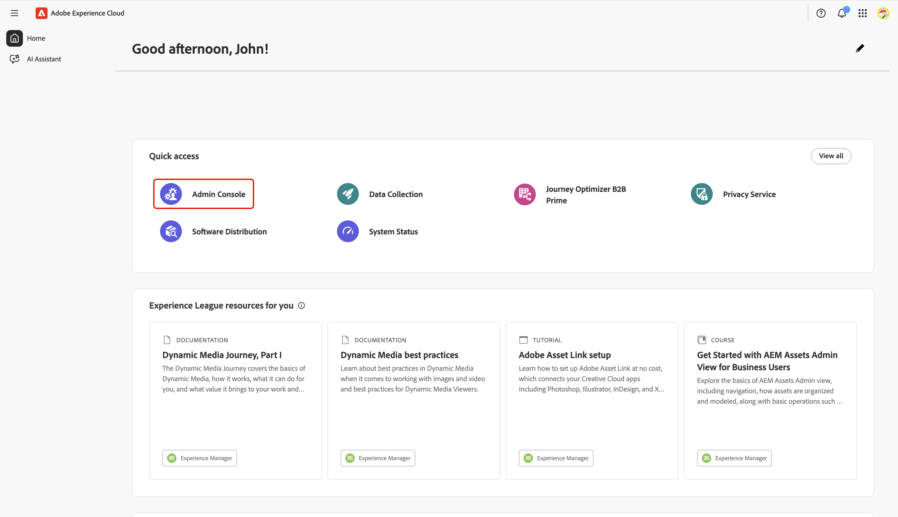
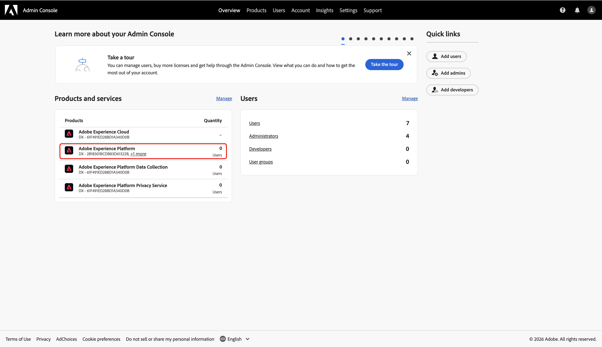
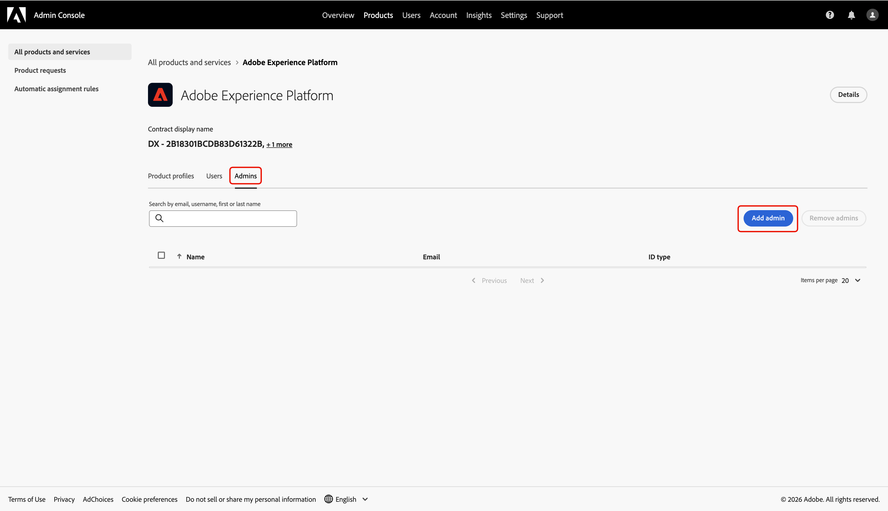
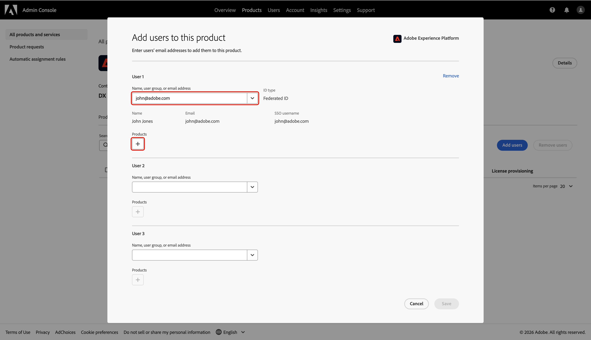
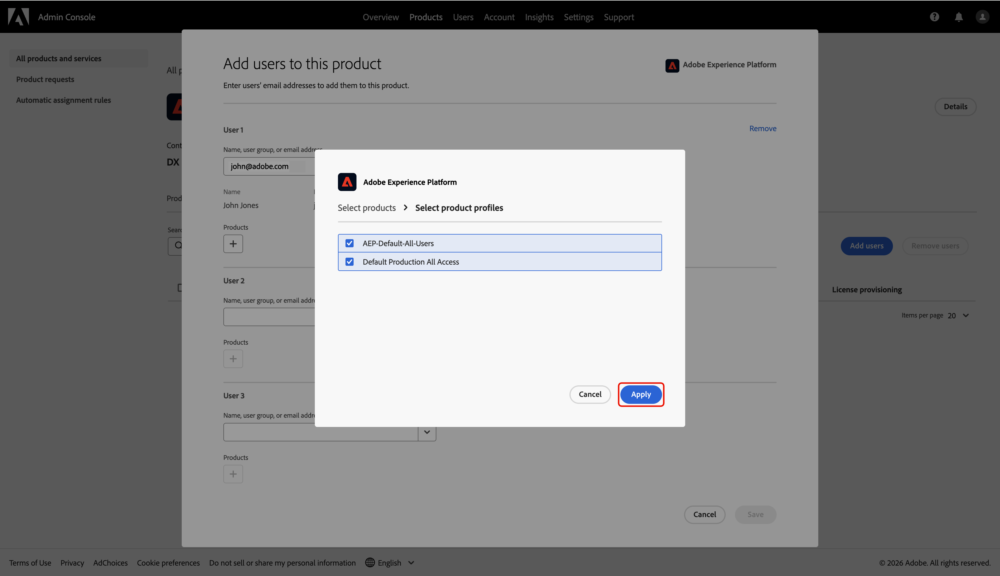

# Configurar o acesso de administrador para a integração do Collaboration [!DNL Starter]

Como o primeiro usuário da sua organização a acessar o Adobe Experience Platform por meio do Collaboration [!DNL Starter], você é responsável por configurar e gerenciar o acesso da sua equipe. Você deve conceder a si mesmo as permissões de administrador e usuário necessárias para começar a trabalhar no Real-Time CDP Collaboration. Leia este guia para saber como configurar o acesso necessário no Admin Console para gerenciar permissões de Colaborações na interface de Permissões.

## Pré-requisitos {#prerequisites}

Antes de continuar, verifique se você tem:

* Aceitou o convite do seu parceiro licenciado da Collaboration. Para obter mais informações sobre os requisitos do convite, consulte a [visão geral [!DNL Starter] do Collaboration](../overview/starter-overview.md#prerequisites).
* Revisamos e assinamos os termos e condições da Collaboration.
* Recebeu seu email de boas-vindas do Adobe e concluiu a criação da sua primeira conta.

## Configurar acesso {#setup-access}

Quando sua conta do Adobe é criada por meio do fluxo de trabalho [!DNL Starter], você recebe automaticamente a função de administrador do sistema. Isso permite gerenciar usuários e o acesso ao produto na Admin Console. No entanto, você ainda não tem acesso a **[!UICONTROL Permissões]**, que é necessário para gerenciar o acesso ao Collaboration.

Use o Admin Console para conceder a si mesmo **acesso de administrador de produto** ao Experience Platform e **acesso de usuário** aos produtos da Experience Platform para obter **[!UICONTROL Permissões]**.

Para saber mais sobre funções e produtos no Experience Cloud, leia a documentação da [visão geral do controle de acesso](../permissions/overview.md).

>[!TIP]
>
>Neste guia, um **administrador** fará referência a **administradores de sistema e de produto**.

### Configurar o acesso do administrador do produto {#configure-product-admin-access}

Leia esta seção para conceder a si mesmo privilégios de administrador para começar a configurar o acesso ao Collaboration [!DNL Starter].

#### Acessar o Admin Console {#access-admin-console}

Para começar, entre no [Adobe Experience Cloud](https://experience.adobe.com/){target="_blank"} com suas credenciais. Você pode ver uma lista dos seus produtos disponíveis na seção **[!UICONTROL Acesso rápido]**. Selecione **[!UICONTROL Admin Console]**.

{zoomable="yes"}

#### Acessar o painel de produtos do Adobe Experience Platform {#access-adobe-experience-platform}

O espaço de trabalho [Admin Console](https://adminconsole.adobe.com/) é aberto em uma nova guia. Selecione **[!UICONTROL Adobe Experience Platform]** na lista **[!UICONTROL Produtos]** em **[!UICONTROL Produtos e serviços]**.

{zoomable="yes"}

#### Adicionar administrador de produto {#add-product-admin}

No painel de produtos **[!UICONTROL Adobe Experience Platform]**, navegue até a guia **[!UICONTROL Administradores]**. Em seguida, selecione **[!UICONTROL Adicionar administrador]**.

{zoomable="yes"}

Digite seu endereço de email ou nome de usuário na caixa de diálogo **[!UICONTROL Adicionar administradores de produtos]** e selecione a conta correta na lista suspensa. Depois de concluído, selecione **[!UICONTROL Salvar]**.

{zoomable="yes"}

Agora, você é um administrador de produto e pode adicionar usuários ou outros administradores ao produto no Admin Console. Em seguida, conceda a si mesmo acesso de usuário ao produto Experience Platform para acessar e executar funções nas Permissões.

### Configurar o acesso do usuário {#configure-user-access}

Para gerenciar as permissões do Collaboration, você deve ter **acesso de usuário** ao produto, além do acesso de administrador. O acesso do usuário pode ser configurado por um administrador do sistema ou do produto.

>[!TIP]
>
>Se você estiver seguindo a partir da seção anterior, já deverá estar no painel de produtos do **[!UICONTROL Adobe Experience Platform]** dentro da Admin Console. A partir daqui, prossiga para [adicione-se como usuário](#add-user).

Para começar a configurar o acesso do usuário, conclua as seguintes etapas:

1. [Acesse o Admin Console pela página inicial do Adobe Experience Cloud](#access-admin-console).
2. [Navegue até o painel de produtos do Adobe Experience Platform](#access-adobe-experience-platform).

#### Adicionar usuário ao produto {#add-user}

Agora você está no painel de produtos **[!UICONTROL Adobe Experience Platform]**. Navegue até a guia **[!UICONTROL Usuários]** e selecione **[!UICONTROL Adicionar usuários]**.

{zoomable="yes"}

A caixa de diálogo **[!UICONTROL Adicionar usuários a este produto]** é exibida, solicitando que você digite seu nome, grupo de usuários ou endereço de email. Preencha os valores e selecione sua conta na lista suspensa.

{zoomable="yes"}

Em seguida, selecione o ícone adicionar  em **[!UICONTROL Produtos]**.

Uma caixa de diálogo é exibida com uma lista de [perfis de produto](https://helpx.adobe.com/br/enterprise/using/manage-product-profiles.html) disponíveis. Selecione **[!UICONTROL AEP-Default-All-Users]** e **[!UICONTROL Acesso Total à Produção Padrão]**. Em seguida, selecione **[!UICONTROL Aplicar]**.

{zoomable="yes"}

Finalmente, selecione **[!UICONTROL Salvar]** para concluir a adição de um novo usuário ao produto.

{zoomable="yes"}

Após ter acesso de usuário, navegue de volta para [Adobe Experience Cloud](https://experience.adobe.com/){target="_blank"}. Confirme se as **[!UICONTROL Permissões]** e o **[!UICONTROL Real-Time CDP Collaboration]** estão disponíveis no **[!UICONTROL Acesso rápido]**.

{zoomable="yes"}

>[!TIP]
>
>Se as **[!UICONTROL Permissões]** e a **[!UICONTROL Real-Time CDP Collaboration]** não aparecerem no **[!UICONTROL Acesso rápido]**, tente sair e entrar novamente.

## Próximas etapas {#next-steps}

Agora você tem **acesso de administrador** e **acesso de usuário** para inserir Permissões, onde é possível definir funções, atribuir permissões específicas e gerenciar o acesso de usuários aos recursos e recursos do Collaboration. Para obter instruções passo a passo, consulte o [Guia de controles de permissão](./starter-permission-controls.md).
