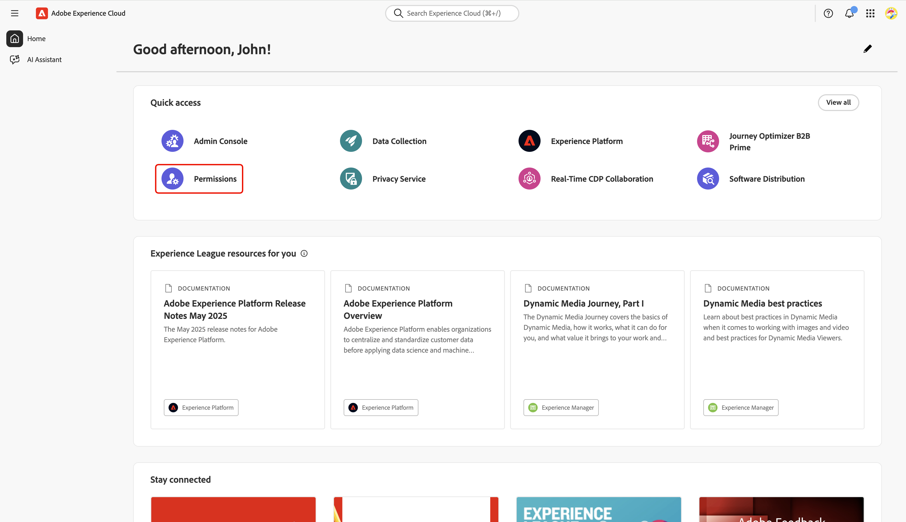
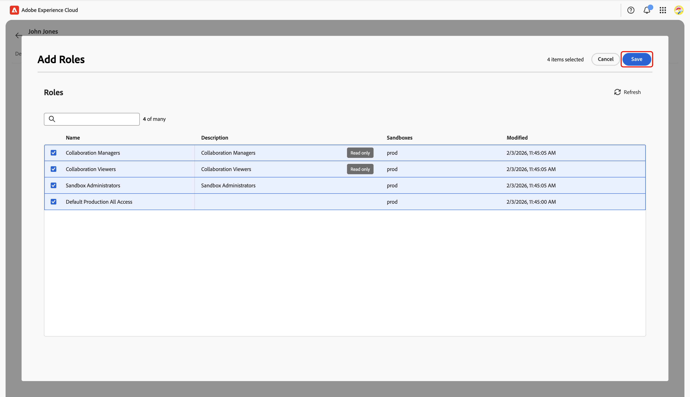

# Configurar controles de permissão para a integração do Collaboration [!DNL Starter]

Depois de configurar o acesso de administrador e usuário aos produtos da Adobe Experience Platform, é necessário atribuir a si mesmo funções com as permissões apropriadas para o Real-Time CDP Collaboration. Leia este guia para saber como adicionar as funções certas à sua conta por meio da interface de Permissões do Experience Cloud, para que você possa acessar e gerenciar o acesso do usuário aos recursos do Collaboration.

Para obter detalhes sobre funções padrão e permissões disponíveis incluídas no recurso do Collaboration, consulte [guia de como gerenciar funções](../permissions/manage-roles.md).

## Pré-requisitos {#prerequisites}

Verifique se você tem **privilégios de administrador** e **acesso de usuário** ao produto Adobe Experience Platform. Se você ainda não tiver configurado esses níveis de acesso, consulte o [guia de acesso do administrador](./starter-admin-access.md) para obter instruções passo a passo.

## Configurar permissões {#setup-permissions}

Siga as etapas abaixo para configurar as permissões necessárias para o Collaboration. Primeiro, faça logon no [Adobe Experience Cloud](https://experience.adobe.com/) com suas credenciais.

### Permissões de acesso {#access-permissions}

Depois de fazer logon, navegue até a seção **[!UICONTROL Acesso rápido]** e selecione **[!UICONTROL Permissões]**. Isso abre o painel Permissões, onde você pode atribuir as funções necessárias a si mesmo.

{zoomable="yes"}

### Selecionar um usuário {#select-user}

No painel **[!UICONTROL Permissões]**, selecione **[!UICONTROL Usuários]** no painel esquerdo. Em seguida, selecione a conta na tabela Usuários.

>[!NOTE]
>
> Se você for o primeiro usuário da sua organização a acessar o Experience Platform, talvez seja o único usuário listado na tabela **Usuários**. Para convidar membros adicionais da equipe, siga as etapas do [guia de configuração de acesso do usuário](../permissions/manage-user-access.md#administrators-configure-user-access-to-experience-platform).

O painel {zoomable="yes"}

### Atribuir funções {#assign-roles}

No espaço de trabalho **[!UICONTROL Usuário]** correspondente, navegue até a guia **[!UICONTROL Funções]**. Em seguida, selecione **[!UICONTROL Adicionar Funções]**.

{zoomable="yes"}

A caixa de diálogo **[!UICONTROL Adicionar Funções]** aparece com uma tabela de funções disponíveis. Cada linha na tabela representa uma função com as seguintes informações:

| **Coluna** | **Descrição** |
|---------------|--------------------------------------------------------|
| **Nome** | O nome da função. |
| **Descrição** | Um breve resumo descrevendo a função da função. Observe que as funções &quot;somente leitura&quot; não podem ser personalizadas. |
| **Sandboxes** | Especifica a quais sandboxes (por exemplo, `Prod`) a função fornece acesso. |
| **Modificado** | A data em que a função foi atualizada pela última vez. |

{style="table-layout:auto"}

Para obter uma visão geral detalhada de uma função específica e suas permissões, consulte o guia [Gerenciar permissões de uma função](https://experienceleague.adobe.com/en/docs/experience-platform/access-control/abac/permissions-ui/permissions).

Revise as informações e selecione as funções que deseja atribuir à sua conta. Quando terminar, selecione **[!UICONTROL Salvar]**.

{zoomable="yes"}

Uma caixa de diálogo de confirmação confirma que novas funções foram adicionadas com êxito.

Para verificar se suas permissões estão configuradas corretamente, retorne à página inicial do [Experience Cloud](https://experience.adobe.com/). Selecione **[!UICONTROL Real-Time CDP Collaboration]** em **[!UICONTROL Acesso rápido]**. Você deve conseguir acessar o espaço de trabalho do Collaboration e começar a usar os recursos disponíveis para sua conta do [!DNL Starter].

## Próximas etapas {#next-steps}

Com suas permissões configuradas, você está pronto para acessar o Collaboration. Em seguida, é possível:

* [Crie funções personalizadas com permissões específicas para gerenciar diferentes níveis de acesso](../permissions/manage-roles.md#create-specific-access-roles).
* [Atribuir vários usuários a uma função nas Permissões](../permissions/manage-user-access.md#assign-a-role).
* [Configure a conta do Collaboration e estabeleça conexões com seu colaborador convidador](../overview/starter-overview.md#set-up-connections).
* [Saiba mais sobre o uso e o consumo de crédito no Collaboration [!DNL Starter]](./starter-credit-usage.md).

Para obter uma visão geral completa do Real-Time CDP Collaboration e seus principais recursos, leia o [guia de visão geral](../home.md).
