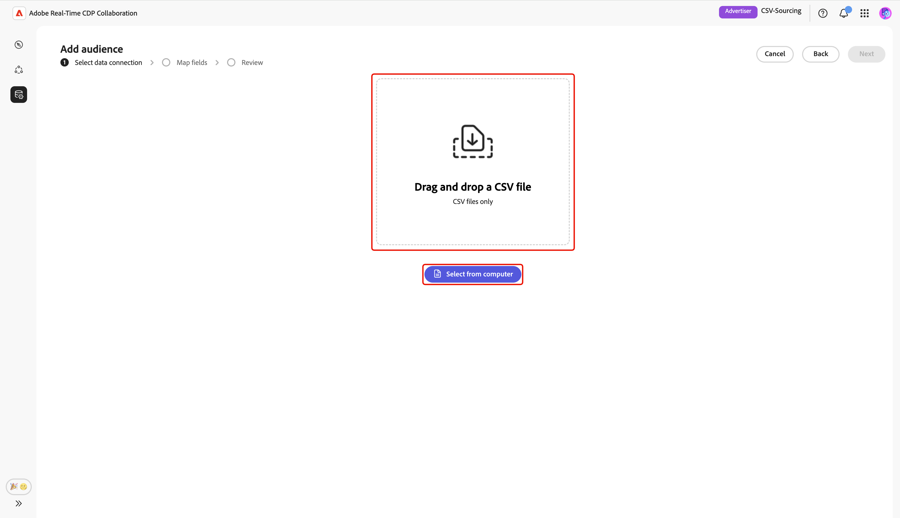
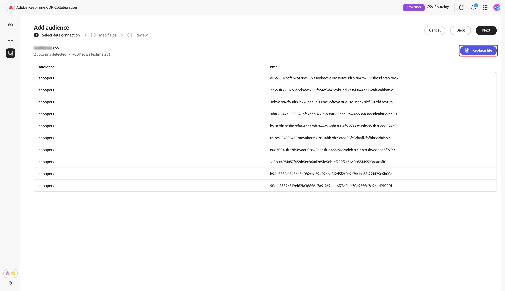
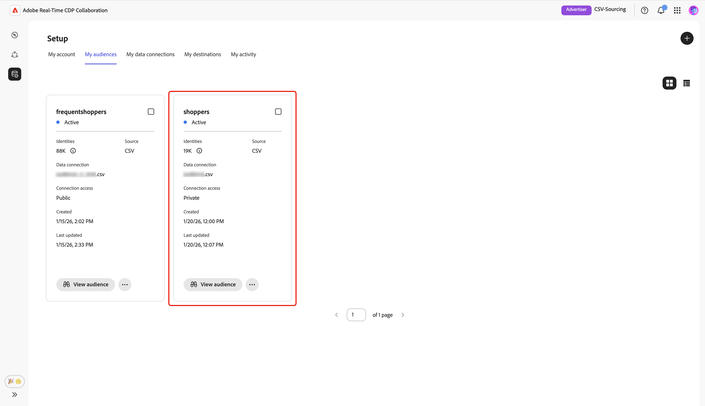

# Fazer upload de arquivo CSV para fornecimento de público

Este guia fornece etapas para fazer upload de um arquivo CSV na interface do usuário do Adobe Real-Time CDP Collaboration a fim de obter os dados do público-alvo para uso em projetos de colaboração.

## Visão geral {#overview}

O upload de arquivos CSV é um método para fornecer dados de público-alvo primários para projetos de colaboração. Esta é uma alternativa para [conectar seu AWS S3 bucket](./configure-aws-s3-audience-sourcing.md), [conectar o Google Cloud Storage](./configure-gcs-audience-sourcing.md) ou [fornecer públicos-alvo da Experience Platform](./onboard-audiences.md).

Siga este fluxo de trabalho para fazer upload de um arquivo CSV contendo os dados do público-alvo para fornecer e gerenciar públicos-alvo primários no Collaboration. É possível mapear campos de identidade para ativação e análise de sobreposição. Depois que o arquivo é carregado e processado, o público-alvo de origem fica disponível no espaço de trabalho **[!UICONTROL Meus públicos-alvo]**, onde você pode revisar, ativar e gerenciar seus projetos de colaboração.

>[!IMPORTANT]
>
>* Os públicos-alvo originados por meio do upload de CSV estão disponíveis por **7 dias**. Após esse período, o público-alvo expira e deve ser recarregado para uso em seus projetos de colaboração.
>
>* Agora, é possível carregar um arquivo CSV por sessão. Para adicionar outros públicos-alvo, conclua o fluxo de trabalho de upload novamente para cada arquivo que deseja originar.

## Pré-requisitos {#prerequisites}

Antes de carregar arquivos CSV para fornecimento de público, verifique se você tem:

* Integração de conta concluída no Real-Time CDP Collaboration. Consulte [Integrar sua conta](./onboard-account.md) para obter instruções passo a passo.
* As permissões necessárias para adicionar públicos-alvo na organização.
* Um arquivo CSV que contém os dados do público-alvo com campos de identidade como email ou telefone.

## Fazer upload de um arquivo CSV {#upload-csv-file}

Na guia **[!UICONTROL Meus públicos-alvo]** do espaço de trabalho **[!UICONTROL Configuração]**, selecione o ícone adicionar () e selecione **[!UICONTROL Público]**.

Se este for seu primeiro público-alvo, você também poderá selecionar a opção **[!UICONTROL Adicionar]**.

O fluxo de trabalho Adicionar público-alvo é exibido. Selecione **[!UICONTROL Adicionar nova conexão de dados]** e **[!UICONTROL Avançar]**.

{zoomable="yes"}

### Selecione Arquivo CSV como a conexão de dados {#select-csv-file}

Selecione **[!UICONTROL Arquivo CSV]** como uma conexão de dados, seguido por **[!UICONTROL Próximo]**.

### Selecionar arquivo {#select-file}

Escolha **[!UICONTROL Selecionar do computador]** para carregar um arquivo CSV do sistema local. Como alternativa, você pode arrastar e soltar o arquivo CSV que deseja carregar no painel [!UICONTROL Arrastar e soltar um arquivo CSV].

>[!IMPORTANT]
>
>Somente arquivos CSV são suportados. O tamanho máximo do arquivo é **2 GB**.

Depois de carregada, a interface mostra um resumo que inclui o número de colunas, uma contagem de linhas estimada, a estrutura do arquivo e uma pré-visualização das primeiras 10 linhas de dados.

Revise o resumo e selecione **[!UICONTROL Próximo]**.

#### Substituir arquivo {#replace-file}

Se precisar carregar um arquivo CSV diferente, escolha **[!UICONTROL Substituir arquivo]** e selecione seu novo arquivo. A interface é atualizada para exibir um resumo atualizado dos novos dados.

Depois de revisar o resumo revisado, selecione **[!UICONTROL Próximo]**.

### Confirmar confirmação de consentimento {#confirm-consent}

Antes de continuar, você deve reconhecer que as opções de recusa de consentimento foram removidas dos dados do público-alvo. O Collaboration exige dados limpos do público-alvo sem usuários que recusaram o compartilhamento de dados.

Marque a caixa de confirmação seguida de **[!UICONTROL OK]** para confirmar. A caixa de diálogo é fechada e você prossegue para a tela Mapear campos.

### Mapear campos de identidade de origem {#map-fields}

O mapeamento de campo determina como o Collaboration usa os dados do público-alvo para ativação e análise de sobreposição. Na tela **[!UICONTROL Mapear campos]**, use os menus suspensos para mapear cada campo de identidade de origem do seu arquivo CSV para o campo de destino apropriado no Collaboration.

Se você precisar de detalhes adicionais sobre um campo de destino, incluindo o tipo de dados ou a descrição, selecione **[!UICONTROL Detalhes dos campos de destino]** para obter mais informações.

Em seguida, revise os campos mapeados e selecione **[!UICONTROL Avançar]**.

### Revisar e concluir o upload {#review-and-complete}

A tela **[!UICONTROL Avaliação]** é exibida com um resumo das configurações de público-alvo do seu arquivo CSV. Revise as informações nas seguintes seções:

* **[!UICONTROL Informações do Arquivo]**: Exibe o nome do arquivo, o número de colunas e a contagem estimada de linhas.
* **[!UICONTROL Mapeamento]**: lista como os campos de origem do seu arquivo de público-alvo carregado (por exemplo, `email`) são mapeados para campos de destino usados no Collaboration (por exemplo, Email com hash).

Selecione o ícone de lápis se precisar editar uma seção. Selecione **[!UICONTROL Concluir]** para confirmar todas as seções.

Uma barra de progresso é exibida abaixo das seções de resumo para indicar o progresso do upload. Depois que o upload for concluído, uma caixa de diálogo de confirmação confirmará que o público-alvo de CSV foi criado e a origem do público-alvo está em andamento.

## Revisar públicos-alvo originados {#review-sourced-audiences}

Depois de fazer upload do arquivo CSV, o Collaboration começa a fornecer públicos-alvo do arquivo. Esse processo pode levar vários minutos. Quando o fornecimento for concluído, seus públicos-alvo estarão disponíveis na guia **[!UICONTROL Meus públicos-alvo]** com os mesmos recursos e informações que os públicos-alvo provenientes da Experience Platform.

Quando estiver na exibição de grade ou tabela, selecione um item de linha ou **[!UICONTROL Exibir público-alvo]** para ter uma visão geral de um público-alvo específico. Ele exibe o status, a origem e o nome da conexão de dados do público-alvo, juntamente com painéis detalhados para:

**[!UICONTROL Identidades]**: exibe a contagem e o detalhamento totais de identidades assim que os dados são disponibilizados.
**[!UICONTROL Categorias]**: exibe as marcas usadas para organizar ou filtrar o público.
**[!UICONTROL Acesso à conexão]**: exibe se o público é privado, público ou compartilhado com colaboradores específicos.
**[!UICONTROL Metadata visibility]**: Displays what audience information (such as identity count, overlap percentage, and index) is visible to collaborators.

Use this view to confirm audience configuration and visibility settings before using the audience in collaboration projects. For more information, see [how to view an individual audience](./onboard-audiences.md#view-individual-audiences).

## Próximas etapas {#next-steps}

You have now successfully uploaded your CSV file in Collaboration. After sourcing completes, you can:

* Create collaboration projects with your sourced audiences. See [Discover audiences](../../guide/collaborate/discover.md).
* Activate audiences to connected destinations. See [Activate audiences](../../guide/collaborate/activate.md).
* Review audience overlap and insights. See [Measure campaign performance](../../guide/collaborate/measure.md).
* Manage your audience settings and visibility. See [Source and manage audiences](./onboard-audiences.md).

For information about other audience sourcing methods, see [Configure AWS S3 for audience sourcing](./configure-aws-s3-audience-sourcing.md) or [Source audiences from Experience Platform](./onboard-audiences.md).
